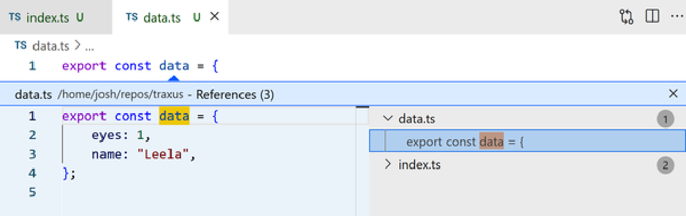
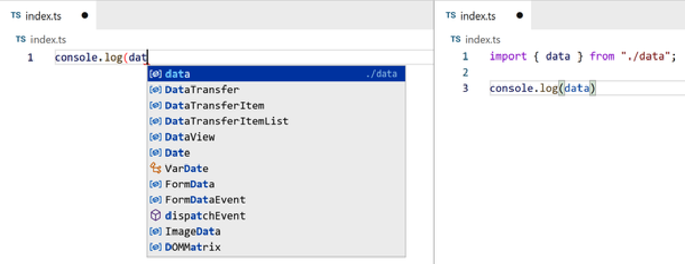
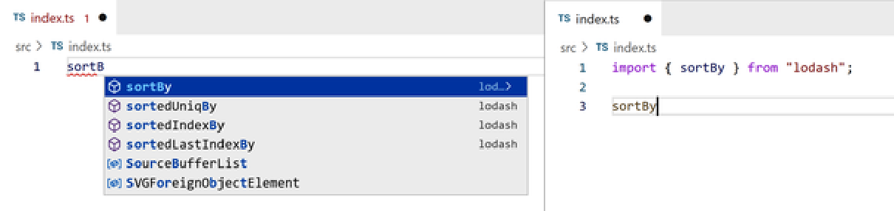
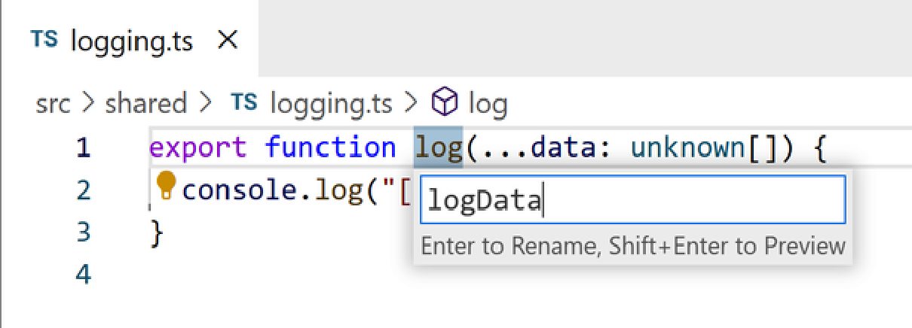
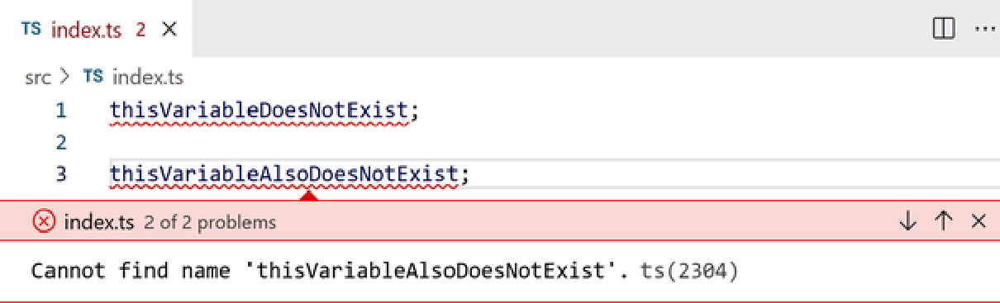
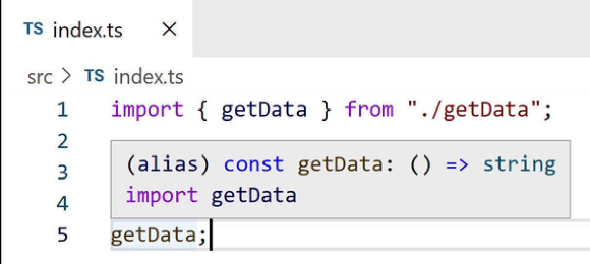
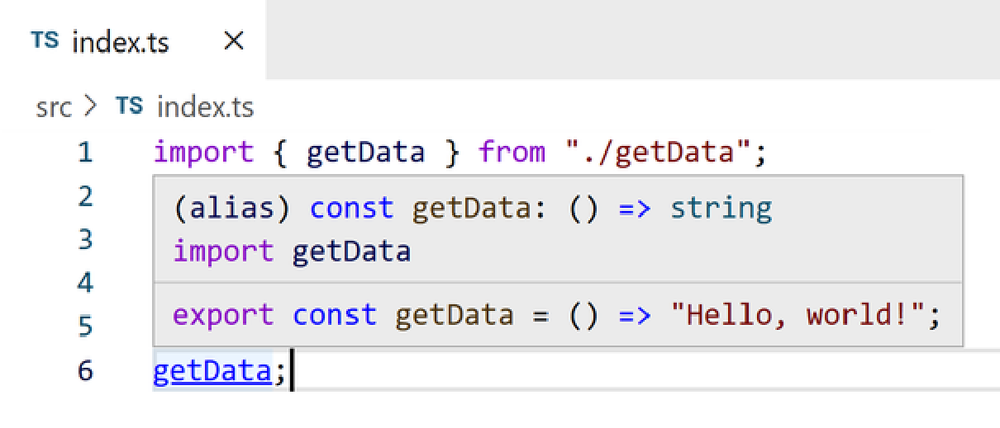
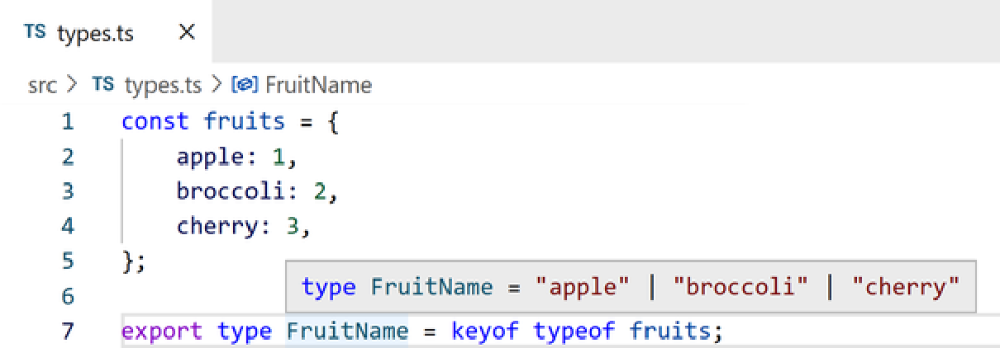
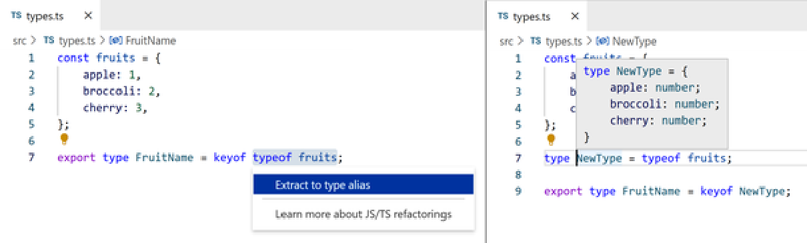

# **Chapter 12. Using IDE Features** 

## Table of Contents

- [**Chapter 12. Using IDE Features**](#chapter-12-using-ide-features)
      - [**NOTE**](#note)
      - [**TIP**](#tip)
  - [**Navigating Code**](#navigating-code)
    - [**Finding Definitions**](#finding-definitions)
    - [**Finding References**](#finding-references)
    - [**Finding Implementations**](#finding-implementations)
  - [**Writing Code**](#writing-code)
    - [**Completing Names**](#completing-names)
    - [**Automatic Import Updates**](#automatic-import-updates)
      - [**TIP**](#tip)
    - [**Code Actions**](#code-actions)
      - [**TIP**](#tip)
      - [**Renaming**](#renaming)
      - [**Removing unused code**](#removing-unused-code)
      - [**Other quick fixes**](#other-quick-fixes)
      - [**Refactoring**](#refactoring)
  - [**Working Effectively with Errors**](#working-effectively-with-errors)
    - [**Language Service Errors**](#language-service-errors)
      - [**Problems tab**](#problems-tab)
      - [**Running a terminal compiler**](#running-a-terminal-compiler)
      - [**TIP**](#tip)
      - [**Understanding types**](#understanding-types)
  - [**Summary**](#summary)
      - [**TIP**](#tip)

_Programming with an IDE the first time feels like superpowers._ 

No popular programming language would be complete without syntax highlighting and other IDE features to help developing in it. One of TypeScript’s greatest strengths is that its language service provides a suite of powerful development helpers for JavaScript and TypeScript code. This chapter will cover some of the most useful items. 

I highly recommend you try these IDE features out on the TypeScript projects you’ve built alongside this book. Although all the examples and screenshots in this chapter are of VS Code, my favorite editor, any IDE with TypeScript support will support most or all of this chapter. As of 2022 that includes the native support or TypeScript plugins for at least all of: Atom, Emacs, Vim, V is ual Studio, and WebStorm. 

#### **NOTE** 

This chapter is a nonexhaustive list of some of the more commonly useful TypeScript IDE features, along with any default shortcuts for them in VS Code. You’ll likely find more as you keep writing TypeScript code. 

Many IDE features are generally made available in the context menu surfaced by right-clicking on a name in code. IDEs such as VS Code generally show keyboard shortcuts in the context menu too. Getting comfortable with your IDE’s keyboard shortcuts can help you write code and execute refactors much more quickly. 

This screenshot shows the list of commands and their shortcuts in VS Code for a variable in TypeScript (Figure 12-1). 

_Figure 12-1. VS Code showing a list of commands in the right-click context menu for a variable_ 

#### **TIP** 

In VS Code, as with most applications, up and down arrows select drop-down options, and Enter activates one. 

## **Navigating Code** 

Developers generally spend much more time reading code rather than actively writing it. Tools that assist in navigating code are supremely useful for speeding that time up. Many of the features provided by the TypeScript language service are geared toward learning about code: in particular, jumping between type definitions or values in code and where they’re used. I’ll now go through commonly used navigation options from the context menu along with their VS Code shortcuts. 

### **Finding Definitions** 

TypeScript can start from a reference to a type definition or value and navigate you back to its original location in code. VS Code also provides a couple of ways to backtrace in that way: 

- Go to Definition (F12) navigates directly to where a requested name was originally defined. 

- Cmd (Mac) / Ctrl (Windows) + clicking a name triggers going to definition as well. 

- Peek > Peek Definition (Option (Mac) / Alt (Windows) + F12) brings up a Peek box showing the definition instead. 

Go to Type Definition is a specialized version of Go to Definition that goes to the definition of whatever type a value is. For an instance of a class or interface, it will reveal the class or interface itself instead of where the instance is defined. 

These screenshots show finding the definition of a `data` variable imported into a file with Go to Definition (Figure 12-2). 

_Figure 12-2. Left: going to definition on a variable name; right: the resultant opened data.ts file_ 

When the definition is declared in your own code, such as a relative file, the editor will bring you to that file. Modules outside your code such as npm packages will commonly use _.d.ts_ declaration files instead. 

### **Finding References** 

Given a type definition or value, TypeScript can show you a list of all the references to it, or places it’s used in the project. VS Code provides a couple ways to visualize that list. 

Go to References (Shift + F12) shows a list of references to that type definition or value—starting with itself—in an expandable Peek box just below the right-clicked name. 

For example, here’s a Go to References of a `data` variable’s declaration in one file, _data.ts_ , that shows both the declaration and its usage in another file, _index.ts_ (Figure 12-3). 

_Figure 12-3. Peek menu showing references to a variable_ 

That Peek box contains a file view of the referencing file. You can use that file—type, run editor commands, and so on—as if it were a regularly opened file. You can also double-click in the Peek box’s view of a file to open that file. 

Clicking through the list of file names on the right of the Peek box will switch the Peek box’s file view to the clicked file. Double-clicking a line of a file from the list will open the file and select its matched reference. 

Here, VS Code is showing the same `data` variable’s declaration and usage, but expanded in the sidebar view on the right (Figure 12-4). 

_Figure 12-4. Peek menu showing an opened reference to a variable_ 

Find All References (Option (Mac) / Alt (Windows) + Shift + F12) also shows a list of references, but in a sidebar view that stays v is ible after code navigation. This can be useful for opening or performing actions on more than just one reference at a time (Figure 12-5). 

_Figure 12-5. Find All References menu for a variable_ 

### **Finding Implementations** 

Go to Implementations (Cmd (Mac) / Ctrl (Windows) + F12) and Find All Implementations are specialized versions of Go To / Find All References made for interfaces and abstract class methods. They find all implementations of an interface or abstract method in code (Figure 12-6). 

_Figure 12-6. Find All Implementations menu for an_ _`AI` interface_ 

These are particularly helpful when you’re specifically searching for how values typed as a type such as class or interface are used. Find All References might be too no is y, as it will also show definitions of and other type references to the class or interface. 

## **Writing Code** 

IDE language services such as VS Code’s TypeScript service run in the background of your editor and react to actions taken in files. They see edits to files as you type them—even before changes are saved to files. Doing so enables a slew of features that help automate common tasks when writing TypeScript code. 

### **Completing Names** 

TypeScript’s APIs can be used by editors to fill in names that exist in the same file as well. When you start typing a name, such as when providing a previously declared variable as a function argument, editors using TypeScript will often suggest autocompletions with a list of variables with matching names. Clicking the name in the list with your mouse or hitting the Enter key will complete the name (Figure 12-7). 

_Figure 12-7. Left: autocompletions on a variable typed as_ _`dat` ; right: the result of autocompleting to an imported_ _`data`_ 

Automatic import additions will be offered for package dependencies as well. These screenshots show a TypeScript file’s imports and module code before and after `sortBy` is imported from the `"lodash"` package (Figure 12-8). 

_Figure 12-8. Left: autocompletions on a variable typed as_ _`sortBy` ; right: the result of autocompleting to an imported_ _`sortBy` from_ _`lodash`_ 

Automatic imports are one of my favorite features of the TypeScript experience. They greatly expedite the often laborious processes of figuring out where imports come from and then explicitly typing them out. 

Similarly, if you start typing the name of a property from a typed value, editors powered by TypeScript will offer to autocomplete to known properties of the value’s type (Figure 12-9). 

_Figure 12-9. Left: autocompletions on a property typed as_ _`forE` ; right: the result of autocompleting to_ _`.forEach`_ 

### **Automatic Import Updates** 

If you rename a file or move it from one folder to another, you may need to update potentially many import statements for the file. Updates may need to be made both in that file itself and in any other file that imports from it. 

If you drag and drop a file or rename it to a nested folder path using the VS Code file explorer, VS Code will offer to use TypeScript to update file paths for you. 

These screenshots show a _src/logging.ts_ file being renamed to a _src/shared/logging.ts_ location, and file imports getting updated in a corresponding manner (Figure 12-10). 

_Figure 12-10. Left: a src/index.ts file importing from_ _`"./logging"` ; middle: renaming src/logging.ts to src/shared/logging.ts; right: src/index.ts with an updated import path_ 

#### **TIP** 

Multifile edits may leave changes to files unsaved. Remember to save any changed files after running edits on them. 

### **Code Actions** 

Many of TypeScript’s IDE utilities are provided as actions you can trigger. While some of these modify only the current file being edited, some can modify many files at once. Using these code actions is a great way to direct TypeScript to do many of your manual code writing tasks such as calculating import paths and common refactors for you. 

Code actions are generally represented with some kind of icon in editors when available. VS Code, for example, shows a clickable light bulb next to your text cursor when at least one code action is available (Figure 12-11). 

_Figure 12-11. Code actions lightbulb next to a name causing a type error_ 

#### **TIP** 

Editors generally expose keyboard shortcuts to operate their code actions menu or equivalent, allowing you to trigger any action in this chapter without using a mouse. VS Code’s default shortcut to open a code actions menu is Cmd + `.` on Mac and Ctrl + `.` on Linux/Windows. Up and down arrows select drop-down options, and Enter activates one. 

These code actions—in particular renames and refactors—are especially powerful by virtue of being informed by TypeScript’s type system. When applying an action to a type, TypeScript will understand which values across all files are of that type, and can then apply any needed changes to those values. 

#### **Renaming** 

Changing a name that already exists, such as that of a function, interface, or variable can be cumbersome to perform manually. TypeScript can perform a renaming for a name that also updates all references to the name. 

The Rename Symbol (F2) context menu option creates a text box where you can type in a new name. Triggering a rename on a function’s name, for example, would provide a text box to rename that function and all calls to it. Hit Enter to apply that name (Figure 12-12). 

_Figure 12-12. Box for renaming a_ _`log` function, with_ _`logData` inserted_ 

If you’d like to see what would happen before you apply the new name, press Shift + Enter to open a Refactor Preview pane that lists all the text changes that would happen (Figure 12-13). 

_Figure 12-13. Refactor preview for renaming a_ _`log` function, with_ _`logData` previewed across two files_ 

#### **Removing unused code** 

Many IDEs subtly change the visual appearance of code that is unused, such as imported values and variables that are never referenced. VS Code, for example, reduces their opacity by about a third. 

TypeScript provides code actions to delete unused code. (Figure 12-14) shows the result of asking TypeScript to remove an unused `import` statement. 

_Figure 12-14. Left: selecting an unused import and opening the refactors menu; right: the file after TypeScript deletes it_ 

#### **Other quick fixes** 

Many TypeScript error messages are for code problems that can be quickly rectified, such as minor typos in keywords or variable names. Other commonly useful TypeScript quick fixes include: 

- Declaring a missing property on a class or interface 

- Correcting a m is typed field name 

- Filling in missing properties of a variable declared as a type 

I recommend checking the list of quick fixes whenever you spot an error message you haven’t seen before. You never know what useful utilities TypeScript has made available to resolve it! 

#### **Refactoring** 

The TypeScript language service provides a plethora of handy code changes for different structures of code. Some are as simple as moving lines of code around, while others are as complex as creating new functions for you. 

When you’ve selected an area of code, VS Code will d is play a lightbulb icon next to your selection. Click it to see the list of refactors available. Here’s a developer extracting an inline array literal to a `const` variable (Figure 12-15). 

_Figure 12-15. Left: selecting an array literal and opening the refactors menu; right: extracting to a constant variable_ 

## **Working Effectively with Errors** 

Reading and taking action on error messages is a fact of life for working in any programming language. Every developer, regardless of proficiency with the TypeScript language, will trigger a plethora of TypeScript compiler errors each time they write TypeScript code. Using IDE features to enhance your ability to work effectively with TypeScript compiler errors will help you become much more productive in the language. 

### **Language Service Errors** 

Editors generally surface any errors reported by the TypeScript language service as red squigglies underneath the troublesome code. Hovering your mouse over underlined characters will show a hover box next to them with the text of the error (Figure 12-16). 

_Figure 12-16. Hover information on a variable that does not exist_ 

VS Code also shows errors for any open files in a Problems tab in its Panels section. The bottom left View Problem link in the mouse hover box for an error will open an inline d is play of the message inserted after the problem’s line and before any subsequent lines (Figure 12-17). 

_Figure 12-17. View Problem inline d is play for a variable that does not exist_ 

When multiple problems exist in the same source file, their d is plays will include up and down arrows that you can use to switch between them. F8 and Shift + F8 will work as shortcuts to go forward and backward through that list of problems, respectively (Figure 12-18). 

_Figure 12-18. One of two View Problem inline d is plays for variables that do not exist_ 

#### **Problems tab** 

VS Code includes a Problems tab in its panel that, as its name suggests, surfaces any problems in your workspace. That includes errors reported by the TypeScript language service. 

This screenshot shows a Problems tab showing two problems in a TypeScript file (Figure 12-19). 

_Figure 12-19. Problems tab showing two errors in a file_ 

Clicking any error within the Problems tab will bring your text cursor to the offending line and column in its file. 

Note that VS Code will only list problems for files that are currently open. If you want a real-time updated list of all TypeScript compiler problems, you’ll need to run the TypeScript compiler in a terminal. 

#### **Running a terminal compiler** 

I recommending running the TypeScript compiler in watch mode (covered in Chapter 13, “Configuration Options”) in a terminal while working in a TypeScript project. Doing so will give you a real-time updated list of all problems—not just those in files. 

To do this in VS Code, open the Terminal panel and run `tsc -w` (or `tsc -b -w` if using project references, also covered in Chapter 13, “Configuration Options”). You should now see a terminal d is play showing all TypeScript issues in your project, as in this screenshot (Figure 12-20). 

_Figure 12-20. Running_ _`tsc -w` in a terminal to report a problem in a file_ 

Cmd (Mac) / Ctrl (Windows) + clicking a file name will bring your text cursor to the offending line and column in its file as well. 

#### **TIP** 

Some projects use VS Code launch.json configurations to start a terminal with TypeScript compiler in watch mode for you. See code.visualstudio.com/docs/editor/tasks for a full reference on VS Code tasks. 

#### **Understanding types** 

You will sometimes find that you need to learn the typeof something that’s set up in a way that the type isn’t apparent. For any value, you can hover your mouse over its name to see a hover box showing its type. 

This screenshot shows the hover box for a variable (Figure 12-21). 

_Figure 12-21. Hover information on a variable_ 

Hold Ctrl while hovering to also show where the name is declared. This screenshot shows the Ctrl hover box for the same variable as before (Figure 12-22). 

_Figure 12-22. Expanded hover information on a variable_ 

Hover info boxes are also available on types, such as type aliases. This screenshot shows hovering over a `keyof typeof` type to see its equivalent union of string literals (Figure 12-23). 

_Figure 12-23. Expanded hover information on a type_ 

One strategy I’ve found to be helpful when trying to understand components of complex types is to create a type alias that represents just one component of the type. You will then be able to hover your mouse over that type alias to see what its type result is. 

For the `FruitsType` type from before as an example, its `typeof fruits` portion could be extracted into a separate intermediary type with a refactor. That intermediary type can then be hovered to see type information (Figure 12-24). 

_Figure 12-24. Left: extracting part of the_ _`FruitsType` type; right: hovering over that extracted type_ 

The intermediary type alias strategy is particularly useful for debugging the type operations covered in Chapter 15, “Type Operations”. 

## **Summary** 

In this chapter, you explored using TypeScript’s IDE integrations to level up your ability to write TypeScript code: 

- Opening context menus on types and values to list their available commands 

- Navigating code by finding definitions, references, and implementations 

- Automating writing code with name completions and automatic imports 

- More code actions including renames and refactors 

- Strategies for viewing and understanding language service errors 

- Strategies for understanding types 

#### **TIP** 

Now that you’ve finished reading this chapter, practice what you’ve learned on _https://learningtypescript.com/using-ide-features_ . 

_What do IDEs in love say to each other?_ 

_“You complete me!”_ 

