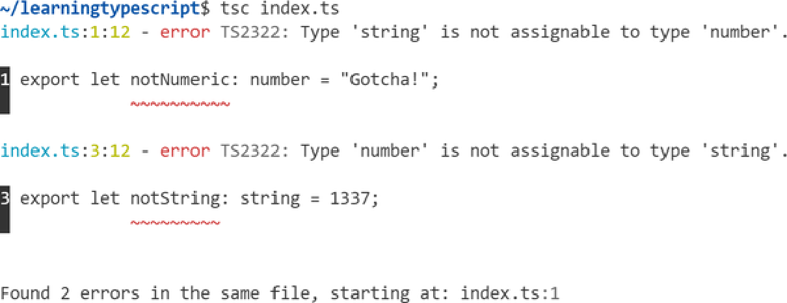
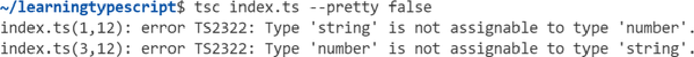

# **Chapter 13. Configuration Options** 


## Table of Contents

- [**Chapter 13. Configuration Options**](#chapter-13-configuration-options)
  - [**tsc Options**](#tsc-options)
    - [**Pretty Mode**](#pretty-mode)
    - [**Watch Mode**](#watch-mode)
  - [**TSConfig Files**](#tsconfig-files)
      - [**NOTE**](#note)
    - [**tsc --init**](#tsc-init)
    - [**CLI Versus Configuration**](#cli-versus-configuration)
      - [**TIP**](#tip)
  - [**File Inclusions**](#file-inclusions)
    - [**include**](#include)
    - [**exclude**](#exclude)
      - [**TIP**](#tip)
  - [**Alternative Extensions**](#alternative-extensions)
    - [**JSX Syntax**](#jsx-syntax)
      - [**jsx**](#jsx)
    - [**resolveJsonModule**](#resolvejsonmodule)
  - [**Emit**](#emit)
    - [**outDir**](#outdir)
    - [**target**](#target)
      - [**TIP**](#tip)
    - [**Emitting Declarations**](#emitting-declarations)
      - [**emitDeclarationOnly**](#emitdeclarationonly)
    - [**Source Maps**](#source-maps)
      - [**sourceMap**](#sourcemap)
      - [**declarationMap**](#declarationmap)
      - [**TIP**](#tip)
    - [**noEmit**](#noemit)
  - [**Type Checking**](#type-checking)
    - [**lib**](#lib)
      - [**TIP**](#tip)
    - [**skipLibCheck**](#skiplibcheck)
    - [**Strict Mode**](#strict-mode)
      - [**WARNING**](#warning)
      - [**noImplicitAny**](#noimplicitany)
      - [**TIP**](#tip)
      - [**strictBindCallApply**](#strictbindcallapply)
      - [**strictFunctionTypes**](#strictfunctiontypes)
      - [**NOTE**](#note)
      - [**strictNullChecks**](#strictnullchecks)
      - [**strictPropertyInitialization**](#strictpropertyinitialization)
      - [**useUnknownInCatchVariables**](#useunknownincatchvariables)
  - [**Modules**](#modules)
    - [**module**](#module)
    - [**moduleResolution**](#moduleresolution)
      - [**NOTE**](#note)
      - [**TIP**](#tip)
    - [**Interoperability with CommonJS**](#interoperability-with-commonjs)
      - [**esModuleInterop**](#esmoduleinterop)
      - [**allowSyntheticDefaultImports**](#allowsyntheticdefaultimports)
    - [**isolatedModules**](#isolatedmodules)
  - [**JavaScript**](#javascript)
      - [**TIP**](#tip)
    - [**allowJs**](#allowjs)
    - [**checkJs**](#checkjs)
      - [**@ts-check**](#ts-check)
    - [**JSDoc Support**](#jsdoc-support)
      - [**TIP**](#tip)
  - [**Configuration Extensions**](#configuration-extensions)
    - [**extends**](#extends)
    - [**Configuration Bases**](#configuration-bases)
      - [**TIP**](#tip)
  - [**Project References**](#project-references)
      - [**TIP**](#tip)
    - [**composite**](#composite)
    - [**references**](#references)
      - [**NOTE**](#note)
    - [**Build Mode**](#build-mode)
      - [**Build-mode options**](#build-mode-options)
  - [**Summary**](#summary)
      - [**TIP**](#tip)


_Compiler options:_ 

_Types and modules and oh my!_ 

_`tsc` your way._ 

TypeScript is highly configurable and made to adapt to all common JavaScript usage patterns. It can work for projects ranging from legacy browser code to the most modern server environments. 

Much of TypeScript’s configurability comes from its cornucopia of over 100 configuration options that can be provided via either: 

- Command-line (CLI) flags passed to `tsc` 
- “TSConfig” TypeScript configuration files 

This chapter is not intended as a full reference for all TypeScript configuration options. Instead, I’d suggest treating this chapter as a tour of the most common options you’ll find yourself using. I’ve included just the ones that tend to be more useful and widely used for most TypeScript project setups. See aka.ms/tsc for a full reference on each of these options and more. 

## **tsc Options** 

Back in Chapter 1, “From JavaScript to TypeScript”, you used `tsc index.ts` to compile an _index.ts_ file. The `tsc` command can take in most of TypeScript’s configuration options as `--` flags. 

For example, to run `tsc` on an _index.ts_ file and skip emitting an _index.js_ file (so, only run type checking), pass the `--noEmit` flag: 

```shell
tsc index.ts --noEmit
```

You can run `tsc --help` to get a list of commonly used CLI flags. The full list of `tsc` configuration options from aka.ms/tsc is viewable with `tsc -- all` . 

### **Pretty Mode** 

The `tsc` CLI has the ability to output in a “pretty” mode: stylized with colors and spacing to make them easier to read. It defaults to pretty mode if it detects that the output terminal supports colorful text. 

Here’s an example of what `tsc` looks like printing two type errors from a file (Figure 13-1). 





_Figure 13-1._ _`tsc` reporting two errors with blue file names, yellow line and column numbers, and red squigglies_ 

If you’d prefer CLI output that is more condensed and/or doesn’t have different colors, you can explicitly provide `--pretty false` to tell TypeScript to use a more terse, uncolored format (Figure 13-2). 





_Figure 13-2._ _`tsc` reporting two errors in plain text_ 

### **Watch Mode** 

My favorite way to use the `tsc` CLI is with its `-w` / `--watch` mode. Instead of exiting once completed, watch mode will keep TypeScript running indefinitely and continuously updates your terminal with a real-time list of all the errors it sees. 

Running in watch mode on a file that contains two errors is shown in Figure 13-3. 


_Figure 13-3._ _`tsc` reporting two errors in watch mode_ 

Figure 13-4 shows `tsc` updating console output to indicate that the file was changed in a way to fix all errors. 


_Figure 13-4._ _`tsc` reporting no errors in watch mode_ 

Watch mode is particularly useful when you’re working on large changes such as refactors across many files. You can use TypeScript’s type errors as a checklist of sorts to see what still needs to be cleaned up. 

## **TSConfig Files** 

Instead of always providing all file names and configuration options to `tsc` , most configuration options may be specified in a _tsconfig.json_ (“TSConfig”) file in a directory. 

The existence of a _tsconfig.json_ indicates that the directory is the root of a TypeScript project. Running `tsc` in a directory will read in any configuration options in that _tsconfig.json_ file. 

You can also pass `-p` / `--project` to `tsc` with a path to a directory containing a _tsconfig.json_ or any file to have `tsc` use that instead: 

```shell
tsc -p path/to/tsconfig.json
```

TSConfig files are generally strongly recommended to be used for TypeScript projects whenever possible. IDEs such as VS Code will respect their configuration when giving you IntelliSense features. 

See aka.ms/tsconfig.json for the full list of configuration options available in TSConfig files. 

#### **NOTE** 

If you don’t set an option in your _tsconfig.json_ , don’t worry that TypeScript’s default setting for it may change and interfere with your project’s compilation settings. This almost never happens and if it did, it would require a major version update to TypeScript and be called out in the release notes. 

### **tsc --init** 

The `tsc` command line includes an `--init` command to create a new _tsconfig.json_ file. That newly created TSConfig file will contain a link to the configuration docs as well as most of the allowed TypeScript configuration options with one-line comments briefly describing their use. Running this command: 

```shell
tsc --init
```

will generate a fully commented _tsconfig.json_ file: 

```json
{

"compilerOptions":{

/* V is it https://aka.ms/tsconfig.json to read more about this file */

// ...

}

}
```

I recommend using `tsc --init` to create your configuration file on your first few TypeScript projects. Its default values are applicable to most projects, and its documentation comments are helpful in understanding them. 

### **CLI Versus Configuration** 

Looking through the TSConfig file created by `tsc --init` , you may notice that configuration options in that file are within a `"compilerOptions"` object. Most options available in both the CLI and in TSConfig files fall into one of two categories: 

- _Compiler_: How each included file is compiled and/or type checked by TypeScript 
- _File_: Which files will or will not have TypeScript run on them 

Other settings that we’ll talk about after those two categories, such as project references, generally are only available in TSConfig files. 

#### **TIP** 

If a setting is provided to the `tsc` CLI, such as a one-off change for a CI or production build, it will generally override any value specified in a TSConfig file. Because IDEs generally read from the _tsconfig.json_ in a directory for TypeScript settings, it’s recommended to put most configuration options in a _tsconfig.json_ file. 

## **File Inclusions** 

By default, `tsc` will run on all nonhidden _.ts_ files (those whose names do not start with a `.` ) in the current directory and any child directories, ignoring hidden directories and directories named _node_modules_ . TypeScript configurations can change that list of files to run on. 

### **include** 

The most common way to include files is with a top-level `"include"` property in a _tsconfig.json_ . It allows an array of strings that describes what directories and/or files to include in TypeScript compilation. 

For example, this configuration file recursively includes all TypeScript source files in a _src/_ directory relative to the _tsconfig.json_ : 

```json
{
"include":["src"]
}
```

Glob wildcards are allowed in `include` strings for more fine-grained control of files to include: 

- matches zero or more characters (excluding directory separators). 

- `?` matches any one character (excluding directory separators). 

- `**/` matches any directory nested to any levels. 

This configuration file allows only _.d.ts_ files nested in a _typings/_ directory and _src/_ files with at least two characters in their name before an extension: 

```json
{
  "include": [
    "typings/**/*.d.ts",
    "src/**/*??.*"
  ]
}
```

For most projects, a simple `include` compiler option such as `["src"]` is generally sufficient. 

### **exclude** 

The `include` list of files for a project sometimes includes files not meant for compilation by TypeScript. TypeScript allows a TSConfig file to omit paths from `include` by specifying them in a top-level `"exclude"` property. Similar to `include` , it allows an array of strings that describes what directories and/or files to exclude from TypeScript compilation. 

The following configuration includes all files in _src/_ except for those within any nested _external/_ directory and a _node_modules_ directory: 

```json
{
"exclude":["**/external", "node_modules"],
"include":["src"]
}
```

By default, `exclude` contains `["node_modules", "bower_components", "jspm_packages"]` to avoid running the TypeScript compiler on compiled third-party library files. 

#### **TIP** 

If you’re writing your own `exclude` list, you typically won’t need to re-add `"bower_components"` or `"jspm_packages"` . Most JavaScript projects that install node modules to a folder within the project only install to `"node_modules"` . 

Keep in mind, `exclude` only acts to remove files from the starting list in `include` . TypeScript will run on any file imported by any included file, even if the imported file is explicitly listed in `exclude` . 

## **Alternative Extensions** 

TypeScript is by default able to read in any file whose extension is _.ts_ . However, some projects require being able to read in files with different extensions, such as JSON modules or JSX syntax for UI libraries such as React. 

### **JSX Syntax** 

JSX syntax like `<Component />` is often used in UI libraries such as Preact and React. JSX syntax is not technically JavaScript. Like TypeScript’s type definitions, it’s an extension to JavaScript syntax that compiles down to regular JavaScript: 

```html
const MyComponent = () => {
// Equivalent to:
//   return React.createElement("div", null, "Hello, world!");
return<div>Hello,world!</div>;
};
```

In order to use JSX syntax in a file, you must do two things: 

- Enable the `"jsx"` compiler option in your configuration options
- Name that file with a _.tsx_ extension 

#### **jsx** 

The value used for the `"jsx"` compiler option determines how TypeScript emits JavaScript code for _.tsx_ files. Projects generally use one of these three values (Table 13-1). 

_Table 13-1. JSX compiler option inputs and outputs_

|**Value**|**Input code**|**Output code**|**Output file extension**|
|---|---|---|---|
|“preserve”|`<div />`|`<div />`|_.jsx_|
|“react”|`<div />`|`React.createElement("div")`|_.js_|
|“react-native”|`<div />`|`<div />`|_.js_|


Values for `jsx` may be provided to the `tsc` CLI and/or in a TSConfig file. 

```shell
tsc --jsx preserve

{
"compilerOptions":{
"jsx":"preserve"
}
}
```

If you’re not directly using TypeScript’s built-in transpiler, which is the case when you’re transpiling code with a separate tool such as Babel, you most likely can use any of the allowed values for `"jsx"` . Most web apps built on modern frameworks such as Next.js or Remix handle React configuration and compiling syntax. If you’re using one of those frameworks you probably won’t have to directly configure TypeScript’s built-in transpiler. 

**Generic arrow functions in .tsx files** 

Chapter 10, “Generics” mentioned that the syntax for generic arrow functions conflicts with JSX syntax. Attempting to write a type argument `<T>` for an arrow function in a _.tsx_ file will give a syntax error for there not being a closing tag for that opening `T` element: 

```typescript
const identity=<T>(input: T) => input;
//               ~~~
// Error: JSX element 'T' has no corresponding closing tag.
```

To work around this syntax ambiguity, you can add an `= unknown` constraint to the type argument. Type arguments default to the `unknown` type so this doesn’t change code behavior at all. It just indicates to TypeScript to read a type argument, not a JSX element: 

```typescript
const identity=<T = unknown>(input: T) => input;  // Ok
```

### **resolveJsonModule** 

TypeScript will allow reading in _.json_ files if the `resolveJsonModule` compiler option is set to `true` . When it is, _.json_ files may be imported from as if they were _.ts_ files exporting an object. TypeScript will infer the typeof that object as if it were a `const` variable. 

For JSON files that contain an object, destructuring imports may be used. This pair of files defines an `"activ is t"` string in an _activ is t.json_ file and imports it into a _usesActiv is t.ts_ file: 

```json
// activ is t.json
{
"activ is t":"Mary Astell"
}
// usesActiv is t.ts
import { activ is t } from "./activ is t.json";
// Logs: "Mary Astell"
console.log(activ is t);
```

Default imports may be used as well if the `esModuleInterop` compiler option—covered later in this chapter—is enabled: 

```typescript
// useActiv is t.ts
import data from "./activ is t.json";
```

For JSON files that contain other literal types, such as arrays or numbers, you’ll have to use the `* as` import syntax. This pair of files defines an array of strings in an _activ is ts.json_ file that is then imported into a _useActiv is ts.ts_ file: 

```javascript
// activ is ts.json
[
"Ida B. Wells",
"Sojourner Truth",
"Tawakkul Karmān"
]
// useActiv is ts.ts
import *as activ is tsfrom"./activ is ts.json";
// Logs: "3 activ is ts"
console.log(`${activ is ts.length} activ is ts`);
```

## **Emit** 

Although the r is e of dedicated compiler tools such as Babel has reduced TypeScript’s role in some projects to solely type checking, many other projects still rely on TypeScript for compiling TypeScript syntax to JavaScript. It’s quite useful for projects to be able to take in a single dependency on `typescript` and use its `tsc` command to output the equivalent JavaScript. 

### **outDir** 

By default, TypeScript places output files alongside their corresponding source files. For example, running `tsc` on a directory containing _fruits/apple.ts_ and _vegetables/zucchini.ts_ would result with output files _fruits/apple.js_ and _vegetables/zucchini.js_ : 

```text
fruits/
  apple.js
  apple.ts
vegetables/
  zucchini.js
  zucchini.ts
```

Sometimes it may be preferable to place output files in a different folder. Many Node projects, for example, put transformed outputs in a _dist_ or _lib_ directory. 

TypeScript’s `outDir` compiler option allows specifying a different root directory for outputs. Output files are kept in the same relative directory structure as input files. 

For example, running `tsc --outDir d is t` on the previous directory would place outputs within a _d is t/_ folder: 

```text
d is t/
  fruits/
    apple.js
  vegetables/
    zucchini.js
fruits/
  apple.ts
vegetables/
  zucchini.ts
```

TypeScript calculates the root directory to place output files into by finding the longest common subpath of all input files (excluding _.d.ts_ declaration files). That means that projects that place all input source files in a single directory will have that directory treated as the root. 

For example, if the above example put all inputs in a _src/_ directory and compiled with `--outDir lib` , _lib/fruits/apple.js_ would be created instead of _lib/src/fruits/apple.js_ : 

```text
lib/
  fruits/
    apple.js
  vegetables/
    zucchini.js
src/
  fruits/
    apple.ts
  vegetables/
    zucchini.ts
```

A `rootDir` compiler option does exist to explicitly specify that root directory, but it’s rarely necessary or used with values other than `.` or `src` . 

### **target** 

TypeScript is able to produce output JavaScript that can run in environments as old as ES3 (circa 1999!). Most environments are able to support syntax features from much newer versions of JavaScript. 

TypeScript includes a `target` compiler option to specify how far back in syntax support JavaScript code needs to be transpiled. Although `target` defaults to `"es3"` for backward compatibility reasons when not specified and `tsc --init` defaults to specifying `"es2016"` , it’s generally adv is able to use the newest JavaScript syntax possible per your target platform(s). Supporting newer JavaScript features in older environments necessitates creating more JavaScript code, which causes slightly larger file sizes and slightly worse runtime performance. 

#### **TIP** 

As of 2022, all releases within the last year of browsers serving > 0.1% of worldwide users support at least all of ECMAScript 2019 and nearly all of ECMAScript 2020–2021, while the LTS-supported versions of Node.js support all of ECMAScript 2021. There’s very little reason not to have a `target` at least as high as `"es2019"` . 

For example, take this TypeScript source containing ES2015 `const` s and ES2020 `??` null is h coalescing: 

```typescript
function defaultNameAndLog(nameMaybe: string | undefined) {
const name = nameMaybe??"anonymous";
console.log("From", nameMaybe, "to", name);
return name;
}
```

With `tsc --target es2020` or newer, both `const` and `??` are supported syntax features, so TypeScript would only need to remove the `: string | undefined` from that snippet: 

```javascript
function defaultNameAndLog(nameMaybe) {
const name = nameMaybe??"anonymous";
console.log("From", nameMaybe, "to", name);
return name;
}
```

With `tsc --target es2015` through `es2019` , the `??` syntax sugar would be compiled down to its equivalent in older versions of JavaScript: 

```javascript
function defaultNameAndLog(nameMaybe) {
const name = nameMaybe !== null&&nameMaybe !== void0
?nameMaybe
:"anonymous";
console.log("From", nameMaybe, "to", name);
return name;
}
```

With `tsc --target es3` or `es5` , the `const` would additionally need to be converted to its equivalent `var` : 

```javascript
function defaultNameAndLog(nameMaybe) {
var name = nameMaybe !== null&&nameMaybe !== void0
?nameMaybe
:"anonymous";
console.log("From", nameMaybe, "to", name);
return name;
}
```

Specifying the `target` compiler option to a value that matches the oldest environment your code runs will ensure code is emitted as modern, terse syntax that can still run without syntax errors. 

### **Emitting Declarations** 

Chapter 11, “Declaration Files” covered how _.d.ts_ declaration files may be distributed in a package to indicate code types to consumers. Most packages use TypeScript’s `declaration` compiler option to emit _.d.ts_ output files from source files: 

```shell
tsc --declaration

{
"compilerOptions":{
"declaration":true
}
}
```

_.d.ts_ output files are emitted under the same output rules as _.js_ files, including respecting `outDir` . 

For example, running `tsc --declaration` on a directory containing _fruits/apple.ts_ and _vegetables/zucchini.ts_ would result in output declaration files _fruits/apple.d.ts_ and _vegetables/zucchini.d.ts_ alongside output _.js_ files: 

```text
fruits/
  apple.d.ts
  apple.js
  apple.ts
vegetables/
  zucchini.d.ts
  zucchini.js
  zucchini.ts
```

#### **emitDeclarationOnly** 

An `emitDeclarationOnly` compiler option exists, as a specialized addition to the `declaration` compiler option, that directs TypeScript to only emit declaration files: no _.js_ / _.jsx_ files at all. This is useful for projects that use an external tool to generate output JavaScript but still want to use TypeScript to generate output definition files: 

```shell
tsc --emitDeclarationOnly

{
"compilerOptions":{
"emitDeclarationOnly":true
}
}
```

If `emitDeclarationOnly` is enabled, either `declaration` or the `composite` compiler option covered later in this chapter must be enabled. 

For example, running `tsc --declaration --emitDeclarationOnly` on a directory containing _fruits/apple.ts_ and _vegetables/zucchini.ts_ would result with output declaration files _fruits/apple.d.ts_ and _vegetables/zucchini.d.ts_ without any output _.js_ files: 

```text
fruits/
  apple.d.ts
  apple.ts
vegetables/
  zucchini.d.ts
  zucchini.ts
```

### **Source Maps** 

Source maps are descriptions of how the contents of output files match up to original source files. They allow developer tools such as debuggers to d is play original source code when navigating through the output file. They’re particularly useful for visual debuggers such as those used in browser developer tools and IDEs to let you see original source file contents while debugging. TypeScript includes the ability to output source maps alongside output files. 

#### **sourceMap** 

TypeScript’s `sourceMap` compiler option enables outputting _.js.map_ or _.jsx.map_ sourcemaps alongside _.js_ or _.jsx_ output files. Sourcemap files are otherw is e given the same name as their corresponding output JavaScript file and placed in the same directory. 

For example, running `tsc --sourceMap` on a directory containing _fruits/apple.ts_ and _vegetables/zucchini.ts_ would result with output sourcemap files _fruits/apple.js.map_ and _vegetables/zucchini.js.map_ alongside output _.js_ files: 

```text
fruits/
  apple.js
  apple.js.map
  apple.ts
vegetables/
  zucchini.js
  zucchini.js.map
  zucchini.ts
```

#### **declarationMap** 

TypeScript is also able to generate source maps for _.d.ts_ declaration files. Its `declarationMap` compiler option directs it to generate a _.d.ts.map_ source map for each _.d.ts_ that maps back to the original source file. Declaration maps enable IDEs such as VS Code to go to the original source file when using editor features such as Go to Definition. 

#### **TIP** 

`declarationMap` is particularly useful when working with project references, covered toward the end of this chapter. 

For example, running `tsc --declaration --declarationMap` on a directory containing _fruits/apple.ts_ and _vegetables/zucchini.ts_ would result in output declaration sourcemap files _fruits/apple.d.ts.map_ and _vegetables/zucchini.d.ts.map_ alongside output _.d.ts_ and _.js_ files: 

```text
fruits/
  apple.d.ts
  apple.d.ts.map
  apple.js
  apple.ts
vegetables/
  zucchini.d.ts
  zucchini.d.ts.map
  zucchini.js
  zucchini.ts
```

### **noEmit** 

For projects that completely rely on other tools to compile source files to output JavaScript, TypeScript can be told to skip emitting files altogether. Enabling the `noEmit` compiler option directs TypeScript to act purely as a type checker. 

Running `tsc --noEmit` on any of the previous examples would result in no new files created. TypeScript would only report any syntax or type errors it finds. 

## **Type Checking** 

Most of TypeScript’s configuration options control its type checker. You can configure it to be gentle and forgiving, only emitting type-checking complaints when it’s completely certain of an error, or harsh and strict, requiring nearly all code be well typed. 

### **lib** 

To start, which global APIs TypeScript assumes to be present in the runtime environment is configurable with the `lib` compiler option. It takes in an array of strings that defaults to your `target` compiler option, as well as `dom` to indicate including browser types. 

Most of the time, the only reason to customize `lib` would be to remove the `dom` inclusion for a project that doesn’t run in the browser: 

```shell
tsc --lib es2020

{
"compilerOptions":{
"lib":["es2020"]
}
}
```

Alternately, for a project that uses polyfills to support newer JavaScript APIs, `lib` can include `dom` and any ECMAScript version: 

```shell
tsc --lib dom,es2021

{
"compilerOptions":{
"lib":["dom","es2021"]
}
}
```

Be wary of modifying `lib` without providing all the right runtime polyfills. A project with a `lib` set to `"es2021"` running on a platform that only supports up through ES2020 might have no type-checking errors but still experience runtime errors attempting to use APIs defined in ES2021 or later, such as `String.replaceAll` : 

```javascript
const value = "a b c";
value.replaceAll(" ", ", ");
// Uncaught TypeError: value.replaceAll is not a function
```

#### **TIP** 

Think of the `lib` compiler option as indicating what built-in language APIs are available, whereas the `target` compiler option indicates what syntax features exist. 

### **skipLibCheck** 

TypeScript provides a `skipLibCheck` compiler option that indicates to skip type checking in declaration files not explicitly included in your source code. This can be useful for applications that rely on many dependencies that may rely on different, conflicting definitions of shared libraries: 

```json
tsc --skipLibCheck
{
"compilerOptions":{

"skipLibCheck":true
}
}
```

`skipLibCheck` speeds up TypeScript performance by allowing it to skip some type checking. For this reason, it is generally a good idea to enable it on most projects. 

### **Strict Mode** 

Most of TypeScript’s type-checking compiler options are grouped into what TypeScript refers to as _strict mode_ . Each strictness compiler option defaults to `false` , and when enabled, directs the type checker to turn on some additional checks. 

I’ll cover the most commonly used strict options in alphabetical order later in this chapter. From those options, `noImplicitAny` and `strictNullChecks` are particularly useful and impactful in enforcing typesafe code. 

You can enable all strict mode checks by enabling the `strict` compiler option: 

```shell
tsc --strict

{
"compilerOptions":{
"strict":true
}
}
```

If you want to enable all strict mode checks except for certain ones, you can both enable `strict` and explicitly d is able certain checks. For example, this configuration enables all strict modes except for `noImplicitAny` : 

```json
tsc --strict --noImplicitAny false
{
"compilerOptions":{

"noImplicitAny":false,
"strict":true
}
}
```

#### **WARNING** 

Future versions of TypeScript may introduce new strict type-checking compiler options under `strict` . Using `strict` may therefore cause new type-checking complaints when you update TypeScript versions. You can always opt out of specific settings in your TSConfig. 

#### **noImplicitAny** 

If TypeScript cannot infer the typeof a parameter or property, then it will fall back to assuming the `any` type. It is generally best practice to not allow these implicit `any` types in code as the `any` type is allowed to bypass much of TypeScript’s type checking. 

The `noImplicitAny` compiler option directs TypeScript to issue a typechecking complaint when it has to fall back to an implicit `any` . 

For example, writing the following function parameter without a type declaration would cause a type error under `noImplicitAny` : 

```typescript
const logMessage= (message) => {
//                ~~~~~~~
// Error: Parameter 'message' implicitly has an 'any' type.
console.log(`Message: ${message}!`);
};
```

Most of the time, a `noImplicitAny` complaint can be resolved either by adding a type annotation on the complaining location: 

```typescript
const logMessage= (message: string) => {  // Ok
console.log(`Message: ${message}!`);
}
```

Or, in the case of function parameters, putting the parent function in a location that indicates the typeof the function: 

```typescript
type LogsMessage= (message: string) => void;

const logMessage: LogsMessage= (message) => {  // Ok
console.log(`Message: ${message}!`);
}
```

#### **TIP** 

`noImplicitAny` is an excellent flag for ensuring type safety across a project. I highly recommend striving to turn it on in projects written completely in TypeScript. However, if a project is still transitioning from JavaScript to TypeScript, it may be easier to finish converting all files to TypeScript first. 

#### **strictBindCallApply** 

When TypeScript was first released, it didn’t have rich enough type system features to be able to represent the built-in `Function.apply` , `Function.bind` , or `Function.call` function utilities. Those functions by default had to take in `any` for their list of arguments. That’s not very type safe! 

As an example, without `strictBindCallApply` , the following variations on `getLength` all include `any` in their types: 

```typescript
function getLength(text: string, trim?: boolean) {
return trim?text.trim().length : text.length;
}
// Function type: (thisArg: Function, argArray?: any) => any
getLength.apply;
// Returned type: any
getLength.bind(undefined, "abc123");
// Returned type: any
getLength.call(undefined, "abc123", true);
```

Now that TypeScript’s type system features are powerful enough to represent those functions’ generic rest arguments, TypeScript allows opting in to using more restrictive types for the functions. 

Enabling `strictBindCallApply` enables much more prec is e types for the `getLength` variations: 

```typescript
function getLength(text: string, trim?: boolean) {
return trim?text.trim().length : text;
}
// Function type:
// (thisArg: typeof getLength, args: [text: string, trim?: boolean]) =>
number;
getLength.apply;
// Returned type: (trim?: boolean) => number
getLength.bind(undefined, "abc123");
// Returned type: number
getLength.call(undefined, "abc123", true);
```

TypeScript best practice is to enable `strictBindCallApply` . Its improved type checking for built-in function utilities helps improve type safety for projects that utilize them. 

#### **strictFunctionTypes** 

The `strictFunctionTypes` compiler option causes function parameter types to be checked slightly more strictly. A function type is no longer considered assignable to another function type if its parameters are subtypes of that other type’s parameters. 

As a concrete example, the `checkOnNumber` function here takes in a function that should be able to receive a `number | string` , but is provided with a `stringContainsA` function that expects to take in a parameter only of type `string` . TypeScript’s default type checking would allow it—and the program would crash from trying to call `.match()` on a `number` : 

```typescript
function checkOnNumber(containsA: (input: number | string) => boolean) {
return containsA(1337);
}

function stringContainsA(input: string) {
return!!input.match(/a/i);

}

checkOnNumber(stringContainsA);
```

Under `strictFunctionTypes` , `checkOnNumber(stringContainsA)` would cause a type-checking error: 

```typescript
// Argument of type '(input: string) => boolean' is not assignable
// to parameter of type '(input: string | number) => boolean'.
//   Types of parameters 'input' and 'input' are incompatible.
//     Type 'string | number' is not assignable to type 'string'.
//       Type 'number' is not assignable to type 'string'.
checkOnNumber(stringContainsA);
```

#### **NOTE** 

In technical terms, function parameters switch from being _bivariant_ to _contravariant_ . You can read more about the difference in the TypeScript 2.6 release notes. 

#### **strictNullChecks** 

Back in Chapter 3, “Unions and Literals”, I discussed the billion-dollar mistake of languages: allowing empty types such as `null` and `undefined` to be assignable to nonempty types. D is abling TypeScript’s `strictNullChecks` flag roughly adds `null | undefined` to every type in your code, thereby allowing any variable to receive `null` or `undefined` . 

This code snippet would cause a type error for assigning `null` to a `string` typed value only when `strictNullChecks` is enabled: 

```typescript
let value: string;

value = "abc123";  // Always ok

value = null;
// With strictNullChecks enabled:
// Error: Type 'null' is not assignable to type 'string'.
```

TypeScript best practice is to enable `strictNullChecks` . Doing so helps prevent crashes and eliminates the billion-dollar mistake. Refer to Chapter 3, “Unions and Literals” for more details. 

#### **strictPropertyInitialization** 

Back in Chapter 8, “Classes”, I discussed strict initialization checking in classes: making sure that each property on a class is definitely assigned in the class constructor. TypeScript’s `strictPropertyInitialization` flag causes a type error to be issued on class properties that have no initializer and are not definitely assigned in the constructor. 

TypeScript best practice is generally to enable `strictPropertyInitialization` . Doing so helps prevent crashes from mistakes in class initialization logic. 

Refer to Chapter 8, “Classes” for more details. 

#### **useUnknownInCatchVariables** 

Error handling in any language is an inherently unsafe concept. Any function can in theory throw any number of errors from edge cases such as reading properties on `undefined` or user-written `throw` statements. In fact, there’s no guarantee a thrown error is even an instance of the `Error` class: code can always `throw "something-else"` . 

As a result, TypeScript’s default behavior for errors is to give them type `any` , as they could be anything. That allows flexibility in error handling at the cost of relying on the not-very-type-safe `any` by default. 

The following snippet’s `error` is typed `any` because there’s no way for TypeScript to know what all the possible errors thrown by `someExternalFunction()` could be: 

```typescript
try {
someExternalFunction();
} catch (error) {
error;  // Default type: any
}
```

As with most `any` uses, it would be more technically sound—at the cost of often necessitating explicit type assertions or narrowing—to treat errors as `unknown` instead. Catch clause errors are allowed to be annotated as the `any` or `unknown` types. 

This snippet correction adds an explicit `: unknown` to `error` to switch it to the `unknown` type: 

```typescript
try {
someExternalFunction();
} catch (error: unknown) {
error;  // Type: unknown
}
```

The strict area flag `useUnknownInCatchVariables` changes TypeScript’s default catch clause error type to `unknown` . With `useUnknownInCatchVariables` enabled, both snippets would have typeof `error` set to be `unknown` . 

TypeScript best practice is generally to enable `useUnknownInCatchVariables` , as it’s not always safe to assume errors will be any particular type. 

## **Modules** 

JavaScript’s various systems for exporting and importing module contents —AMD, CommonJS, ECMAScript, and so on—are one of the most convoluted module systems in any modern programming language. JavaScript is relatively unusual in that the way files import each other’s contents is often driven by user-written frameworks such as Webpack. TypeScript does its best to provide configuration options that represent most reasonable user-land module configurations. 

Most new TypeScript projects are written with the standardized ECMAScript modules syntax. To recap, here is how ECMAScript modules import a value ( `value` ) from another module `("my-example-lib")` and export their own value ( `logValue` ): 

```typescript
import { value } from "my-example-lib";

export const logValue = () => console.log(value);
```

### **module** 

TypeScript provides a `module` compiler option to direct which module system transpiled code will use. When writing source code with ECMAScript modules, TypeScript may transpile the `export` and `import` statements to a different module system based on the `module` value. 

For example, directing that a project written in ECMAScript be output as CommonJS modules in either the command line: 

```shell
tsc --module commonjs
```

or in a TSConfig: 

```json
{
"compilerOptions":{
"module":"commonjs"
}
}
```

The previous code snippet would roughly be output as: 

```javascript
const my_example_lib = require("my-example-lib");
export s.logValue= () => console.log(my_example_lib.value);
```

If your `target` compiler option is `"es3"` or `"es5"` , `module` ’s default value will be `"commonjs"` . Otherw is e, `module` will default to `"es2015"` to specify outputting ECMAScript modules. 

### **moduleResolution** 

_Module resolution_ is the process by which the imported path in an import is mapped to a module. TypeScript provides a `moduleResolution` option that you can use to specify the logic for that process. You’ll typically want to provide it one of two logic strategies: 

- `node` : The behavior used by CommonJS resolvers such as traditional Node.js 

- `nodenext` : Aligning to the behavior specified for ECMAScript modules 

The two strategies are similar. Most projects could use either of them and not notice a difference. You can read more on the intricacies behind the scenes of module resolution on https://www.typescriptlang.org/docs/handbook/module-resolution.html . 

#### **NOTE** 

`moduleResolution` does not change how TypeScript emits code at all. It’s only used to describe the runtime environment your code is meant to be run in. 

Both the following CLI snippet and JSON file snippet would work to specify the `moduleResolution` compiler option: 

```shell
tsc --moduleResolution nodenext

{
"compilerOptions":{
"moduleResolution":"nodenext"
}
}
```

#### **TIP** 

For backward compatibility reasons, TypeScript keeps the default `moduleResolution` value to a `classic` value that was used for projects years ago. You almost certainly do not want the `classic` strategy in any modern project. 

### **Interoperability with CommonJS** 

When working with JavaScript modules, there is a difference between the “default” export of a module and its “namespace” output. The _default_ export of a module is the `.default` property on its exported object. The _namespace_ export of a module is the exported object itself. 

Table 13-2 recaps the differences between default and namespace exports and imports. 

_T a b l_ 

_e 1_ 

_3_ 

_2_ 

_. C_ 

_o_ 

_m_ 

_m_ 

_o_ 

_n J S_ 

_a_ 

_n_ 

_d E C M A S_ 

_c_ 

_r_ 

_i_ 

_p t_ 

_m o d_ 

_u l e e_ 

_x p_ 

_o_ 

_r t a n d i_ 

_m_ 

_p_ 

_o_ 

_r_ 

_t f o_ 

_r_ 

_m_ 

_s_ 

|**Area of syntax**|**CommonJS**<br>**ECMAScript module**|**s**|
|---|---|---|
|Default export|`module.exports.default = value;`|`export default value;`|
|Default import|`const { default: value } = require`<br>`("...");`|`import value from "...";`|
|Namespace export|`module.exports = value;`|Not supported|
|Namespace import|`const value = require("...");`|`import * as value from`<br>`"...";`|


TypeScript’s type system builds its understanding of file imports and exports in terms of ECMAScript modules. If your project depends on npm packages as most do, however, it’s likely some of those dependencies are still publ is hed as CommonJS modules. Furthermore, although some packages that comply with ECMAScript modules rules avoid including a default export, many developers prefer the more succinct default-style imports over namespace-style imports. TypeScript includes a few compiler options that improve interoperability between module formats. 

#### **esModuleInterop** 

The `esModuleInterop` configuration option adds a small amount of logic to JavaScript code emitted by TypeScript when `module` is not an ECMAScript module format such as `"es2015"` or `"esnext"` . That logic allows ECMAScript modules to import from modules even if they don’t happen to adhere to ECMAScript modules’ rules around default or namespace imports. 

One common reason to enable `esModuleInterop` is for packages such as `"react"` that do not ship a default export. If a module attempts to use a default-style import from the `"react"` package, TypeScript would report a type error without `esModuleInterop` enabled: 

```typescript
import React from "react";
//     ~~~~~
// Module '"file:///node_modules/@types/react/index"' can
// only be default-imported using the 'esModuleInterop' flag.
```

Note that `esModuleInterop` only directly changes how emitted JavaScript code works with imports. The following `allowSyntheticDefaultImports` configuration option is what informs the type system about import interoperability. 

#### **allowSyntheticDefaultImports** 

The `allowSyntheticDefaultImports` compiler option informs the type system that ECMAScript modules may default import from files that are otherw is e incompatible CommonJS namespace exports. 

It defaults to `true` only if either of the following is true: 

- `module` is `"system"` (an older, rarely used module format not covered in this book). 

`esModuleInterop` is `true` and `module` is not an ECMAScript modules format such as `"es2015"` or `"esnext"` . 

In other words, if `esModuleInterop` is `true` but `module` is `"esnext"` , TypeScript will assume output compiled JavaScript code is not using import interoperability helpers. It would report a type error for a default import from packages such as `"react"` : 

```typescript
import React from "react";

// Module '"file:///node_modules/@types/react/index"' can only be
// default-imported using the 'allowSyntheticDefaultImports' flag`.
```

### **isolatedModules** 

External transpilers such as Babel that only operate on one file at a time cannot use type system information to emit JavaScript. As a result, TypeScript syntax features that rely on type information to emit JavaScript aren’t generally supported in those transpilers. Enabling the `isolatedModules` compiler tells TypeScript to report an error on any instance of a syntax that is likely to cause issues in those transpilers: 

- Const enums, covered in Chapter 14, “Syntax Extensions” 
- Script (nonmodule) files 
- Standalone type exports, covered in Chapter 14, “Syntax Extensions” 

I generally recommend enabling `isolatedModules` if your project uses a tool other than TypeScript to transpile to JavaScript. 

## **JavaScript** 

While TypeScript is lovely and I hope you want to always write code in it, you don’t have to write all your source files in TypeScript. Although TypeScript by default ignores files with a _.js_ or _.jsx_ extension, using its `allowJs` and/or `checkJs` compiler options will allow it to read from, compile, and even—in a limited capacity—type check JavaScript files. 

#### **TIP** 

A common strategy for converting an existing JavaScript project to TypeScript is to start off with only a few files initially converted to TypeScript. More files may be added over time until there are no more JavaScript files left. You don’t have to go all-in on TypeScript until you’re ready to! 

### **allowJs** 

The `allowJs` compiler option allows constructs declared in JavaScript files to factor into type checking TypeScript files When combined with the `jsx` compiler option, _.jsx_ files are also allowed. 

For example, take this _index.ts_ importing a `value` declared in a _values.js_ file: 

```typescript
// index.ts
import { value } from "./values";

console.log(`Quote: '${value.toUpperCase()}'`);

// values.js
export const value = "We cannot succeed when half of us are held back.";
```

Without `allowJs` enabled, the `import` statement would not have a known type. It would be implicitly `any` by default or trigger a type error like “Could not find a declaration file for module `"./values"` .” 

`allowJs` also adds JavaScript files to the list of files compiled to the ECMAScript target and emitted as JavaScript. Source maps and declaration files will be produced as well if the options to do so are enabled: 

```shell
tsc --allowJs

{
"compilerOptions"
"allowJs":true
}
}

"compilerOptions":{
```

With `allowJs` enabled, the imported `value` would be type `string` . No type errors would be reported. 

### **checkJs** 

TypeScript can do more than just factor JavaScript files into type checking TypeScript files: it can type check JavaScript files too. The `checkJs` compiler option serves two purposes: 

- Defaulting `allowJs` to `true` if it wasn’t already 
- Enabling the type checker on _.js_ and _.jsx_ files 

Enabling `checkJs` will make TypeScript treat JavaScript files as if they were TypeScript files that don’t have any TypeScript-specific syntax. Type mismatches, m is spelled variable names, and so on will all cause type errors as they normally would in a TypeScript file: 

```shell
tsc --checkJs

{
"compilerOptions":{
"checkJs":true
}
}
```

With `checkJs` enabled, this JavaScript file would cause a type-checking complaint for an incorrect variable name: 

```javascript
// index.js

let myQuote = "Each person must live their life as a model for others.";

console.log(quote);
//          ~~~~~
// Error: Cannot find name 'quote'. Did you mean 'myQuote'?
```

Without `checkJs` enabled, TypeScript would not have reported a type error for that likely bug. 

#### **@ts-check** 

Alternately, `checkJs` can be enabled on a file-by-file basis by including a `// @ts-check` comment on top of the file. Doing so enables the `checkJs` option for just that JavaScript file: 

```typescript
// index.js
// @ts-check
let myQuote = "Each person must live their life as a model for others.";

console.log(quote);
//          ~~~~~~~
// Error: Cannot find name 'quote'. Did you mean 'myQuote'?
```

### **JSDoc Support** 

Because JavaScript doesn’t have TypeScript’s rich type syntax, the types of values declared in JavaScript files are often not as prec is e as those declared in TypeScript files. For example, while TypeScript can infer the value of an object declared as a variable in a JavaScript file, there’s no native JavaScript way to declare in that file that the value adheres to any particular interface. 

I mentioned back in Chapter 1, “From JavaScript to TypeScript” that the JSDoc community standard provides some ways to describe types using comments. When `allowJs` and/or `checkJs` are enabled, TypeScript will recognize any JSDoc definitions in code. 

For example, this snippet declares in JSDoc that the `sentenceCase` function takes in a `string` . TypeScript can then infer that it returns a `string` . With `checkJs` enabled, TypeScript would know to report a type error for passing it a `string[]` later: 

```typescript
// index.js
/**
 * @param {string} text
 */
function sentenceCase(text) {
return`${text[0].toUpperCase()}${text.slice(1)}.`;
}
sentenceCase("hello world"); // Ok
sentenceCase(["hello", "world"]);
//           ~~~~~~~~~~~~~~~~~~
// Error: Argument of type 'string[]' is not
// assignable to parameter of type 'string'.
```

TypeScript’s JSDoc support is useful for incrementally adding type checking for projects that don’t have the time or developer familiarity to convert to TypeScript. 

#### **TIP** 

The full list of supported JSDoc syntax is available on _https://www.typescriptlang.org/docs/handbook/jsdoc-supported-types.html_ . 

## **Configuration Extensions** 

As you write more and more TypeScript projects, you may find yourself writing the same project settings repeatedly. Although TypeScript doesn’t allow configuration files to be written in JavaScript and use `import` or `require` , it does offer a mechan is m for a TSConfig file to opt into “extending,” or copying in configuration values, from another configuration file. 

### **extends** 

A TSConfig may extend from another TSConfig with the `extends` configuration option. `extends` takes in a path to another TSConfig file and indicates that all settings from that file should be copied over. It behaves similarly to the `extends` keyword on classes: any option declared on the derived, or child, configuration will override any option of the same name on the base, or parent, configuration. 

For example, many repositories that have multiple TSConfigs, such as monorepos containing multiple _packages/*_ directories, by convention create a _tsconfig.base.json_ file for _tsconfig.json_ files to extend from: 

```json
// tsconfig.base.json
{
"compilerOptions":{
"strict":true
}
}
// packages/core/tsconfig.json
{
"extends":"../../tsconfig.base.json",
"includes":["src"]
}
```

Note that `compilerOptions` are factored in recursively. Each compiler option from a base TSConfig will copy over to a derived TSConfig unless the derived TSConfig overrides that specific option. 

If the previous example were to add a TSConfig that adds the `allowJs` option, that new derived TSConfig would still have `compilerOptions.strict` set to `true` : 

```json
// packages/js/tsconfig.json
{
"extends":"../../tsconfig.base.json",
"compilerOptions":{
"allowJs":true
},
"includes":["src"]
}
```

**Extending modules** 

The `extends` property may point to either kind of JavaScript import:

- _Absolute_: Starting with `@` or an alphabetical letter 
- _Relative_: A local file path starting with `.` 

When an `extends` value is an absolute path, it indicates to extend the TSConfig from an npm module. TypeScript will use the normal Node module resolution system to find a package matching the name. If that package’s `package.json` contains a `"tsconfig"` field containing a relative path string, the TSConfig file at that path will be used. Otherw is e, the package’s _tsconfig.json_ file will be used. 

Many organizations use npm packages to standardize TypeScript compiler options across repositories and/or within monorepos. The following TSConfig files are what you might set up for a monorepo in a `@my-org` organization. `packages/js` needs to specify the `allowJs` compiler option, while `packages/ts` does not change any compiler options: 

```json
// packages/tsconfig.json
{
"compilerOptions":{
"strict":true
}
}
// packages/js/tsconfig.json
{
"extends":"@my-org/tsconfig",
"compilerOptions":{
"allowJs":true
},
"includes":["src"]
}

// packages/ts/tsconfig.json
{

"extends":"@my-org/tsconfig",
"includes":["src"]
}
```

### **Configuration Bases** 

Instead of creating your own configuration from scratch or the `--init` suggestions, you can start with a premade “base” TSConfig file tailored to a particular runtime environment. These premade configuration bases are available on the npm package reg is try under `@tsconfig/` , such as `@tsconfig/recommended` or `@tsconfig/node16` . 

For example, to install the recommended TSConfig base for `deno` : 

```shell
npm install --save-dev @tsconfig/deno
# or
yarn add --dev @tsconfig/deno
```

Once a configuration base package is installed, it can be referenced like any other npm package configuration extension: 

```json
{
"extends":"@tsconfig/deno/tsconfig.json"
}
```

The full list of TSConfig bases is documented on _https://github.com/tsconfig/bases_ . 

#### **TIP** 

It is generally a good idea to know what TypeScript configuration options your file is using, even if you aren’t changing them yourself. 

## **Project References** 

Each of the TypeScript configuration files I’ve shown so far have assumed they manage all the source files of a project. It can be useful in larger projects to use different configuration files for different areas of a project. TypeScript allows defining a system of “project references” where multiple projects can be built together. Setting up project references is a little more work than using a single TSConfig file but comes with several key benefits: 

- You can specify different compiler options for certain areas of code. 

- TypeScript will be able to cache build outputs for individual projects, often resulting in significantly faster build times for large projects. 

- Project references enforce a “dependency tree” (only allowing certain projects to import files from certain other projects), which can help structure discrete areas of code. 

#### **TIP** 

Project references are generally used in larger projects that have multiple d is tinct areas of code, such as monorepos and modular component systems. You probably don’t want to use them for small projects that don’t have dozens or more files. 

The following three sections show how to build up project settings to enable project references: 

- `composite` mode on a TSConfig enforces that it works in ways suitable for multi-TSConfig build modes. 

- `references` in a TSConfig indicate which composite TSConfigs it relies on. 

- Build mode uses composite TSConfig references to orchestrate building their files. 

### **composite** 

TypeScript allows a project to opt into the `composite` configuration option to indicate that its file system inputs and outputs obey constraints that make it easier for build tools to determine whether its build outputs are up-to-date compared to its build inputs. When `composite` is `true` : 

- The rootDir setting, if not already explicitly set, defaults to the directory containing the TSConfig file. 

- All implementation files must be matched by an include pattern or listed in the `files` array. 

`declaration` must be turned on. 

This configuration snippet matches all conditions for enabling `composite` mode in a `core/` directory: 

```json
// core/tsconfig.json
{

"compilerOptions":{

"declaration":true
},

"composite":true
}
```

These changes help TypeScript enforce that all input files to the project create a matching _.d.ts_ file. `composite` is generally most useful in combination with the following `references` configuration option. 

### **references** 

A TypeScript project can indicate it relies on the outputs generated by a composite TypeScript project with a `references` setting in its TSConfig. Importing modules from a referenced project will be seen in the type system as importing from its output _.d.ts_ declaration file(s). 

This configuration snippet sets up a _shell/_ directory to reference a _core/_ directory as its inputs: 

```json
// shell/tsconfig.json
{
"references":[
{"path":"../core"}

]
}
```

#### **NOTE** 

The `references` configuration option will not be copied from base TSConfigs to derived TSConfigs via `extends` . 

`references` is generally most useful in combination with the following build mode. 

### **Build Mode** 

Once an area of code has been set up to use project references, it will be possible to use `tsc` in its alternate “build” mode via the `-b` / `--b` CLI flag. Build mode enhances `tsc` into something of a project build coordinator. It lets `tsc` rebuild only the projects that have been changed since the last build, based on when their contents and their file outputs were last generated. 

More prec is ely, TypeScript’s build mode will do the following when given a TSConfig: 

1. Find that TSConfig’s referenced projects. 

2. Detect if they are up-to-date. 

3. Build out-of-date projects in the correct order. 

4. Build the provided TSConfig if it or any of its dependencies have changed. 

The ability of TypeScript’s build mode to skip rebuilding up-to-date projects can significantly improve build performance. 

**Coordinator configurations** 

A common handy pattern for setting up TypeScript project references in a repository is to set up a root-level `tsconfig.json` with an empty `files` array and references to all the project references in the repository. That root TSConfig won’t direct TypeScript to build any files itself. Instead it will act purely to tell TypeScript to build referenced projects as needed. 

This `tsconfig.json` indicates to build the `packages/core` and `packages/shell` projects in a repository: 

```json
// tsconfig.json
{
"files":[],
"references":[
{"path":"./packages/core"},
{"path":"./packages/shell"}
]
}
```

I personally like to standardize having a script in my `package.json` named `build` or `compile` that calls to `tsc -b` as a shortcut: 

```json
// package.json
{
"scripts":{
"build":"tsc -b"
}
}
```

#### **Build-mode options** 

Build mode supports a few build-specific CLI options: 

- `--clean` : deletes the outputs of the specified projects (may be combined with `--dry` ) 

- `--dry` : shows what would be done but doesn’t actually build anything 

- `--force` : acts as if all projects are out of date 

- `-w` / `--watch` : similar to the typical TypeScript watch mode 

Because build mode supports watch mode, running a command like `tsc -b -w` can be a fast way to get an up-to-date listing of all compiler errors in a large project. 

## **Summary** 

In this chapter, you went over many of the important configuration options provided by TypeScript: 

- Using `tsc` , including its pretty and watch modes 

- Using TSConfig files, including creating one with `tsc --init` 

- Changing which files will be included by the TypeScript compiler 

- Allowing JSX syntax in _.tsx_ files and/or JSON syntax in _.json_ files 

- Changing the directory, ECMAScript version target, declaration file, and/or source map outputs with files 

- Changing the built-in library types used in compilation 

- Strict mode and useful strict flags such as `noImplicitAny` and `strictNullChecks` 

- Supporting different module systems and changing module resolution 

- Allowing including JavaScript files, and opting into type checking those files 

- Using `extends` to share configuration options between files 

- Using project references and build mode to orchestrate multiTSConfig builds 

#### **TIP** 

Now that you’ve finished reading this chapter, practice what you’ve learned on _https://learningtypescript.com/configuration-options_ . 

_What is a disciplinarian’s favorite TypeScript compiler option?_ 

_`strict` ._ 

