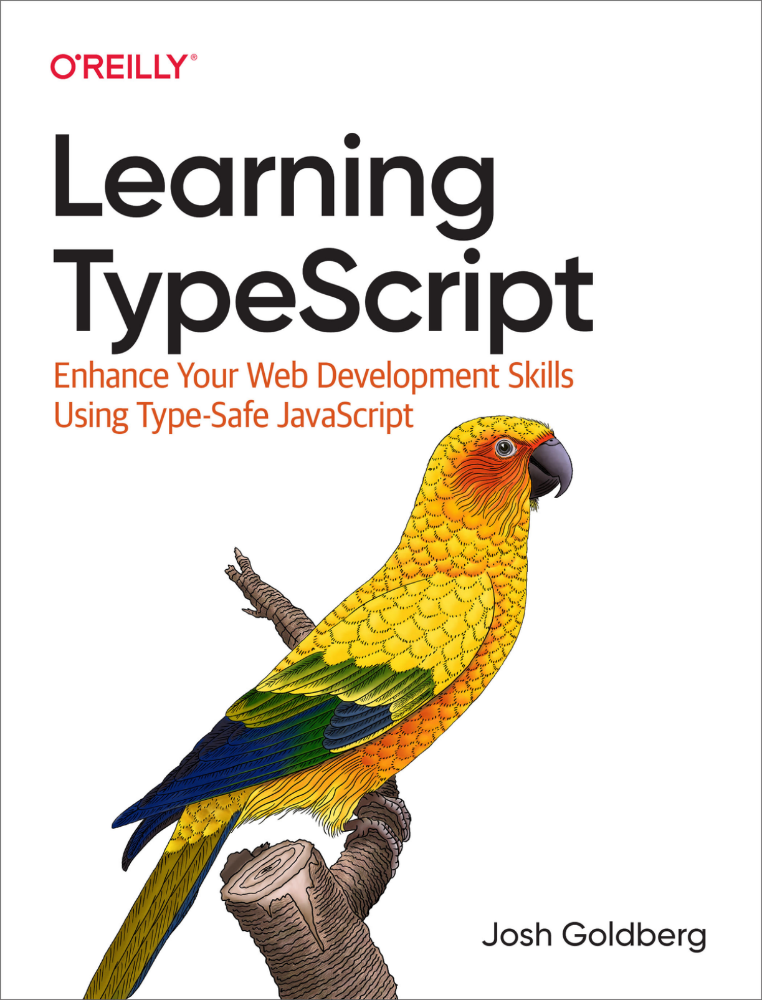

### **Lời khen ngợi dành cho** **_Learning TypeScript_**

_Nếu bạn từng cảm thấy ức chế trước những đường gợn sóng màu đỏ báo lỗi trong code của mình, hãy đọc Learning TypeScript. Goldberg đã khéo léo đặt mọi thứ vào đúng ngữ cảnh thực tế, cho chúng ta thấy rằng TypeScript chưa bao giờ là một sự gò bó, mà là một tài sản vô giá._

—Stefan Baumgartner, kiến trúc sư sản phẩm cao cấp, Dynatrace; người sáng lập, oida.dev

_Josh đưa các khái niệm quan trọng nhất của TypeScript vào vị trí trung tâm và giải thích chúng bằng các ví dụ trực quan cùng sự hóm hỉnh nhẹ nhàng. Một cuốn sách phải đọc đối với bất kỳ lập trình viên JavaScript nào muốn viết TypeScript chuyên nghiệp._

—Andrew Branch, kỹ sư phần mềm phụ trách TypeScript, Microsoft

_Learning TypeScript là một tài liệu tuyệt vời cho những lập trình viên đã từng viết code đôi chút nhưng còn ngần ngại trước các ngôn ngữ định kiểu tĩnh (typed languages). Cuốn sách đi sâu hơn sổ tay TypeScript Handbook một bậc, mang lại cho bạn sự tự tin khi áp dụng TypeScript vào các dự án thực tế của chính mình._

—Boris Cherny, kỹ sư phần mềm, Meta; tác giả cuốn _Programming TypeScript_

_Chúng tôi chẳng hiểu các kiểu dữ liệu trong code là gì, nhưng chúng tôi rất tự hào về Josh và tin chắc rằng đây sẽ là một cuốn sách tuyệt vời._

—Frances và Mark Goldberg

_Josh là một cá nhân hiếm hoi vừa đam mê nắm vững tường tận các nguyên lý nền tảng, vừa nhiệt huyết giải thích các khái niệm cho người mới bắt đầu. Tôi tin rằng cuốn sách này sẽ nhanh chóng trở thành tài liệu quy chuẩn cho cả người mới nhập môn lẫn các chuyên gia TypeScript._

—Beyang Liu, CTO và đồng sáng lập, Sourcegraph

_Learning TypeScript là cuốn sách nhập môn và tài liệu tra cứu tuyệt vời cho ngôn ngữ TS. Cách hành văn của Josh rất sáng sủa và giàu thông tin, giúp giải thích sáng tỏ những khái niệm và cú pháp TS vốn dễ gây nhầm lẫn. Đây là khởi đầu hoàn hảo cho bất kỳ ai mới tiếp cận TypeScript!_

—Mark Erikson, kỹ sư frontend cao cấp, Replay; người bảo trì (maintainer), Redux

_Learning TypeScript là cuốn sách tuyệt vời để bắt đầu hành trình TypeScript của bạn. Sách cung cấp cho bạn các công cụ để hiểu ngôn ngữ, hệ thống kiểu (type system) và khả năng tích hợp IDE, cũng như cách tận dụng tối đa trải nghiệm phát triển với TypeScript._

—Titian Cernicova Dragomir, kỹ sư phần mềm, Bloomberg LP

_Josh là một phần quan trọng của cộng đồng TypeScript trong nhiều năm, và tôi thực sự hào hứng khi mọi người có thể hưởng lợi từ sự hiểu biết sâu sắc cùng phong cách giảng dạy dễ tiếp cận của anh ấy qua Learning TypeScript._

—James Henry, kiến trúc sư tư vấn, Nrwl; 4x Microsoft MVP; người sáng lập, angular-eslint và typescript-eslint

_Josh không chỉ là một kỹ sư phần mềm tài năng: anh ấy còn là một người hướng dẫn xuất sắc; bạn có thể cảm nhận niềm đam mê giáo dục của anh ấy xuyên suốt cuốn sách này. Learning TypeScript được cấu trúc một cách bài bản, chứa đựng nhiều ví dụ thực tế giúp đưa những người mới bắt đầu và những người yêu thích TypeScript lên một tầm cao mới. Tôi có thể tự tin khẳng định rằng Learning TypeScript là cẩm nang chuẩn mực cho bất kỳ ai muốn học hoặc nâng cao kiến thức về TypeScript._

—Remo Jansen, CEO, Wolk Software

_Trong Learning TypeScript, Josh Goldberg phân tách các khái niệm phức tạp nhất của TypeScript thành những mô tả mạch lạc, trực diện cùng các ví dụ dễ hiểu, chắc chắn sẽ đóng vai trò như một trợ thủ học tập và tài liệu tra cứu giá trị trong nhiều năm tới. Từ bài thơ haiku đầu tiên đến câu chuyện cười cuối cùng, Learning TypeScript là một tác phẩm nhập môn tuyệt vời về ngôn ngữ này._

—Nick Nisi, kỹ sư trưởng (staff engineer), C2FO

_Người ta từng nói: “Hãy luôn đặt cược vào JavaScript.” Giờ đây câu nói đó là: “Hãy luôn đặt cược vào TypeScript,” và cuốn sách này sẽ là tài liệu được khuyến nghị hàng đầu trong ngành. Đảm bảo như vậy._

—Joe Previte, kỹ sư TypeScript mã nguồn mở

_Đọc Learning TypeScript giống như trò chuyện cùng một người bạn thông minh, ấm áp và luôn hào hứng chia sẻ những điều thú vị. Bạn sẽ vừa được giải trí vừa được tiếp thu kiến thức bổ ích về TypeScript, bất kể trước đó bạn đã biết nhiều hay ít._

—John Reilly, kỹ sư trưởng nhóm (group principal engineer), Investec; người bảo trì, ts-loader; nhà nghiên cứu lịch sử Definitely Typed

_Learning TypeScript là một hướng dẫn toàn diện nhưng rất dễ tiếp cận về ngôn ngữ và hệ sinh thái TypeScript. Sách bao quát tập tính năng phong phú của TypeScript, đồng thời đưa ra các gợi ý và phân tích đánh đổi dựa trên kinh nghiệm thực tiễn sâu rộng._

—Daniel Rosenwasser, giám đốc chương trình (program manager), TypeScript, Microsoft; đại diện TC39

_Đây là tài liệu yêu thích nhất của tôi khi học TypeScript. Từ những chủ đề nhập môn cho đến nâng cao, mọi thứ đều rõ ràng, súc tích và toàn diện. Josh là một tác giả xuất sắc và vô cùng hóm hỉnh._

—Loren Sands-Ramshaw, tác giả cuốn _The GraphQL Guide_; kỹ sư TypeScript SDK, Temporal

_Nếu bạn đang muốn trở thành một lập trình viên TypeScript hiệu quả, Learning TypeScript sẽ đồng hành cùng bạn từ những khái niệm vỡ lòng đến các kỹ thuật nâng cao._

—Basarat Ali Syed, kỹ sư trưởng (principal engineer), SEEK; tác giả cuốn _Beginning NodeJS_ và _TypeScript Deep Dive_; Youtuber (Basarat Codes); Microsoft MVP

_Cuốn sách này là một phương pháp tuyệt vời để học ngôn ngữ và là sự bổ sung hoàn hảo cho tài liệu TypeScript Handbook._

—Orta Therox, cựu kỹ sư phát triển trình biên dịch TypeScript, Puzmo

_Josh là một trong những sứ giả truyền thông TypeScript tận tâm và rõ ràng nhất trên thế giới, và kiến thức của anh ấy cuối cùng đã được đúc kết thành sách! Cả người mới bắt đầu lẫn các lập trình viên giàu kinh nghiệm đều sẽ thích thú với cách tuyển chọn và sắp xếp chủ đề khoa học. Các mẹo (tips), ghi chú (notes) và cảnh báo (warnings) mang phong cách O’Reilly kinh điển thực sự vô cùng giá trị._

—Shawn “swyx” Wang, trưởng bộ phận DX, Airbyte

_Cuốn sách này sẽ thực sự giúp bạn làm chủ TypeScript. Các chương lý thuyết kết hợp với các dự án thực hành tạo nên sự cân bằng học tập hoàn hảo và bao quát hầu như mọi khía cạnh của ngôn ngữ. Việc hiệu đính cuốn sách này thậm chí còn giúp tôi học thêm được nhiều kỹ thuật mới._

_Cuối cùng thì tôi cũng đã hiểu được những điều tinh tế của Declaration Files. Rất đáng khuyến nghị._

—Lenz Weber-Tronik, lập trình viên full stack, Mayflower Germany; người bảo trì, Redux

_Learning TypeScript là một cuốn sách dễ tiếp cận, lôi cuốn, đúc kết nhiều năm kinh nghiệm của Josh trong việc xây dựng giáo trình TypeScript nhằm giảng dạy cho bạn mọi thứ cần biết theo đúng trình tự hợp lý. Dù nền tảng lập trình của bạn là gì, bạn đang được dẫn dắt bởi một người thầy xuất sắc với Josh và Learning TypeScript._

—Dan Vanderkam, kỹ sư phần mềm cao cấp (senior staff software engineer), Google; tác giả cuốn _Effective TypeScript_

_Learning TypeScript là cuốn sách mà tôi ước gì mình đã có khi mới bắt đầu tiếp cận TypeScript. Niềm đam mê giảng dạy của Josh thấm đượm trong từng trang sách. Sách được sắp xếp một cách chu đáo thành các phần dễ tiếp thu, bao quát mọi thứ bạn cần để trở thành chuyên gia TypeScript._

—Brad Zacher, kỹ sư phần mềm, Meta; người bảo trì cốt lõi (core maintainer), typescript-eslint

# **Learning TypeScript**

## Mục lục

- [**Lời khen ngợi dành cho** **_Learning TypeScript_**](#lời-khen-ngợi-dành-cho-_learning-typescript_)
- [**Learning TypeScript**](#learning-typescript)
  - [**Josh Goldberg**](#josh-goldberg)
    - [**Learning TypeScript**](#learning-typescript)
    - [**Lịch sử phiên bản cho Ấn bản Đầu tiên**](#lịch-sử-phiên-bản-cho-ấn-bản-đầu-tiên)
    - [2022-06-03: Bản phát hành đầu tiên](#2022-06-03-bản-phát-hành-đầu-tiên)
    - [**Lời đề tặng**](#lời-đề-tặng)

Nâng cao Kỹ năng Phát triển Web của Bạn với Type-Safe JavaScript

## **Josh Goldberg**

### **Learning TypeScript**

Tác giả: Josh Goldberg

Bản quyền © 2022 Josh Goldberg. Bảo lưu mọi quyền. In tại U.S.A.

Xuất bản bởi O’Reilly Media, Inc., 1005 Gravenstein Highway North, Sebastopol, CA 95472.

Sách của O’Reilly có thể được mua cho mục đích giáo dục, kinh doanh hoặc quảng bá bán hàng. Các ấn bản trực tuyến cũng có sẵn cho hầu hết các tựa sách (http://oreilly.com). Để biết thêm thông tin, vui lòng liên hệ bộ phận kinh doanh doanh nghiệp/tổ chức của chúng tôi: 800-998-9938 hoặc _corporate@oreilly.com_.

Biên tập viên Mua bản quyền: Amanda Quinn

Biên tập viên Phát triển: Rita Fernando

Biên tập viên Sản xuất: Clare Jensen

Biên tập viên Bản thảo: Piper Editorial Consulting LLC

Hiệu đính: nSight, Inc.

Chỉ mục: nSight, Inc.

Thiết kế Dàn trang: David Futato

Thiết kế Bìa: Karen Montgomery

Minh họa: Kate Dullea

Tháng 6 năm 2022: Ấn bản đầu tiên

### **Lịch sử phiên bản cho Ấn bản Đầu tiên**

### 2022-06-03: Bản phát hành đầu tiên

Xem http://oreilly.com/catalog/errata.csp?isbn=9781098110338 để biết thông tin chi tiết về bản phát hành.

Logo O’Reilly là nhãn hiệu đã đăng ký của O’Reilly Media, Inc. _Learning TypeScript_, hình ảnh bìa và nhận diện thương mại liên quan là nhãn hiệu của O’Reilly Media, Inc.

Quan điểm được trình bày trong tác phẩm này là của tác giả và không đại diện cho quan điểm của nhà xuất bản. Mặc dù nhà xuất bản và tác giả đã nỗ lực hết mình để đảm bảo rằng thông tin và hướng dẫn trong tác phẩm này là chính xác, nhà xuất bản và tác giả từ chối mọi trách nhiệm đối với các sai sót hoặc thiếu sót, bao gồm nhưng không giới hạn trách nhiệm đối với các thiệt hại phát sinh từ việc sử dụng hoặc tin cậy vào tác phẩm này. Việc sử dụng thông tin và hướng dẫn trong tác phẩm này hoàn toàn thuộc về trách nhiệm của bạn. Nếu bất kỳ đoạn mã mẫu hoặc công nghệ nào khác mà tác phẩm này chứa hoặc mô tả phải tuân theo các giấy phép mã nguồn mở hoặc quyền sở hữu trí tuệ của người khác, bạn có trách nhiệm đảm bảo việc sử dụng của mình tuân thủ các giấy phép và/hoặc quyền đó. 978-1-098-11033-8

[LSI]

### **Lời đề tặng**

Cuốn sách này xin dành tặng cho người bạn đời tuyệt vời của tôi, Mariah, người đã mang đến cho tôi niềm vui khi nhận nuôi những chú mèo hoang và luôn phải hối hận vì điều đó kể từ lúc bấy giờ. Toot.
