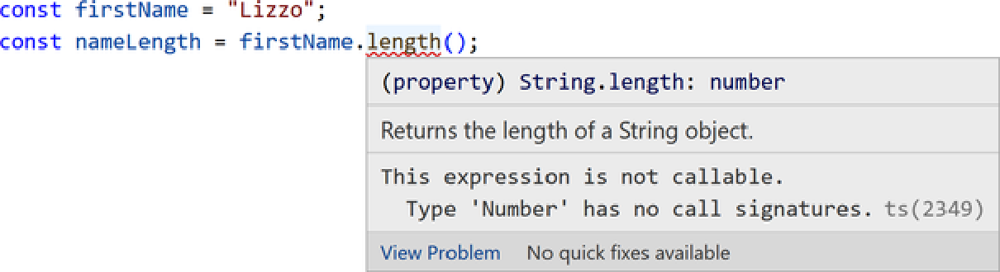
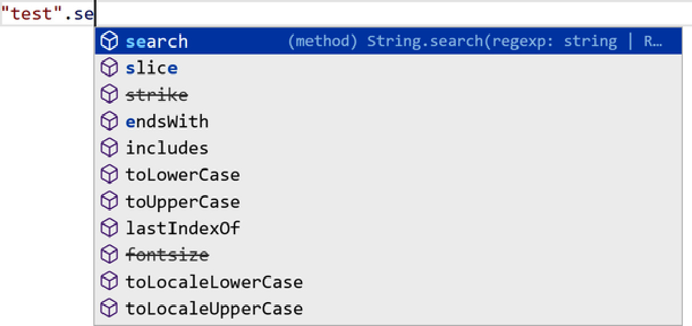
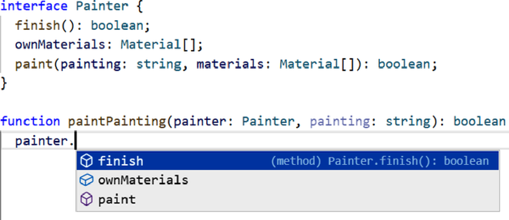
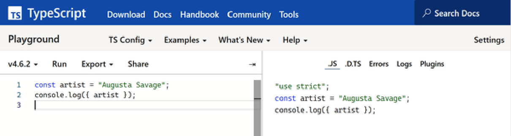

**Phần I. Khái niệm (Concepts)**

# **Chương 1. Từ JavaScript sang TypeScript**

## Mục lục

- [**Chương 1. Từ JavaScript sang TypeScript**](#chương-1-từ-javascript-sang-typescript)
  - [**Lịch sử JavaScript**](#lịch-sử-javascript)
  - [**Những cạm bẫy của Vanilla JavaScript**](#những-cạm-bẫy-của-vanilla-javascript)
    - [**Sự tự do đắt giá**](#sự-tự-do-đắt-giá)
    - [**Tài liệu hóa lỏng lẻo**](#tài-liệu-hóa-lỏng-lẻo)
    - [**Công cụ hỗ trợ lập trình viên yếu hơn**](#công-cụ-hỗ-trợ-lập-trình-viên-yếu-hơn)
      - [**GHI CHÚ (NOTE)**](#ghi-chú-note)
  - [**TypeScript!**](#typescript)
    - [_Compiler (Trình biên dịch)_](#compiler-trình-biên-dịch)
    - [_Language service (Dịch vụ ngôn ngữ)_](#language-service-dịch-vụ-ngôn-ngữ)
  - [**Bắt đầu với TypeScript Playground**](#bắt-đầu-với-typescript-playground)
    - [**TypeScript trong thực tế**](#typescript-trong-thực-tế)
    - [**Tự do thông qua sự ràng buộc**](#tự-do-thông-qua-sự-ràng-buộc)
    - [**Tài liệu hóa chính xác**](#tài-liệu-hóa-chính-xác)
    - [**Công cụ hỗ trợ lập trình viên mạnh mẽ hơn**](#công-cụ-hỗ-trợ-lập-trình-viên-mạnh-mẽ-hơn)
    - [**Biên dịch cú pháp**](#biên-dịch-cú-pháp)
      - [**GHI CHÚ (NOTE)**](#ghi-chú-note-1)
  - [**Bắt đầu trên môi trường cục bộ**](#bắt-đầu-trên-môi-trường-cục-bộ)
    - [**Chạy trên máy cục bộ**](#chạy-trên-máy-cục-bộ)
      - [**GHI CHÚ (NOTE)**](#ghi-chú-note-2)
      - [**MẸO (TIP)**](#mẹo-tip)
    - [**Các tính năng của Editor**](#các-tính-năng-của-editor)
      - [**MẸO (TIP)**](#mẹo-tip-1)
  - [**Những điều TypeScript không phải là**](#những-điều-typescript-không-phải-là)
    - [**Liều thuốc chữa cho code tồi**](#liều-thuốc-chữa-cho-code-tồi)
    - [**Phần mở rộng cho JavaScript (hầu hết là vậy)**](#phần-mở-rộng-cho-javascript-hầu-hết-là-vậy)
      - [**GHI CHÚ (NOTE)**](#ghi-chú-note-3)
    - [**Chậm hơn JavaScript**](#chậm-hơn-javascript)
      - [**GHI CHÚ (NOTE)**](#ghi-chú-note-4)
    - [**Đã dừng tiến hóa**](#đã-dừng-tiến-hóa)
  - [**Tổng kết**](#tổng-kết)
    - [**MẸO (TIP)**](#mẹo-tip-2)

_JavaScript hôm nay_

_Hỗ trợ trình duyệt nhiều thập kỷ trước_

_Vẻ đẹp của web_

Trước khi nói về TypeScript, trước hết chúng ta cần hiểu nó bắt nguồn từ đâu: JavaScript!

## **Lịch sử JavaScript**

JavaScript được Brendan Eich thiết kế chỉ trong vòng 10 ngày tại Netscape vào năm 1995 với mục tiêu dễ tiếp cận và dễ sử dụng cho các trang web. Kể từ đó, các lập trình viên đã không ngừng châm chọc những nét kỳ quặc và những thiếu sót được nhìn nhận của nó. Tôi sẽ đề cập đến một vài trong số đó ở phần tiếp theo.

Tuy nhiên, JavaScript đã phát triển vượt bậc kể từ năm 1995! Ủy ban chỉ đạo của nó, TC39, đã phát hành các phiên bản mới của ECMAScript—đặc tả ngôn ngữ làm nền tảng cho JavaScript—hàng năm kể từ năm 2015 với các tính năng mới giúp nó bắt kịp các ngôn ngữ hiện đại khác. Đầy ấn tượng, ngay cả khi liên tục có các phiên bản ngôn ngữ mới, JavaScript vẫn duy trì được tính tương thích ngược trong nhiều thập kỷ trên nhiều môi trường khác nhau, bao gồm trình duyệt, ứng dụng nhúng và các runtime phía server.

Ngày nay, JavaScript là một ngôn ngữ linh hoạt tuyệt vời với rất nhiều điểm mạnh. Chúng ta nên trân trọng rằng dù JavaScript có những nét kỳ quặc, nó cũng chính là nhân tố thúc đẩy sự phát triển đáng kinh ngạc của các ứng dụng web và internet.

_Hãy chỉ cho tôi một ngôn ngữ lập trình hoàn hảo, và tôi sẽ chỉ cho bạn một ngôn ngữ không có người dùng nào._

—Anders Hejlsberg, TSConf 2019

## **Những cạm bẫy của Vanilla JavaScript**

Các lập trình viên thường gọi việc sử dụng JavaScript mà không kèm bất kỳ phần mở rộng ngôn ngữ hay framework đáng kể nào là “vanilla”: ám chỉ hương vị nguyên bản, quen thuộc. Tôi sẽ sớm giải thích lý do tại sao TypeScript bổ sung đúng hương vị cần thiết để vượt qua những cạm bẫy lớn này, nhưng việc hiểu lý do tại sao chúng lại gây phiền toái là rất hữu ích. Tất cả những điểm yếu này càng trở nên rõ rệt hơn khi dự án càng lớn và có vòng đời càng dài.

### **Sự tự do đắt giá**

Điều khiến nhiều lập trình viên phàn nàn nhiều nhất ở JavaScript thật không may lại là một trong những tính năng then chốt của nó: JavaScript hầu như không đặt ra bất kỳ hạn chế nào về cách bạn cấu trúc mã nguồn của mình. Sự tự do đó khiến việc bắt đầu một dự án bằng JavaScript trở nên vô cùng thú vị!

Tuy nhiên, khi bạn có ngày càng nhiều tệp hơn, sự tự do đó bắt đầu bộc lộ tác hại. Hãy xem đoạn mã sau, được trích ra mà không có ngữ cảnh từ một ứng dụng vẽ tranh hư cấu nào đó:

```typescript
function paintPainting(painter, painting) {
  return painter
    .prepare()
    .paint(painting, painter.ownMaterials)
    .finish();
}
```

Đọc đoạn mã đó mà không có bất kỳ ngữ cảnh nào, bạn chỉ có thể đoán mơ hồ về cách gọi hàm `paintPainting`. Có lẽ nếu từng làm việc trong codebase xung quanh, bạn có thể nhớ ra rằng `painter` nên là giá trị được trả về từ một hàm `getPainter` nào đó. Thậm chí bạn có thể đoán may mắn rằng `painting` là một chuỗi (string).

Tuy nhiên, ngay cả khi những giả định đó là đúng, những thay đổi sau này đối với mã nguồn có thể khiến chúng không còn đúng nữa. Có thể `painting` bị đổi từ string sang một kiểu dữ liệu khác, hoặc có thể một hoặc nhiều phương thức của `painter` bị đổi tên.

Các ngôn ngữ khác có thể từ chối cho phép bạn chạy mã nếu trình biên dịch của chúng xác định rằng mã đó có khả năng bị crash. Nhưng với các ngôn ngữ định kiểu động (dynamically typed languages)—những ngôn ngữ chạy mã mà không kiểm tra trước xem nó có khả năng bị crash hay không—như JavaScript thì không như vậy.

Sự tự do trong mã nguồn vốn làm cho JavaScript trở nên thú vị lại trở thành một nỗi đau thực sự khi bạn muốn có sự an toàn khi chạy mã của mình.

### **Tài liệu hóa lỏng lẻo**

Không có gì tồn tại trong đặc tả ngôn ngữ JavaScript để chính thức hóa việc mô tả các tham số hàm, giá trị trả về của hàm, các biến hoặc các cấu trúc khác trong mã nguồn được dùng để làm gì. Nhiều lập trình viên đã áp dụng một chuẩn gọi là JSDoc để mô tả các hàm và biến bằng cách sử dụng các khối comment. Chuẩn JSDoc mô tả cách bạn có thể viết các comment tài liệu đặt ngay phía trên các cấu trúc như hàm và biến, được định dạng theo cách chuẩn tắc. Dưới đây là một ví dụ, một lần nữa được tách khỏi ngữ cảnh:

```javascript
/**
 * Performs a painter painting a particular painting.
 *
 * @param {Painting} painter
 * @param {string} painting
 * @returns {boolean} Whether the painter painted the painting.
 */
function paintPainting(painter, painting) { /* ... */ }
```

JSDoc có những vấn đề then chốt thường khiến việc sử dụng nó trong một codebase lớn trở nên khó chịu:

- Không có gì ngăn cản việc các mô tả trong JSDoc bị sai lệch so với mã nguồn thực tế.
- Ngay cả khi các mô tả JSDoc của bạn trước đó là chính xác, trong quá trình tái cấu trúc mã (code refactor), rất khó để tìm thấy tất cả các comment JSDoc hiện đã không còn hợp lệ liên quan đến những thay đổi của bạn.
- Việc mô tả các đối tượng phức tạp rất cồng kềnh và dài dòng, đòi hỏi nhiều comment độc lập để định nghĩa các kiểu và mối quan hệ giữa chúng.

Việc duy trì các comment JSDoc trên một tá tệp không tốn quá nhiều thời gian, nhưng trên hàng trăm hoặc thậm chí hàng nghìn tệp được cập nhật liên tục thì đó có thể là một cực hình thực sự.

### **Công cụ hỗ trợ lập trình viên yếu hơn**

Bởi vì JavaScript không cung cấp các cách tích hợp sẵn để xác định kiểu dữ liệu, và mã nguồn rất dễ phân kỳ khỏi các comment JSDoc, nên rất khó để tự động hóa các thay đổi lớn hoặc thu thập thông tin chuyên sâu về một codebase. Các lập trình viên JavaScript thường ngạc nhiên khi thấy các tính năng trong các ngôn ngữ định kiểu tĩnh như C# và Java cho phép lập trình viên thực hiện đổi tên thành viên của class hoặc nhảy đến vị trí khai báo kiểu của một tham số.

#### **GHI CHÚ (NOTE)**

Bạn có thể phản biện rằng các IDE hiện đại như VS Code có cung cấp một số công cụ phát triển như tái cấu trúc tự động cho JavaScript. Đúng là như vậy, nhưng: chúng sử dụng TypeScript hoặc một công cụ tương đương bên dưới hậu trường cho nhiều tính năng JavaScript của mình, và các công cụ phát triển đó không đáng tin cậy hoặc mạnh mẽ trong hầu hết mã JavaScript như trong mã TypeScript được định nghĩa rõ ràng.

## **TypeScript!**

TypeScript được tạo ra nội bộ tại Microsoft vào đầu những năm 2010, sau đó được phát hành và mở mã nguồn vào năm 2012. Người đứng đầu nhóm phát triển là Anders Hejlsberg, nhân vật nổi tiếng vì cũng từng dẫn dắt việc phát triển các ngôn ngữ phổ biến C# và Turbo Pascal. TypeScript thường được mô tả là một “superset của JavaScript” hoặc “JavaScript có thêm kiểu dữ liệu.” Nhưng TypeScript thực sự _là_ gì?

TypeScript gồm bốn yếu tố:

_Ngôn ngữ lập trình (Programming language)_

Một ngôn ngữ bao gồm tất cả các cú pháp JavaScript hiện có, cộng thêm cú pháp mới dành riêng cho TypeScript để định nghĩa và sử dụng các kiểu dữ liệu (types).

_Bộ kiểm tra kiểu (Type checker)_

Một chương trình nhận vào một tập hợp các tệp được viết bằng JavaScript và/hoặc TypeScript, xây dựng sự hiểu biết về tất cả các cấu trúc (biến, hàm…) được tạo ra, và thông báo cho bạn biết nếu nó cho rằng có bất kỳ điều gì được thiết lập không chính xác.

#### _Compiler (Trình biên dịch)_

Một chương trình chạy bộ kiểm tra kiểu, báo cáo mọi vấn đề, sau đó xuất ra mã JavaScript tương đương.

#### _Language service (Dịch vụ ngôn ngữ)_

Một chương trình sử dụng bộ kiểm tra kiểu để hướng dẫn các trình soạn thảo (editor) như VS Code cách cung cấp các tiện ích hữu ích cho lập trình viên.

## **Bắt đầu với TypeScript Playground**

Bạn đã đọc khá nhiều về TypeScript rồi. Bây giờ hãy bắt tay vào viết code nhé!

Trang web chính thức của TypeScript có một trình soạn thảo “Playground” tại _<https://www.typescriptlang.org/play>_. Bạn có thể gõ code vào trình soạn thảo chính và thấy nhiều gợi ý tương tự như khi bạn làm việc với TypeScript trên máy cục bộ trong một IDE (Integrated Development Environment) đầy đủ.

Hầu hết các đoạn mã mẫu trong cuốn sách này đều được cố ý giữ ngắn gọn và khép kín để bạn có thể gõ chúng vào Playground và thử nghiệm một cách thú vị.

### **TypeScript trong thực tế**

Hãy xem xét đoạn mã sau:

```typescript
const firstName = "Georgia";
const nameLength = firstName.length();
//                           ~~~~~~
// This expression is not callable.
```

Đoạn mã này được viết hoàn toàn bằng cú pháp JavaScript bình thường—tôi chưa hề giới thiệu bất kỳ cú pháp nào dành riêng cho TypeScript. Nếu bạn chạy bộ kiểm tra kiểu của TypeScript trên đoạn mã này, nó sẽ sử dụng hiểu biết của mình rằng thuộc tính `length` của một string là một number—chứ không phải là một hàm—để đưa ra cảnh báo như hiển thị trong comment.

Nếu bạn dán đoạn mã đó vào Playground hoặc một editor, nó sẽ được language service hướng dẫn hiển thị một đường gợn sóng màu đỏ nhỏ bên dưới `length` cho biết TypeScript không hài lòng với mã của bạn. Rê chuột qua đoạn mã có gợn sóng sẽ hiển thị nội dung cảnh báo (Hình 1-1).



_Hình 1-1. TypeScript báo lỗi khi thuộc tính length của string không thể gọi được như một hàm_

Được thông báo về những lỗi đơn giản này ngay trong editor khi bạn đang gõ sẽ dễ chịu hơn nhiều so với việc phải chờ đến khi dòng mã đó được thực thi và ném ra lỗi. Nếu bạn cố chạy đoạn mã đó trong JavaScript, chương trình sẽ bị crash!

### **Tự do thông qua sự ràng buộc**

TypeScript cho phép chúng ta chỉ định rõ những kiểu giá trị nào có thể được cung cấp cho các tham số và biến. Ban đầu, một số lập trình viên cảm thấy việc phải viết tường minh trong mã nguồn cách các phần cụ thể hoạt động là một sự gò bó.

Nhưng! Tôi xin khẳng định rằng việc bị “ràng buộc” theo cách này thực sự là một điều rất tốt! Bằng cách giới hạn mã nguồn của chúng ta chỉ được phép sử dụng theo những cách mà bạn chỉ định, TypeScript mang lại cho bạn sự tự tin rằng những thay đổi ở một khu vực mã nguồn sẽ không làm hỏng các khu vực khác đang sử dụng nó.

Ví dụ, nếu bạn thay đổi số lượng tham số bắt buộc cho một hàm, TypeScript sẽ thông báo cho bạn nếu bạn quên cập nhật ở một nơi nào đó đang gọi hàm này.

Trong ví dụ sau, hàm `sayMyName` đã bị đổi từ nhận hai tham số sang nhận một tham số, nhưng lời gọi hàm với hai string chưa được cập nhật và do đó kích hoạt cảnh báo từ TypeScript:

```javascript
// Previously: sayMyName(firstName, lastNameName) { ...
function sayMyName(fullName) {
  console.log(`You acting kind of shady, ain't callin' me ${fullName}`);
}

sayMyName("Beyoncé", "Knowles");
//                   ~~~~~~~~~
// Expected 1 argument, but got 2.
```

Đoạn mã đó vẫn sẽ chạy mà không bị crash trong JavaScript, nhưng kết quả đầu ra của nó sẽ khác với mong đợi (nó sẽ không bao gồm `"Knowles"`):

```text
You acting kind of shady, ain't callin' me Beyoncé
```

Việc gọi các hàm với sai số lượng đối số chính là kiểu tự do ngắn hạn của JavaScript mà TypeScript sẽ siết chặt lại.

### **Tài liệu hóa chính xác**

Hãy xem phiên bản “TypeScript hóa” của hàm `paintPainting` từ phần trước. Mặc dù tôi chưa đi sâu vào chi tiết cú pháp TypeScript để tài liệu hóa các kiểu, đoạn mã sau vẫn gợi mở về độ chính xác tuyệt vời mà TypeScript có thể mang lại khi tài liệu hóa mã nguồn:

```typescript
interface Painter {
  finish(): boolean;
  ownMaterials: Material[];
  paint(painting: string, materials: Material[]): boolean;
}

function paintPainting(painter: Painter, painting: string): boolean {
  /* ... */
}
```

Một lập trình viên TypeScript khi đọc đoạn mã này lần đầu tiên có thể hiểu ngay rằng `painter` có ít nhất ba thuộc tính, hai trong số đó là các phương thức. Bằng cách tích hợp cú pháp mô tả “hình dạng” (shapes) của các đối tượng, TypeScript cung cấp một hệ thống tuyệt vời, có tính thực thi cao để mô tả cấu trúc của các đối tượng.

### **Công cụ hỗ trợ lập trình viên mạnh mẽ hơn**

Hệ thống định kiểu của TypeScript cho phép các trình soạn thảo như VS Code có được hiểu biết sâu sắc hơn nhiều về mã nguồn của bạn. Sau đó, chúng có thể sử dụng những hiểu biết đó để đưa ra các gợi ý thông minh khi bạn đang gõ phím. Những gợi ý này có thể cực kỳ hữu ích cho quá trình phát triển.

Nếu trước đây bạn từng sử dụng VS Code để viết JavaScript, bạn có thể đã nhận thấy rằng nó gợi ý “tự động hoàn thành” (autocompletion) khi bạn viết mã với các kiểu đối tượng tích hợp sẵn như string. Ví dụ: nếu bạn bắt đầu gõ thành viên của một thứ được biết là string, TypeScript có thể gợi ý tất cả các thành viên của string đó (Hình 1-2).



_Hình 1-2. TypeScript cung cấp các gợi ý autocompletion trong JavaScript cho một string_

Khi bạn thêm bộ kiểm tra kiểu của TypeScript để phân tích mã, nó có thể cung cấp cho bạn những gợi ý hữu ích này ngay cả đối với mã do chính bạn viết ra. Khi gõ `painter.` trong hàm `paintPainting`, TypeScript sẽ sử dụng kiến thức rằng tham số `painter` có kiểu `Painter` và kiểu `Painter` có các thành viên sau (Hình 1-3).



_Hình 1-3. TypeScript cung cấp các gợi ý autocompletion cho kiểu tùy chỉnh_

Thật tuyệt vời! Tôi sẽ đề cập đến vô số tính năng hữu ích khác của trình soạn thảo trong Chương 12, “Sử dụng các tính năng IDE”.

### **Biên dịch cú pháp**

Trình biên dịch của TypeScript cho phép chúng ta nhập vào cú pháp TypeScript, kiểm tra kiểu cho nó và xuất ra mã JavaScript tương đương. Như một sự tiện lợi, trình biên dịch cũng có thể nhận cú pháp JavaScript hiện đại và biên dịch nó xuống các phiên bản ECMAScript cũ hơn tương đương.

Nếu bạn dán đoạn mã TypeScript này vào Playground:

```javascript
const artist = "Augusta Savage";
console.log({ artist });
```

Playground sẽ hiển thị cho bạn ở phía bên phải màn hình rằng đây sẽ là mã JavaScript tương đương được xuất ra bởi trình biên dịch (Hình 1-4).



_Hình 1-4. TypeScript Playground biên dịch mã TypeScript thành JavaScript tương đương_

TypeScript Playground là một công cụ tuyệt vời để quan sát cách mã nguồn TypeScript chuyển thành mã đầu ra JavaScript.

#### **GHI CHÚ (NOTE)**

Nhiều dự án JavaScript sử dụng các bộ chuyển mã (transpiler) chuyên dụng như Babel (_<https://babeljs.io>_) thay vì trình biên dịch riêng của TypeScript để chuyển đổi mã nguồn thành JavaScript có thể chạy được. Bạn có thể tìm thấy danh sách các starter dự án phổ biến trên _<https://learningtypescript.com/starters>_.

## **Bắt đầu trên môi trường cục bộ**

Bạn có thể chạy TypeScript trên máy tính của mình miễn là bạn đã cài đặt Node.js. Để cài đặt phiên bản TypeScript mới nhất trên toàn hệ thống (globally), hãy chạy lệnh sau:

```shell
npm i -g typescript
```

Bây giờ, bạn sẽ có thể chạy TypeScript trên dòng lệnh bằng lệnh `tsc` (**T**ype**S**cript **C**ompiler). Hãy thử chạy nó với cờ `--version` để đảm bảo rằng nó đã được thiết lập đúng cách:

```shell
tsc --version
```

Nó sẽ in ra một thông báo dạng `Version X.Y.Z`—tùy thuộc vào phiên bản hiện tại tại thời điểm bạn cài đặt TypeScript:

```shell
$ tsc --version
Version 4.7.2
```

### **Chạy trên máy cục bộ**

Bây giờ TypeScript đã được cài đặt, hãy thiết lập một thư mục trên máy cục bộ để chạy TypeScript trên mã nguồn. Tạo một thư mục ở đâu đó trên máy tính của bạn và chạy lệnh này để tạo tệp cấu hình _tsconfig.json_ mới:

```shell
tsc --init
```

Tệp _tsconfig.json_ khai báo các thiết lập mà TypeScript sử dụng khi phân tích mã của bạn. Hầu hết các tùy chọn trong tệp đó sẽ không liên quan trực tiếp đến bạn trong cuốn sách này (có rất nhiều trường hợp biên bất thường trong lập trình mà ngôn ngữ cần phải tính đến!). Tôi sẽ đề cập đến chúng trong Chương 13, “Các tùy chọn cấu hình”. Tính năng quan trọng là giờ đây bạn có thể chạy lệnh `tsc` để yêu cầu TypeScript biên dịch tất cả các tệp trong thư mục đó và TypeScript sẽ tham chiếu đến _tsconfig.json_ đó cho bất kỳ tùy chọn cấu hình nào.

Hãy thử tạo một tệp có tên _index.ts_ với nội dung sau:

```typescript
console.blub("Nothing is worth more than laughter.");
```

Sau đó, chạy `tsc` và truyền cho nó tên của tệp _index.ts_ đó:

```shell
tsc index.ts
```

Bạn sẽ nhận được một thông báo lỗi có dạng đại loại như:

```typescript
index.ts:1:9 - error TS2339: Property 'blub' does not exist on type 'Console'.

1 console.blub("Nothing is worth more than laughter.");
          ~~~~

Found 1 error.
```

Quả thực, `blub` không hề tồn tại trên `console`. Tôi đã nghĩ gì thế nhỉ?

Trước khi bạn sửa lại mã để làm hài lòng TypeScript, hãy lưu ý rằng `tsc` đã tạo ra một tệp _index.js_ cho bạn với nội dung bao gồm cả `console.blub`.

#### **GHI CHÚ (NOTE)**

Đây là một khái niệm quan trọng: mặc dù có một _lỗi kiểu_ (type error) trong mã của chúng ta, nhưng _cú pháp_ (syntax) vẫn hoàn toàn hợp lệ. Trình biên dịch TypeScript vẫn sẽ tạo ra JavaScript từ một tệp đầu vào bất kể có bất kỳ lỗi kiểu nào.

Hãy sửa lại mã trong _index.ts_ để gọi `console.log` và chạy lại `tsc`. Terminal của bạn sẽ không còn bất kỳ cảnh báo nào nữa, và tệp _index.js_ giờ đây sẽ chứa mã đầu ra đã được cập nhật:

```javascript
console.log("Nothing is worth more than laughter.");
```

#### **MẸO (TIP)**

Tôi rất khuyến khích bạn thực hành với các đoạn mã mẫu của cuốn sách khi bạn đọc qua chúng, hoặc trong playground hoặc trong một editor có hỗ trợ TypeScript (nghĩa là nó chạy TypeScript language service cho bạn). Các bài tập nhỏ độc lập, cũng như các dự án lớn hơn, cũng có sẵn để giúp bạn thực hành những gì đã học tại _<https://learningtypescript.com>_.

### **Các tính năng của Editor**

Một lợi ích khác của việc tạo tệp _tsconfig.json_ là khi các editor mở một thư mục cụ thể, giờ đây chúng sẽ nhận diện thư mục đó là một dự án TypeScript. Ví dụ: nếu bạn mở VS Code trong một thư mục, các cài đặt mà nó sử dụng để phân tích mã TypeScript của bạn sẽ tuân theo bất kỳ nội dung nào có trong _tsconfig.json_ của thư mục đó.

Như một bài tập thực hành, hãy quay lại các đoạn mã mẫu trong chương này và gõ chúng vào trình soạn thảo của bạn. Bạn sẽ thấy các menu thả xuống gợi ý các phần hoàn thành cho các tên khi bạn gõ chúng, đặc biệt là đối với các thành viên như `log` trên `console`.

Rất hào hứng: bạn đang sử dụng TypeScript language service để giúp chính mình viết code! Bạn đang trên con đường trở thành một lập trình viên TypeScript!

#### **MẸO (TIP)**

VS Code đi kèm với sự hỗ trợ TypeScript tuyệt vời và bản thân nó cũng được xây dựng bằng TypeScript. Bạn không _bắt buộc_ phải sử dụng nó cho TypeScript—hầu như tất cả các trình soạn thảo hiện đại đều hỗ trợ TypeScript xuất sắc hoặc tích hợp sẵn hoặc có sẵn thông qua các plugin—nhưng tôi khuyên bạn nên dùng nó để ít nhất là thử nghiệm TypeScript trong khi đọc cuốn sách này. Nếu bạn sử dụng một trình soạn thảo khác, tôi cũng khuyên bạn nên kích hoạt hỗ trợ TypeScript của nó. Tôi sẽ đề cập sâu hơn về các tính năng của editor trong Chương 12, “Sử dụng các tính năng IDE”.

## **Những điều TypeScript không phải là**

Bây giờ bạn đã thấy TypeScript tuyệt vời như thế nào, tôi cũng phải cảnh báo bạn về một số hạn chế. Mọi công cụ đều xuất sắc ở một số lĩnh vực và có những hạn chế ở những lĩnh vực khác.

### **Liều thuốc chữa cho code tồi**

TypeScript giúp bạn cấu trúc mã JavaScript của mình, nhưng ngoài việc thực thi tính an toàn kiểu (type safety), nó không áp đặt bất kỳ quan điểm nào về việc cấu trúc đó trông phải như thế nào.

Tốt thôi!

TypeScript là một ngôn ngữ mà tất cả mọi người đều có thể sử dụng, chứ không phải là một framework độc đoán (opinionated framework) hướng đến một đối tượng cụ thể. Bạn có thể viết mã bằng bất kỳ mô hình kiến trúc nào mà bạn đã quen thuộc từ JavaScript, và TypeScript sẽ hỗ trợ chúng.

Nếu ai đó cố nói với bạn rằng TypeScript bắt buộc bạn phải sử dụng classes, hoặc gây khó khăn cho việc viết mã tốt, hoặc bất kỳ lời phàn nàn nào về phong cách code ngoài kia, hãy nhìn họ một cách nghiêm nghị và bảo họ tìm đọc một cuốn _Learning TypeScript_. TypeScript không áp đặt các quan điểm về phong cách viết mã như việc nên dùng class hay function, cũng không gắn liền với bất kỳ framework ứng dụng cụ thể nào—Angular, React, v.v.—hơn những framework khác.

### **Phần mở rộng cho JavaScript (hầu hết là vậy)**

Các mục tiêu thiết kế của TypeScript nêu rõ ràng rằng nó cần phải:

- Bám sát các đề xuất ECMAScript hiện tại và tương lai
- Bảo toàn hành vi thời gian chạy (runtime behavior) của toàn bộ mã JavaScript

TypeScript không hề cố gắng thay đổi cách JavaScript hoạt động. Những người tạo ra nó đã rất nỗ lực để tránh thêm các tính năng code mới có thể bổ sung hoặc xung đột với JavaScript. Nhiệm vụ như vậy thuộc về phạm vi của TC39, ủy ban kỹ thuật làm việc trên chính ECMAScript.

Có một vài tính năng cũ hơn trong TypeScript đã được thêm vào từ nhiều năm trước để phản ánh các trường hợp sử dụng phổ biến trong mã JavaScript. Hầu hết các tính năng đó hoặc tương đối hiếm gặp hoặc đã không còn được ưa chuộng, và chỉ được đề cập ngắn gọn trong Chương 14, “Các phần mở rộng cú pháp”. Tôi khuyên bạn nên tránh xa chúng trong hầu hết các trường hợp.

#### **GHI CHÚ (NOTE)**

Tính đến năm 2022, TC39 đang nghiên cứu việc bổ sung cú pháp cho các chú thích kiểu vào JavaScript. Các đề xuất mới nhất cho thấy chúng hoạt động như một dạng comment không ảnh hưởng đến mã tại thời gian chạy và chỉ được sử dụng cho các hệ thống tại thời điểm phát triển như TypeScript. Sẽ mất nhiều năm cho đến khi các type comment hoặc một thứ tương đương được thêm vào JavaScript, vì vậy chúng sẽ không được đề cập ở nơi nào khác trong cuốn sách này.

### **Chậm hơn JavaScript**

Đôi khi trên internet, bạn có thể nghe thấy một số lập trình viên có quan điểm cá nhân phàn nàn rằng TypeScript chạy chậm hơn JavaScript tại thời điểm runtime. Nhận định đó nhìn chung là không chính xác và gây hiểu lầm. Những thay đổi duy nhất mà TypeScript thực hiện đối với mã là nếu bạn yêu cầu nó biên dịch mã của bạn xuống các phiên bản JavaScript cũ hơn để hỗ trợ các môi trường runtime cũ như Internet Explorer 11. Nhiều framework trong môi trường production hoàn toàn không sử dụng trình biên dịch của TypeScript, mà thay vào đó sử dụng một công cụ riêng biệt để chuyển mã (transpilation - phần biên dịch chuyển đổi mã nguồn từ ngôn ngữ lập trình này sang ngôn ngữ khác) và chỉ sử dụng TypeScript cho việc kiểm tra kiểu (type checking).

Tuy nhiên, TypeScript có làm tăng thêm chút thời gian khi build mã của bạn. Mã TypeScript phải được biên dịch xuống JavaScript trước khi hầu hết các môi trường, chẳng hạn như trình duyệt và Node.js, có thể chạy nó. Hầu hết các pipeline build nhìn chung được thiết lập sao cho ảnh hưởng hiệu năng là không đáng kể, và các tính năng TypeScript chạy chậm hơn như phân tích mã để tìm các sai sót tiềm ẩn được thực hiện tách biệt khỏi việc tạo ra các tệp mã ứng dụng có thể chạy được.

#### **GHI CHÚ (NOTE)**

Ngay cả các dự án dường như cho phép chạy trực tiếp mã TypeScript, chẳng hạn như ts-node và Deno, bản thân chúng cũng chuyển đổi mã TypeScript sang JavaScript trong nội bộ trước khi chạy.

### **Đã dừng tiến hóa**

Web vẫn còn lâu mới dừng tiến hóa, và do đó TypeScript cũng vậy. Ngôn ngữ TypeScript liên tục nhận được các bản sửa lỗi và bổ sung tính năng để phù hợp với nhu cầu luôn biến đổi của cộng đồng web. Các nguyên lý cơ bản của TypeScript mà bạn sẽ học trong cuốn sách này sẽ vẫn giữ nguyên, nhưng các thông báo lỗi, các tính năng nâng cao hơn và các tích hợp trình soạn thảo sẽ ngày càng hoàn thiện theo thời gian.

Trên thực tế, mặc dù ấn bản này của cuốn sách được xuất bản với phiên bản TypeScript 4.7.2 là mới nhất, nhưng vào thời điểm bạn bắt đầu đọc nó, chúng ta có thể chắc chắn rằng một phiên bản mới hơn đã được phát hành. Một số thông báo lỗi của TypeScript trong cuốn sách này thậm chí có thể đã được cập nhật mới hơn!

## **Tổng kết**

Trong chương này, bạn đã tìm hiểu về bối cảnh dẫn đến một số điểm yếu chính của JavaScript, vị trí mà TypeScript phát huy tác dụng, và cách bắt đầu với TypeScript:

- Sơ lược lịch sử JavaScript
- Những cạm bẫy của JavaScript: sự tự do đắt giá, tài liệu hóa lỏng lẻo và công cụ hỗ trợ lập trình viên yếu hơn
- TypeScript là gì: một ngôn ngữ lập trình, một bộ kiểm tra kiểu, một trình biên dịch và một dịch vụ ngôn ngữ
- Các ưu điểm của TypeScript: tự do thông qua sự ràng buộc, tài liệu hóa chính xác và công cụ hỗ trợ lập trình viên mạnh mẽ hơn
- Bắt đầu viết mã TypeScript trên TypeScript Playground và trên máy tính cục bộ của bạn
- Những điều TypeScript không phải là: liều thuốc chữa cho code tồi, phần mở rộng cho JavaScript (hầu hết là vậy), chậm hơn JavaScript, hay đã dừng tiến hóa

#### **MẸO (TIP)**

Bây giờ bạn đã đọc xong chương này, hãy thực hành những gì bạn đã học tại _<https://learningtypescript.com/from-javascript-to-typescript>_.

_Điều gì sẽ xảy ra nếu bạn phát hiện ra các lỗi khi chạy trình biên dịch TypeScript?_

_Tốt hơn hết là bạn nên đi_ _`catch` chúng lại!_
