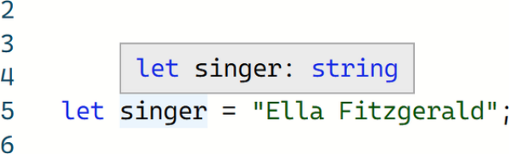
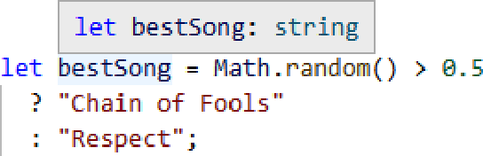

# **Chương 2. Hệ thống kiểu (The Type System)**

## Mục lục

- [**Chương 2. Hệ thống kiểu (The Type System)**](#chương-2-hệ-thống-kiểu-the-type-system)
  - [**Kiểu dữ liệu chứa đựng những gì?**](#kiểu-dữ-liệu-chứa-đựng-những-gì)
    - [**GHI CHÚ (NOTE)**](#ghi-chú-note)
    - [**Hệ thống kiểu (Type Systems)**](#hệ-thống-kiểu-type-systems)
    - [**Các loại lỗi**](#các-loại-lỗi)
      - [**Lỗi cú pháp (Syntax errors)**](#lỗi-cú-pháp-syntax-errors)
      - [**MẸO (TIP)**](#mẹo-tip)
      - [**Lỗi kiểu (Type errors)**](#lỗi-kiểu-type-errors)
      - [**GHI CHÚ (NOTE)**](#ghi-chú-note-1)
  - [**Khả năng gán (Assignability)**](#khả-năng-gán-assignability)
    - [**Hiểu về các lỗi Assignability**](#hiểu-về-các-lỗi-assignability)
  - [**Chú thích kiểu (Type Annotations)**](#chú-thích-kiểu-type-annotations)
    - [**GHI CHÚ (NOTE)**](#ghi-chú-note-2)
    - [**Các chú thích kiểu không cần thiết**](#các-chú-thích-kiểu-không-cần-thiết)
  - [**Hình dạng kiểu (Type Shapes)**](#hình-dạng-kiểu-type-shapes)
    - [**Modules**](#modules)
      - [**CẢNH BÁO (WARNING)**](#cảnh-báo-warning)
  - [**Tổng kết**](#tổng-kết)
    - [**MẸO (TIP)**](#mẹo-tip-1)

_Sức mạnh của JavaScript_

_Đến từ sự linh hoạt_

_Hãy cẩn thận với điều đó!_

Tôi đã nói ngắn gọn trong Chương 1, “Từ JavaScript sang TypeScript” về sự tồn tại của một “bộ kiểm tra kiểu” (type checker) trong TypeScript—công cụ quan sát mã nguồn của bạn, hiểu cách nó được thiết kế để hoạt động và thông báo cho bạn biết bạn có thể đã làm sai ở đâu. Nhưng thực sự thì một bộ kiểm tra kiểu hoạt động như thế nào?

## **Kiểu dữ liệu chứa đựng những gì?**

Một “kiểu” (type) là một mô tả về _hình dạng_ (shape) mà một giá trị JavaScript có thể có. Khi nói “hình dạng”, ý tôi là những thuộc tính (properties) và phương thức (methods) nào tồn tại trên một giá trị, và toán tử tích hợp `typeof` sẽ mô tả giá trị đó là gì.

Ví dụ, khi bạn tạo một biến với giá trị khởi tạo là `"Aretha"`:

```typescript
let singer = "Aretha";
```

TypeScript có thể suy luận (infer), hoặc tự nhận ra rằng biến `singer` có _kiểu_ là string. Các kiểu cơ bản nhất trong TypeScript tương ứng với bảy loại kiểu nguyên thủy (primitives) cơ bản trong JavaScript:

- `null`
- `undefined`
- `boolean` // `true` hoặc `false`
- `string` // `""`, `"Hi!"`, `"abc123"`, …
- `number` // `0`, `2.1`, `-4`, …
- `bigint` // `0n`, `2n`, `-4n`, …
- `symbol` // `Symbol()`, `Symbol("hi")`, …

Đối với mỗi giá trị này, TypeScript hiểu kiểu của giá trị là một trong bảy kiểu nguyên thủy cơ bản:

- `null; // null`
- `undefined; // undefined`
- `true; // boolean`
- `"Louise"; // string`
- `1337; // number`
- `1337n; // bigint`
- `Symbol("Franklin"); // symbol`

Nếu bạn quên tên của một kiểu nguyên thủy, bạn có thể gõ một biến `let` với giá trị nguyên thủy vào TypeScript Playground hoặc một IDE và rê chuột qua tên biến đó. Cửa sổ popover xuất hiện sẽ hiển thị tên của kiểu nguyên thủy, chẳng hạn như ảnh chụp màn hình này hiển thị khi rê chuột qua một biến string (Hình 2-1).



_Hình 2-1. TypeScript hiển thị kiểu của một biến string trong thông tin hover_

TypeScript cũng đủ thông minh để suy luận kiểu của một biến có giá trị ban đầu được tính toán. Trong ví dụ này, TypeScript biết rằng biểu thức ba ngôi (ternary expression) luôn trả về một string, vì vậy biến `bestSong` là một `string`:

```typescript
// Inferred type: string
let bestSong = Math.random() > 0.5
  ? "Chain of Fools"
  : "Respect";
```

Quay lại TypeScript Playground hoặc IDE của bạn, hãy thử rê con trỏ chuột qua biến `bestSong` đó. Bạn sẽ thấy một hộp thông tin hoặc thông báo cho bạn biết rằng TypeScript đã suy luận biến `bestSong` có kiểu `string` (Hình 2-2).



_Hình 2-2. TypeScript báo cáo một biến `let` có kiểu chuỗi ký tự cụ thể từ biểu thức ba ngôi của nó_

#### **GHI CHÚ (NOTE)**

Hãy nhớ lại sự khác biệt giữa các đối tượng và kiểu nguyên thủy trong JavaScript: các lớp như `Boolean` và `Number` bọc xung quanh các giá trị nguyên thủy tương đương của chúng. Thực hành tốt nhất trong TypeScript nói chung là tham chiếu đến các tên viết thường, tương ứng là `boolean` và `number`.

### **Hệ thống kiểu (Type Systems)**

Một _hệ thống kiểu_ (type system) là tập hợp các quy tắc về cách một ngôn ngữ lập trình hiểu các cấu trúc trong chương trình có thể có những kiểu dữ liệu nào.

Về bản chất, hệ thống kiểu của TypeScript hoạt động theo quy trình:

- Đọc mã nguồn của bạn và hiểu tất cả các kiểu và giá trị đang tồn tại
- Đối với mỗi giá trị, xem xét kiểu mà khai báo ban đầu của nó chỉ ra rằng nó có thể chứa
- Đối với mỗi giá trị, xem xét tất cả các cách mà nó được sử dụng sau này trong mã nguồn
- Phàn nàn với người dùng nếu cách sử dụng của một giá trị không khớp với kiểu của nó

Hãy cùng xem xét chi tiết quá trình suy luận kiểu này.

Hãy lấy đoạn mã sau, trong đó TypeScript phát ra một lỗi kiểu về việc một thuộc tính thành viên bị gọi nhầm như một hàm:

```typescript
let firstName = "Whitney";
firstName.length();
//        ~~~~~~
//  This expression is not callable.

//    Type 'Number' has no call signatures
```

TypeScript đi đến thông báo lỗi đó theo thứ tự các bước:

1. Đọc mã nguồn và hiểu rằng có một biến tên là `firstName`
2. Kết luận rằng `firstName` có kiểu `string` vì giá trị khởi tạo của nó là một `string`, `"Whitney"`
3. Nhận thấy mã nguồn đang cố truy cập thành viên `.length` của `firstName` và gọi nó như một hàm
4. Báo lỗi rằng thành viên `.length` của một string là một number, không phải là một hàm _(nó không thể được gọi như một hàm)_

Hiểu được hệ thống kiểu của TypeScript là một kỹ năng quan trọng để hiểu mã nguồn TypeScript. Các đoạn mã mẫu trong chương này và xuyên suốt phần còn lại của cuốn sách sẽ hiển thị các kiểu ngày càng phức tạp hơn mà TypeScript có thể suy luận từ mã nguồn.

### **Các loại lỗi**

Trong khi viết TypeScript, hai loại “lỗi” mà bạn sẽ gặp thường xuyên nhất là:

_Lỗi cú pháp (Syntax error)_

Ngăn cản TypeScript chuyển đổi mã sang JavaScript

_Lỗi kiểu (Type error)_

Bộ kiểm tra kiểu phát hiện thấy điều gì đó không khớp nhau

Sự khác biệt giữa hai loại lỗi này là rất quan trọng.

#### **Lỗi cú pháp (Syntax errors)**

Lỗi cú pháp xảy ra khi TypeScript phát hiện ra cú pháp không chính xác mà nó không thể hiểu được dưới dạng mã lệnh. Những lỗi này chặn TypeScript tạo mã JavaScript đầu ra từ tệp của bạn một cách hợp lệ. Tùy thuộc vào công cụ và cài đặt bạn đang sử dụng để chuyển đổi mã TypeScript sang JavaScript, bạn vẫn có thể nhận được một số đầu ra JavaScript (trong cài đặt `tsc` mặc định, bạn sẽ nhận được). Nhưng nếu có, nó có thể sẽ không giống như những gì bạn mong đợi.

Mã TypeScript đầu vào này có lỗi cú pháp do có một từ khóa `let` không mong muốn:

```typescript
let let wat;
//      ~~~
// Error: ',' expected.
```

Đầu ra JavaScript đã biên dịch của nó, tùy thuộc vào phiên bản trình biên dịch TypeScript, có thể trông đại loại như:

```javascript
let let, wat;
```

#### **MẸO (TIP)**

Mặc dù TypeScript sẽ cố gắng hết sức để xuất ra mã JavaScript bất kể có lỗi cú pháp, nhưng mã đầu ra có thể sẽ không phải là những gì bạn muốn. Tốt nhất là bạn nên sửa các lỗi cú pháp trước khi cố gắng chạy JavaScript đầu ra.

#### **Lỗi kiểu (Type errors)**

Lỗi kiểu xảy ra khi cú pháp của bạn hợp lệ nhưng bộ kiểm tra kiểu của TypeScript đã phát hiện ra lỗi với các kiểu dữ liệu của chương trình. Những lỗi này không chặn cú pháp TypeScript được chuyển đổi sang JavaScript. Tuy nhiên, chúng thường chỉ ra rằng có điều gì đó sẽ bị crash hoặc hoạt động không mong muốn nếu mã của bạn được phép chạy.

Bạn đã thấy điều này trong Chương 1, “Từ JavaScript sang TypeScript” với ví dụ `console.blub`, nơi mã hoàn toàn hợp lệ về mặt cú pháp nhưng TypeScript có thể phát hiện rằng nó có khả năng bị crash khi chạy:

```typescript
console.blub("Nothing is worth more than laughter.");
//      ~~~~
// Error: Property 'blub' does not exist on type 'Console'.
```

Mặc dù TypeScript có thể xuất ra mã JavaScript bất kể có sự xuất hiện của các lỗi kiểu, các lỗi kiểu nhìn chung là dấu hiệu cho thấy JavaScript đầu ra có thể sẽ không chạy theo cách bạn muốn. Tốt nhất là bạn nên đọc chúng và cân nhắc sửa bất kỳ vấn đề nào được báo cáo trước khi chạy JavaScript.

#### **GHI CHÚ (NOTE)**

Một số dự án được cấu hình để chặn chạy mã trong quá trình phát triển cho đến khi tất cả các lỗi kiểu TypeScript—chứ không chỉ cú pháp—được khắc phục. Nhiều lập trình viên, bao gồm cả tôi, thường thấy điều này khá phiền phức và không cần thiết. Hầu hết các dự án đều có cách để không bị chặn, chẳng hạn như với tệp _tsconfig.json_ và các tùy chọn cấu hình được đề cập trong Chương 13, “Các tùy chọn cấu hình”.

## **Khả năng gán (Assignability)**

TypeScript đọc các giá trị ban đầu của các biến để xác định những biến đó được phép có kiểu dữ liệu nào. Nếu sau đó nó thấy một phép gán giá trị mới cho biến đó, nó sẽ kiểm tra xem kiểu của giá trị mới đó có giống với kiểu của biến hay không.

TypeScript hoàn toàn chấp nhận việc sau đó gán một giá trị khác cùng kiểu cho một biến. Ví dụ: nếu một biến ban đầu có giá trị `string`, việc sau đó gán cho nó một `string` khác là hoàn toàn bình thường:

```typescript
let firstName = "Carole";
firstName = "Joan";
```

Nếu TypeScript thấy một phép gán có kiểu dữ liệu khác, nó sẽ đưa ra lỗi kiểu cho chúng ta. Chúng ta không thể, chẳng hạn, ban đầu khai báo một biến với giá trị `string` rồi sau đó lại gán vào một `boolean`:

```typescript
let lastName = "King";
lastName = true;
// Error: Type 'boolean' is not assignable to type 'string'.
```

Việc TypeScript kiểm tra xem một giá trị có được phép cung cấp cho một lời gọi hàm hoặc biến hay không được gọi là _khả năng gán_ (assignability): liệu giá trị đó có _thể gán được_ (assignable) cho kiểu dự kiến mà nó được truyền vào hay không. Đây sẽ là một thuật ngữ quan trọng trong các chương sau khi chúng ta so sánh các đối tượng phức tạp hơn.

### **Hiểu về các lỗi Assignability**

Các lỗi có định dạng “Type…is not assignable to type…” sẽ là một trong những loại lỗi phổ biến nhất bạn sẽ thấy khi viết mã TypeScript.

Kiểu đầu tiên được đề cập trong thông báo lỗi đó là giá trị mà mã đang cố gắng gán cho một nơi tiếp nhận. Kiểu thứ hai được đề cập là nơi tiếp nhận đang được gán kiểu đầu tiên. Ví dụ: khi chúng ta viết `lastName = true` trong đoạn mã trước, chúng ta đang cố gắng _gán_ giá trị `true`—kiểu `boolean`—cho biến tiếp nhận `lastName`—kiểu `string`.

Bạn sẽ thấy các vấn đề về khả năng gán ngày càng phức tạp hơn khi bạn tiến sâu hơn vào cuốn sách này. Hãy nhớ đọc chúng cẩn thận để hiểu sự khác biệt được báo cáo giữa kiểu thực tế và kiểu mong đợi. Làm như vậy sẽ giúp bạn làm việc với TypeScript dễ dàng hơn rất nhiều.

## **Chú thích kiểu (Type Annotations)**

Đôi khi một biến không có giá trị ban đầu để TypeScript đọc. TypeScript sẽ không cố gắng tìm ra kiểu ban đầu của biến từ các lần sử dụng sau này. Mặc định nó sẽ coi biến đó là kiểu `any` một cách ngầm định: biểu thị rằng nó có thể là bất cứ thứ gì trên đời.

Các biến không thể suy luận được kiểu ban đầu sẽ trải qua trạng thái gọi là _evolving any_ (any tiến hóa): thay vì thực thi bất kỳ kiểu cụ thể nào, TypeScript sẽ tiến hóa hiểu biết của mình về kiểu của biến mỗi khi một giá trị mới được gán.

Ở đây, việc gán cho biến `any` tiến hóa `rocker` đầu tiên là một string, có nghĩa là nó có các phương thức của string như `toUpperCase`, nhưng sau đó lại được tiến hóa thành một `number`:

```typescript
let rocker;  // Type: any
rocker = "Joan Jett";  // Type: string
rocker.toUpperCase();  // Ok
rocker = 19.58;  // Type: number
rocker.toPrecision(1);  // Ok
rocker.toUpperCase();
//     ~~~~~~~~~~~
// Error: 'toUpperCase' does not exist on type 'number'.
```

TypeScript đã có thể bắt được rằng chúng ta đang gọi phương thức `toUpperCase()` trên một biến đã tiến hóa thành kiểu `number`. Tuy nhiên, ban đầu nó không thể cho chúng ta biết liệu việc chúng ta tiến hóa biến từ `string` sang `number` có phải là chủ ý hay không.

Việc cho phép các biến có kiểu `any` tiến hóa—và việc sử dụng kiểu `any` nói chung—làm mất đi một phần mục đích kiểm tra kiểu của TypeScript! TypeScript hoạt động tốt nhất khi nó biết các giá trị của bạn được mong đợi là kiểu gì. Phần lớn việc kiểm tra kiểu của TypeScript không thể áp dụng cho các giá trị có kiểu `any` vì chúng không có kiểu đã biết để kiểm tra. Chương 13, “Các tùy chọn cấu hình” sẽ đề cập đến cách cấu hình các cảnh báo về `any` ngầm định của TypeScript.

TypeScript cung cấp một cú pháp để khai báo kiểu của một biến mà không cần phải gán giá trị ban đầu cho nó, được gọi là _chú thích kiểu_ (type annotation). Một chú thích kiểu được đặt sau tên của một biến và bao gồm một dấu hai chấm theo sau là tên của một kiểu.

Chú thích kiểu này chỉ ra rằng biến `rocker` được định hướng có kiểu `string`:

```typescript
let rocker: string;
rocker = "Joan Jett";
```

Các chú thích kiểu này chỉ tồn tại cho TypeScript—chúng không ảnh hưởng đến mã thời gian chạy và không phải là cú pháp JavaScript hợp lệ. Nếu bạn chạy `tsc` để biên dịch mã nguồn TypeScript sang JavaScript, chúng sẽ bị xóa bỏ. Ví dụ: ví dụ trước sẽ được biên dịch thành đoạn mã JavaScript gần giống như sau:

```javascript
// output .js file
let rocker;
rocker = "Joan Jett";
```

Việc gán một giá trị có kiểu không thể gán cho kiểu được chú thích của biến sẽ gây ra lỗi kiểu.

Đoạn mã này gán một number cho một biến `rocker` đã được khai báo trước đó là kiểu `string`, gây ra lỗi kiểu:

```typescript
let rocker: string;
rocker = 19.58;
// Error: Type 'number' is not assignable to type 'string'.
```

Bạn sẽ thấy qua vài chương tiếp theo cách các chú thích kiểu cho phép bạn nâng cao hiểu biết của TypeScript về mã của bạn, cho phép nó cung cấp cho bạn các tính năng tốt hơn trong quá trình phát triển. TypeScript chứa một tập hợp các cú pháp mới, chẳng hạn như các chú thích kiểu chỉ tồn tại trong hệ thống kiểu này.

#### **GHI CHÚ (NOTE)**

Không có gì chỉ tồn tại trong hệ thống kiểu được sao chép sang JavaScript được xuất ra. Các kiểu TypeScript không ảnh hưởng đến JavaScript đầu ra.

### **Các chú thích kiểu không cần thiết**

Các chú thích kiểu cho phép chúng ta cung cấp thông tin cho TypeScript mà nó không thể tự mình thu thập được. Bạn cũng có thể sử dụng chúng trên các biến có kiểu có thể suy luận được ngay lập tức, nhưng bạn sẽ không nói cho TypeScript biết bất cứ điều gì mà nó chưa biết.

Chú thích kiểu `: string` sau đây là dư thừa vì TypeScript đã có thể tự suy luận rằng `firstName` có kiểu `string`:

```typescript
let firstName: string = "Tina";
//           ~~~~~~~~ Does not change the type system...
```

Nếu bạn thêm một chú thích kiểu cho một biến có giá trị ban đầu, TypeScript sẽ kiểm tra xem nó có khớp với kiểu giá trị của biến hay không. `firstName` sau đây được khai báo là kiểu `string`, nhưng giá trị khởi tạo của nó là `number 42`, điều mà TypeScript coi là sự không tương thích:

```typescript
let firstName: string = 42;
//  ~~~~~~~~~
// Error: Type 'number' is not assignable to type 'string'.
```

Nhiều lập trình viên—bao gồm cả bản thân tôi—thường không thích thêm chú thích kiểu vào các biến mà chú thích kiểu đó không làm thay đổi điều gì. Việc phải viết các chú thích kiểu thủ công có thể rườm rà—đặc biệt là khi chúng thay đổi, và đối với các kiểu phức tạp mà tôi sẽ chỉ cho bạn sau này trong cuốn sách này.

Đôi khi việc đưa các chú thích kiểu tường minh vào các biến có thể hữu ích để tài liệu hóa mã một cách rõ ràng và/hoặc để bảo vệ TypeScript trước các thay đổi vô tình đối với kiểu của biến. Chúng ta sẽ thấy trong các chương sau cách các chú thích kiểu tường minh đôi khi có thể thông báo cho TypeScript những thông tin mà bình thường nó không suy luận ra được.

## **Hình dạng kiểu (Type Shapes)**

TypeScript không chỉ kiểm tra xem các giá trị được gán cho các biến có khớp với kiểu ban đầu của chúng hay không. TypeScript cũng biết những thuộc tính thành viên nào nên tồn tại trên các đối tượng. Nếu bạn cố gắng truy cập một thuộc tính của một biến, TypeScript sẽ đảm bảo rằng thuộc tính đó được biết là có tồn tại trên kiểu của biến đó.

Giả sử chúng ta khai báo một biến `rapper` có kiểu `string`. Sau đó, khi chúng ta sử dụng biến `rapper` đó, các thao tác mà TypeScript biết là hoạt động trên string sẽ được cho phép:

```typescript
let rapper = "Queen Latifah";
rapper.length;  // ok
```

Các thao tác mà TypeScript không biết là có hoạt động trên string sẽ không được phép:

```typescript
rapper.push('!');
//     ~~~~
// Property 'push' does not exist on type 'string'.
```

Các kiểu cũng có thể là những hình dạng phức tạp hơn, đáng chú ý nhất là các đối tượng (objects). Trong đoạn mã sau, TypeScript biết đối tượng `cher` không có khóa `middleName` và đưa ra cảnh báo:

```typescript
let cher = {
  firstName: "Cherilyn",
  lastName: "Sarkisian",
};
cher.middleName;
//   ~~~~~~~~~~
//   Property 'middleName' does not exist on type
//   '{ firstName: string; lastName: string; }'.
```

Sự hiểu biết của TypeScript về hình dạng đối tượng cho phép nó báo cáo các vấn đề với việc sử dụng các đối tượng, chứ không chỉ khả năng gán. Chương 4, “Đối tượng” sẽ mô tả thêm nhiều tính năng mạnh mẽ của TypeScript xung quanh các đối tượng và kiểu đối tượng.

### **Modules**

Ngôn ngữ lập trình JavaScript đã không đưa vào một đặc tả về cách các tệp có thể chia sẻ mã với nhau cho đến tận thời gian tương đối gần đây trong lịch sử của nó. ECMAScript 2015 đã thêm “ECMAScript modules”, hay ESM, để chuẩn hóa cú pháp `import` và `export` giữa các tệp.

Để tham khảo, tệp module này import một `value` từ một tệp anh em `./values` và export một biến `doubled`:

```typescript
import { value } from "./values";

export const doubled = value * 2;
```

Để phù hợp với đặc tả ECMAScript, trong cuốn sách này tôi sẽ sử dụng các thuật ngữ sau:

_Module_

Một tệp có `export` hoặc `import` ở cấp cao nhất (top-level)

_Script_

Bất kỳ tệp nào không phải là module

TypeScript có thể hoạt động với các tệp module hiện đại đó cũng như các tệp cũ hơn. Bất kỳ thứ gì được khai báo trong một tệp module sẽ chỉ khả dụng trong tệp đó trừ khi có một câu lệnh `export` tường minh trong tệp đó export nó ra ngoài. Một biến được khai báo trong một module có cùng tên với một biến được khai báo trong một tệp khác sẽ không bị coi là xung đột tên (trừ khi một tệp import biến của tệp kia).

Các tệp `a.ts` và `b.ts` sau đây đều là các module export một biến `shared` có tên tương tự mà không gặp vấn đề gì. `c.ts` gây ra lỗi kiểu vì nó có xung đột tên giữa biến `shared` được import và giá trị của chính nó:

```typescript
// a.ts
export const shared = "Cher";

// b.ts
export const shared = "Cher";

// c.ts
import { shared } from "./a";
//       ~~~~~~
// Error: Import declaration conflicts with local declaration of 'shared'.
export const shared = "Cher";
//           ~~~~~~
// Error: Individual declarations in merged declaration
// 'shared' must be all exported or all local.
```

Tuy nhiên, nếu một tệp là một script, TypeScript sẽ coi nó có phạm vi toàn cục (globally scoped), nghĩa là tất cả các script đều có quyền truy cập vào nội dung của nó. Điều đó có nghĩa là các biến được khai báo trong một tệp script không thể có cùng tên với các biến được khai báo trong các tệp script khác.

Các tệp `a.ts` và `b.ts` sau đây được coi là script vì chúng không có các câu lệnh `export` hoặc `import` theo kiểu module. Điều đó có nghĩa là các biến cùng tên của chúng xung đột với nhau như thể chúng được khai báo trong cùng một tệp:

```typescript
// a.ts
const shared = "Cher";
//    ~~~~~~
// Cannot redeclare block-scoped variable 'shared'.

// b.ts
const shared = "Cher";
//    ~~~~~~
// Cannot redeclare block-scoped variable 'shared'.
```

Nếu bạn thấy những lỗi “Cannot redeclare…” này trong một tệp TypeScript, có thể là do bạn chưa thêm câu lệnh `export` hoặc `import` vào tệp. Theo đặc tả ECMAScript, nếu bạn cần một tệp trở thành một module mà không có câu lệnh `export` hoặc `import`, bạn có thể thêm một `export {};` ở đâu đó trong tệp để buộc nó trở thành một module:

```typescript
// a.ts and b.ts
const shared = "Cher";  // Ok
export {};
```

#### **CẢNH BÁO (WARNING)**

TypeScript sẽ không nhận diện được kiểu của các import và export trong các tệp TypeScript được viết bằng các hệ thống module cũ hơn như CommonJS. TypeScript nhìn chung sẽ thấy các giá trị được trả về từ các hàm `require` kiểu CommonJS được định kiểu là `any`.

## **Tổng kết**

Trong chương này, bạn đã thấy hệ thống kiểu của TypeScript hoạt động như thế nào về cốt lõi:

- “Kiểu” là gì và các kiểu nguyên thủy được TypeScript nhận diện
- “Hệ thống kiểu” là gì và cách hệ thống kiểu của TypeScript hiểu mã nguồn
- So sánh lỗi kiểu với lỗi cú pháp
- Các kiểu biến được suy luận và khả năng gán của biến
- Chú thích kiểu để khai báo rõ ràng các kiểu biến và tránh các kiểu `any` tiến hóa
- Kiểm tra thành viên đối tượng trên các hình dạng kiểu
- Phạm vi khai báo của các tệp ECMAScript module so với các tệp script

#### **MẸO (TIP)**

Bây giờ bạn đã đọc xong chương này, hãy thực hành những gì bạn đã học tại _<https://learningtypescript.com/the-type-system>_.

_Tại sao number và string lại chia tay nhau?_

_Vì họ không phải là kiểu (type) của nhau._
