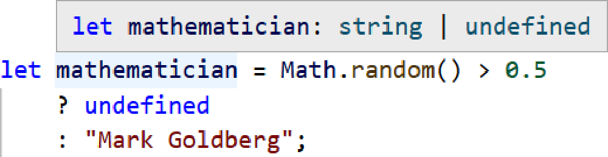
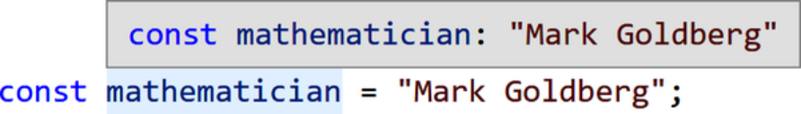
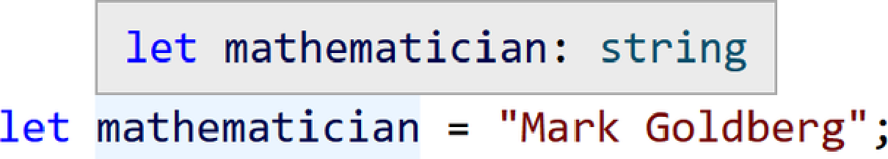

# **Chương 3. Unions và Literals**

## Mục lục

- [**Chương 3. Unions và Literals**](#chương-3-unions-và-literals)
  - [**Kiểu kết hợp (Union Types)**](#kiểu-kết-hợp-union-types)
    - [**Khai báo Union Types**](#khai-báo-union-types)
      - [**GHI CHÚ (NOTE)**](#ghi-chú-note)
    - [**Thuộc tính của Union**](#thuộc-tính-của-union)
  - [**Thu hẹp kiểu (Narrowing)**](#thu-hẹp-kiểu-narrowing)
    - [**Thu hẹp qua phép gán (Assignment Narrowing)**](#thu-hẹp-qua-phép-gán-assignment-narrowing)
    - [**Kiểm tra điều kiện (Conditional Checks)**](#kiểm-tra-điều-kiện-conditional-checks)
    - [**Kiểm tra Typeof (Typeof Checks)**](#kiểm-tra-typeof-typeof-checks)
  - [**Kiểu giá trị cụ thể (Literal Types)**](#kiểu-giá-trị-cụ-thể-literal-types)
    - [**Khả năng gán của Literal (Literal Assignability)**](#khả-năng-gán-của-literal-literal-assignability)
  - [**Kiểm tra Null nghiêm ngặt (Strict Null Checking)**](#kiểm-tra-null-nghiêm-ngặt-strict-null-checking)
    - [**Sai lầm tỷ đô (The Billion-Dollar Mistake)**](#sai-lầm-tỷ-đo-the-billion-dollar-mistake)
    - [**Thu hẹp dựa trên tính chân lý (Truthiness Narrowing)**](#thu-hẹp-dựa-trên-tính-chân-lý-truthiness-narrowing)
    - [**Biến không có giá trị khởi tạo**](#biến-không-có-giá-trị-khởi-tạo)
  - [**Bí danh kiểu (Type Aliases)**](#bí-danh-kiểu-type-aliases)
    - [**Type Aliases không phải là JavaScript**](#type-aliases-không-phải-là-javascript)
    - [**Kết hợp các Type Aliases**](#kết-hợp-các-type-aliases)
  - [**Tổng kết**](#tổng-kết)
    - [**MẸO (TIP)**](#mẹo-tip)

_Không có gì là bất biến_

_Giá trị có thể thay đổi theo thời gian_

_(à, ngoại trừ các hằng số)_

Chương 2, “Hệ thống kiểu” đã đề cập đến khái niệm “hệ thống kiểu” (type system) và cách nó có thể đọc các giá trị để hiểu kiểu của các biến. Bây giờ tôi muốn giới thiệu hai khái niệm then chốt mà TypeScript sử dụng để đưa ra các suy luận dựa trên các giá trị đó:

_Unions (Kiểu kết hợp)_

Mở rộng kiểu được phép của một giá trị thành hai hoặc nhiều kiểu có thể xảy ra

_Narrowing (Thu hẹp kiểu)_

Thu hẹp kiểu được phép của một giá trị để _loại trừ_ một hoặc nhiều kiểu có thể xảy ra

Kết hợp lại với nhau, unions và narrowing là những khái niệm mạnh mẽ cho phép TypeScript đưa ra các suy luận sáng suốt về mã của bạn mà nhiều ngôn ngữ phổ biến khác không thể làm được.

## **Kiểu kết hợp (Union Types)**

Hãy xem biến `mathematician` này:

```typescript
let mathematician = Math.random() > 0.5
  ? undefined
  : "Mark Goldberg";
```

`mathematician` có kiểu gì?

Nó không đơn thuần chỉ là `undefined` và cũng không đơn thuần chỉ là `string`, mặc dù cả hai đều là những kiểu tiềm năng. `mathematician` có thể là `undefined` _hoặc_ `string`. Loại kiểu “hoặc cái này hoặc cái kia” này được gọi là một _union_ (kiểu kết hợp). Union types là một khái niệm tuyệt vời cho phép chúng ta xử lý các tình huống mã nguồn mà chúng ta không biết chính xác một giá trị là kiểu nào, nhưng biết chắc rằng nó là một trong hai hoặc nhiều lựa chọn.

TypeScript biểu diễn union types bằng cách sử dụng toán tử `|` (dấu gạch đứng / pipe) giữa các giá trị có thể có, hoặc các _thành phần cấu thành_ (constituents). Kiểu của `mathematician` ở trên được hiểu là `string | undefined`. Rê chuột qua biến mathematician sẽ hiển thị kiểu của nó là `string | undefined` (Hình 3-1).



_Hình 3-1. TypeScript báo cáo biến `mathematician` có kiểu là `string | undefined`_

### **Khai báo Union Types**

Union types là một ví dụ về tình huống mà việc cung cấp một chú thích kiểu tường minh cho một biến có thể hữu ích ngay cả khi nó đã có giá trị ban đầu. Trong ví dụ này, `thinker` bắt đầu với giá trị `null` nhưng được biết là có khả năng sẽ chứa một `string` thay thế. Việc gán cho nó một chú thích kiểu tường minh `string | null` có nghĩa là TypeScript sẽ cho phép nó được gán các giá trị có kiểu `string`:

```typescript
let thinker: string | null = null;
if (Math.random() >0.5) {
thinker = "Susanne Langer";  // Ok
}
```

Các khai báo union type có thể được đặt ở bất kỳ nơi nào bạn có thể khai báo một kiểu bằng chú thích kiểu (type annotation).

#### **GHI CHÚ (NOTE)**

Thứ tự khai báo trong một union type không quan trọng. Bạn có thể viết `boolean | number` hoặc `number | boolean` và TypeScript sẽ đối xử với cả hai hoàn toàn giống hệt nhau.

### **Thuộc tính của Union**

Khi một giá trị được biết là một union type, TypeScript sẽ chỉ cho phép bạn truy cập các thuộc tính thành viên tồn tại trên tất cả các kiểu có thể có trong union đó. Nó sẽ đưa ra lỗi kiểm tra kiểu nếu bạn cố gắng truy cập một thuộc tính không tồn tại trên tất cả các kiểu thành phần.

Trong đoạn mã sau, `physicist` có kiểu `number | string`. Trong khi `.toString()` tồn tại trên cả hai kiểu và được phép sử dụng, thì `.toUpperCase()` và `.toFixed()` lại không được phép vì `.toUpperCase()` bị thiếu trên kiểu `number` và `.toFixed()` bị thiếu trên kiểu `string`:

```typescript
let physicist = Math.random() > 0.5
  ? "Marie Curie"
  : 84;

physicist.toString();  // Ok
physicist.toUpperCase();
//        ~~~~~~~~~~~
// Error: Property 'toUpperCase' does not exist on type 'string | number'.
//   Property 'toUpperCase' does not exist on type 'number'.
physicist.toFixed();
//        ~~~~~~~
// Error: Property 'toFixed' does not exist on type 'string | number'.
//   Property 'toFixed' does not exist on type 'string'.
```

Việc hạn chế quyền truy cập vào các thuộc tính không tồn tại trên tất cả các kiểu trong union là một biện pháp an toàn. Nếu một đối tượng không được biết chắc chắn là một kiểu chứa thuộc tính đó, TypeScript sẽ coi việc cố gắng sử dụng thuộc tính đó là không an toàn. Thuộc tính đó có thể không tồn tại!

Để sử dụng một thuộc tính của một giá trị có kiểu union chỉ tồn tại trên một tập hợp con các kiểu tiềm năng, mã của bạn sẽ cần phải chỉ ra cho TypeScript biết rằng giá trị tại vị trí đó trong mã là một trong những kiểu cụ thể hơn đó: một quá trình được gọi là _thu hẹp kiểu_ (narrowing).

## **Thu hẹp kiểu (Narrowing)**

Thu hẹp kiểu là khi TypeScript suy luận từ mã của bạn rằng một giá trị có kiểu cụ thể hơn so với kiểu mà nó đã được định nghĩa, khai báo hoặc suy luận trước đó. Một khi TypeScript biết rằng kiểu của một giá trị hẹp hơn so với hiểu biết trước đây, nó sẽ cho phép bạn đối xử với giá trị đó giống như kiểu cụ thể hơn đó. Một kiểm tra logic có thể được sử dụng để thu hẹp các kiểu được gọi là một _bảo vệ kiểu_ (type guard).

Hãy cùng tìm hiểu hai trong số các type guards phổ biến mà TypeScript có thể sử dụng để suy luận việc thu hẹp kiểu từ mã của bạn.

### **Thu hẹp qua phép gán (Assignment Narrowing)**

Nếu bạn gán trực tiếp một giá trị cho một biến, TypeScript sẽ thu hẹp kiểu của biến đó về kiểu của giá trị đó.

Ở đây, biến `admiral` ban đầu được khai báo là `number | string`, nhưng sau khi được gán giá trị `"Grace Hopper"`, TypeScript biết nó chắc chắn phải là một `string`:

```typescript
let admiral: number | string;
admiral = "Grace Hopper";
admiral.toUpperCase();  // Ok: string
admiral.toFixed();
//      ~~~~~~~
// Error: Property 'toFixed' does not exist on type 'string'.
```

Thu hẹp qua phép gán cũng phát huy tác dụng khi một biến được cung cấp một chú thích union type tường minh cùng một giá trị ban đầu. TypeScript sẽ hiểu rằng mặc dù biến sau này có thể nhận giá trị của bất kỳ kiểu nào trong union, nhưng ban đầu nó chỉ là kiểu giá trị khởi tạo của nó.

Trong đoạn mã sau, `inventor` được khai báo là kiểu `number | string`, nhưng TypeScript biết nó ngay lập tức được thu hẹp thành một `string` từ giá trị ban đầu của nó:

```typescript
let inventor: number | string = "Hedy Lamarr";
inventor.toUpperCase();  // Ok: string
inventor.toFixed();
//       ~~~~~~~
// Error: Property 'toFixed' does not exist on type 'string'.
```

### **Kiểm tra điều kiện (Conditional Checks)**

Một cách phổ biến để yêu cầu TypeScript thu hẹp giá trị của một biến là viết một câu lệnh `if` kiểm tra biến đó có bằng một giá trị đã biết hay không. TypeScript đủ thông minh để hiểu rằng bên trong thân của câu lệnh `if` đó, biến phải cùng kiểu với giá trị đã biết:

```typescript
// Type of scientist: number | string
let scientist = Math.random() > 0.5
  ? "Rosalind Franklin"
  : 51;

if (scientist === "Rosalind Franklin") {
  // Type of scientist: string
  scientist.toUpperCase();  // Ok
}

// Type of scientist: number | string
scientist.toUpperCase();
//        ~~~~~~~~~~~
// Error: Property 'toUpperCase' does not exist on type 'string | number'.
//   Property 'toUpperCase' does not exist on type 'number'.
```

Việc thu hẹp bằng logic điều kiện cho thấy logic kiểm tra kiểu của TypeScript phản ánh các mô hình lập trình JavaScript tốt. Nếu một biến có thể là một trong nhiều kiểu, bạn thường sẽ muốn kiểm tra kiểu của nó để xem nó có đúng là thứ bạn cần hay không. TypeScript đang buộc chúng ta phải viết code an toàn. Cảm ơn TypeScript!

### **Kiểm tra Typeof (Typeof Checks)**

Ngoài việc kiểm tra giá trị trực tiếp, TypeScript cũng nhận diện toán tử `typeof` trong việc thu hẹp các kiểu biến.

Tương tự như ví dụ `scientist`, việc kiểm tra xem `typeof researcher` có phải là `"string"` hay không sẽ chỉ ra cho TypeScript biết rằng kiểu của `researcher` phải là `string`:

- **`let`** `researcher = Math.random() > 0.5 ? "Rosalind Franklin" : 51;`
- **`if`** `(` **`typeof`** `researcher === "string") { researcher.toUpperCase();` _`// Ok: string`_
- `}`

Phủ định logic từ toán tử `!` và các câu lệnh `else` cũng hoạt động tương tự:

- **`if`** `(!(` **`typeof`** `researcher === "string")) { researcher.toFixed();` _`// Ok: number`_
- `}` **`else`** `{ researcher.toUpperCase();` _`// Ok: string`_
- `}`

Những đoạn mã đó có thể được viết lại bằng biểu thức ba ngôi, vốn cũng được hỗ trợ để thu hẹp kiểu:

- **`typeof`** `researcher === "string" ? researcher.toUpperCase()` _`// Ok: string`_ `: researcher.toFixed();` _`// Ok: number`_

Dù bạn viết chúng theo cách nào, các kiểm tra `typeof` là một cách thiết thực và thường được sử dụng để thu hẹp kiểu.

Bộ kiểm tra kiểu của TypeScript nhận diện thêm một số hình thức thu hẹp kiểu khác mà chúng ta sẽ thấy trong các chương sau.

## **Kiểu giá trị cụ thể (Literal Types)**

Bây giờ tôi đã chỉ ra union types và narrowing để làm việc với các giá trị có thể là hai hoặc nhiều kiểu tiềm năng, tôi muốn đi theo hướng ngược lại bằng cách giới thiệu _literal types_ (kiểu giá trị cụ thể): các phiên bản cụ thể hơn của các kiểu nguyên thủy. Hãy xem biến `philosopher` này:

```typescript
const philosopher = "Hypatia";
```

`philosopher` có kiểu gì?

Thoạt nhìn, bạn có thể nói là `string`—và bạn đã đúng. `philosopher` thực sự là một `string`.

Nhưng! `philosopher` không chỉ là một `string` bất kỳ. Nó cụ thể là giá trị `"Hypatia"`. Do đó, kiểu của biến `philosopher` về mặt kỹ thuật là kiểu cụ thể hơn `"Hypatia"`.

Đó chính là khái niệm về một _literal type_: kiểu của một giá trị được biết là một giá trị cụ thể của một kiểu nguyên thủy, thay vì bất kỳ giá trị nào của kiểu nguyên thủy đó. Kiểu nguyên thủy `string` đại diện cho tập hợp tất cả các chuỗi có thể tồn tại; literal type `"Hypatia"` chỉ đại diện cho duy nhất một chuỗi đó.

Nếu bạn khai báo một biến là `const` và gán trực tiếp cho nó một giá trị literal, TypeScript sẽ suy luận biến đó có kiểu là chính giá trị literal đó. Đây là lý do tại sao, khi bạn rê chuột qua một biến `const` có giá trị literal ban đầu trong một IDE như VS Code, nó sẽ hiển thị cho bạn kiểu của biến là literal đó (Hình 3-2) thay vì kiểu nguyên thủy tổng quát hơn (Hình 3-3).



_Hình 3-2. TypeScript báo cáo một biến `const` có kiểu chính xác là literal type của nó_



_Hình 3-3. TypeScript báo cáo một biến `let` có kiểu tổng quát là primitive type của nó_

Bạn có thể coi mỗi kiểu _nguyên thủy_ (primitive) như một _union_ của mọi giá trị _literal_ phù hợp có thể có. Nói cách khác, một kiểu nguyên thủy là tập hợp của tất cả các giá trị literal có thể có của kiểu đó.

Ngoại trừ các kiểu `boolean`, `null` và `undefined`, tất cả các kiểu nguyên thủy khác như `number` và `string` đều có vô số kiểu literal. Các kiểu phổ biến bạn sẽ tìm thấy trong mã TypeScript thông thường bao gồm:

- `boolean`: chỉ gồm `true | false`
- `null` và `undefined`: cả hai đều chỉ có một giá trị literal, chính là bản thân chúng
- `number`: `0 | 1 | 2 | ... | 0.1 | 0.2 | ...`
- `string`: `"" | "a" | "b" | "c" | ... | "aa" | "ab" | "ac" | ...`

Các chú thích union type có thể kết hợp linh hoạt giữa literals và primitives. Ví dụ, một biểu diễn tuổi thọ (lifespan) có thể được biểu diễn bằng bất kỳ `number` nào _hoặc_ một trong vài trường hợp đặc biệt đã biết:

```typescript
let lifespan: number | "ongoing" | "uncertain";
lifespan = 89;  // Ok
lifespan = "ongoing";  // Ok

lifespan = true;
// Error: Type 'true' is not assignable to
// type 'number | "ongoing" | "uncertain"'
```

### **Khả năng gán của Literal (Literal Assignability)**

Bạn đã thấy các kiểu nguyên thủy khác nhau như `number` và `string` không thể gán cho nhau như thế nào. Tương tự, các literal types khác nhau trong cùng một kiểu nguyên thủy—ví dụ: `0` và `1`—cũng không thể gán cho nhau.

Trong ví dụ này, `specificallyAda` được khai báo là có literal type `"Ada"`, vì vậy trong khi giá trị `"Ada"` có thể được gán cho nó, thì các kiểu `"Byron"` và `string` không thể gán cho nó:

```typescript
let specificallyAda: "Ada";

specificallyAda = "Ada";  // Ok
specificallyAda = "Byron";
// Error: Type '"Byron"' is not assignable to type '"Ada"'.
let someString = "";  // Type: string
specificallyAda = someString;
// Error: Type 'string' is not assignable to type '"Ada"'.
```

Tuy nhiên, các literal types được phép gán cho các kiểu nguyên thủy tương ứng của chúng. Bất kỳ chuỗi literal cụ thể nào vẫn là một `string`.

Trong ví dụ mã này, giá trị `":)"`, vốn có kiểu `":)"`, đang được gán cho biến `someString` trước đó đã được suy luận là có kiểu `string`:

```typescript
someString = ":)";
```

Ai có thể nghĩ rằng một phép gán biến đơn giản lại có nhiều lý thuyết chuyên sâu đến vậy?

## **Kiểm tra Null nghiêm ngặt (Strict Null Checking)**

Sức mạnh của các union được thu hẹp kết hợp với literals đặc biệt rõ ràng khi làm việc với các giá trị có khả năng là undefined, một mảng trong hệ thống kiểu mà TypeScript gọi là _kiểm tra null nghiêm ngặt_ (strict null checking). TypeScript là một phần của làn sóng các ngôn ngữ lập trình hiện đại sử dụng strict null checking để khắc phục “sai lầm tỷ đô” tai tiếng.

### **Sai lầm tỷ đô (The Billion-Dollar Mistake)**

_Tôi gọi đó là sai lầm tỷ đô của mình. Đó là việc phát minh ra tham chiếu null vào năm 1965… Điều này đã dẫn đến vô số lỗi, lỗ hổng bảo mật và sự cố sập hệ thống, có lẽ đã gây ra thiệt hại và đau đớn trị giá một tỷ đô la trong 40 năm qua._

—Tony Hoare, 2009

“Sai lầm tỷ đô” là một thuật ngữ phổ biến trong ngành chỉ việc nhiều hệ thống kiểu cho phép các giá trị null được sử dụng ở những nơi yêu cầu một kiểu dữ liệu khác. Trong các ngôn ngữ không có kiểm tra null nghiêm ngặt, mã như ví dụ này gán `null` cho một `string` được cho phép:

```typescript
const firstName: string = null;
```

Nếu trước đây bạn từng làm việc với một ngôn ngữ định kiểu như C++ hoặc Java chịu ảnh hưởng bởi sai lầm tỷ đô, bạn có thể ngạc nhiên khi thấy một số ngôn ngữ không cho phép điều như vậy. Nếu bạn chưa từng làm việc với một ngôn ngữ có kiểm tra null nghiêm ngặt trước đây, bạn có thể ngạc nhiên khi thấy một số ngôn ngữ lại cho phép sai lầm tỷ đô ngay từ đầu!

Trình biên dịch TypeScript chứa vô số tùy chọn cho phép thay đổi cách nó hoạt động. Chương 13, “Các tùy chọn cấu hình” sẽ đề cập sâu về các tùy chọn của trình biên dịch TypeScript. Một trong những tùy chọn tùy chọn hữu ích nhất, `strictNullChecks`, bật tắt chế độ kiểm tra null nghiêm ngặt. Nói một cách đại khái, việc vô hiệu hóa `strictNullChecks` sẽ thêm `| null | undefined` vào mọi kiểu trong mã của bạn, từ đó cho phép bất kỳ biến nào cũng có thể nhận `null` hoặc `undefined`.

Với tùy chọn `strictNullChecks` được đặt thành `false`, đoạn mã sau được coi là hoàn toàn an toàn về kiểu. Tuy nhiên điều đó là sai; `nameMaybe` có thể là `undefined` khi `.toLowerCase` được truy cập từ nó:

```typescript
let nameMaybe = Math.random() > 0.5
  ? "Tony Hoare"
  : undefined;

nameMaybe.toLowerCase();

// Potential runtime error: Cannot read property 'toLowerCase' of undefined.
```

Khi bật kiểm tra null nghiêm ngặt, TypeScript sẽ phát hiện khả năng crash trong đoạn mã:

```typescript
let nameMaybe = Math.random() > 0.5
  ? "Tony Hoare"
  : undefined;

nameMaybe.toLowerCase();
// Error: Object is possibly 'undefined'.
```

Nếu không bật kiểm tra null nghiêm ngặt, sẽ khó hơn nhiều để biết liệu mã của bạn có an toàn trước các lỗi do các giá trị vô tình là `null` hoặc `undefined` hay không. Thực hành tốt nhất trong TypeScript nói chung là bật kiểm tra null nghiêm ngặt. Làm như vậy giúp ngăn ngừa sự cố crash và loại bỏ sai lầm tỷ đô.

### **Thu hẹp dựa trên tính chân lý (Truthiness Narrowing)**

Hãy nhớ lại từ JavaScript rằng _tính chân lý_ (truthiness), hay việc là _truthy_, là việc một giá trị có được coi là `true` khi được đánh giá trong ngữ cảnh `Boolean` hay không, chẳng hạn như toán tử `&&` hoặc câu lệnh `if`. Tất cả các giá trị trong JavaScript đều là truthy ngoại trừ những giá trị được định nghĩa là _falsy_: `false`, `0`, `-0`, `0n`, `""`, `null`, `undefined`, và `NaN`. [^1]

TypeScript cũng có thể thu hẹp kiểu của một biến từ một kiểm tra tính chân lý nếu chỉ một số giá trị tiềm năng của nó có thể là truthy. Trong đoạn mã sau, `geneticist` có kiểu `string | undefined`, và vì `undefined` luôn là falsy, TypeScript có thể suy ra rằng nó phải có kiểu `string` bên trong thân của câu lệnh `if`:

```typescript
let geneticist = Math.random() > 0.5
  ? "Barbara McClintock"
  : undefined;

if (geneticist) {
  geneticist.toUpperCase();  // Ok: string
}

geneticist.toUpperCase();
// Error: Object is possibly 'undefined'.
```

Các toán tử logic thực hiện kiểm tra tính chân lý cũng hoạt động tương tự, cụ thể là `&&` và `?.`:

```typescript
geneticist && geneticist.toUpperCase();  // Ok: string | undefined
geneticist?.toUpperCase();  // Ok: string | undefined
```

Thật không may, việc kiểm tra tính chân lý không hoạt động theo chiều ngược lại. Nếu tất cả những gì chúng ta biết về một giá trị `string | undefined` là nó là falsy, điều đó không cho chúng ta biết liệu nó là một chuỗi rỗng hay là `undefined`.

Ở đây, `biologist` có kiểu `false | string`, và trong khi nó có thể được thu hẹp về chỉ `string` trong thân câu lệnh `if`, thân câu lệnh `else` biết rằng nó vẫn có thể là một string nếu nó là `""`:

```typescript
let biologist = Math.random() > 0.5 && "Rachel Carson";

if (biologist) {
  biologist;  // Type: string
} else {
  biologist;  // Type: false | string
}
```

### **Biến không có giá trị khởi tạo**

Các biến được khai báo không có giá trị khởi tạo mặc định là `undefined` trong JavaScript. Điều đó tạo ra một trường hợp biên trong hệ thống kiểu: điều gì sẽ xảy ra nếu bạn khai báo một biến có kiểu không bao gồm `undefined`, sau đó cố gắng sử dụng nó trước khi gán giá trị?

TypeScript đủ thông minh để hiểu rằng biến là `undefined` cho đến khi một giá trị được gán. Nó sẽ báo cáo một thông báo lỗi chuyên biệt nếu bạn cố gắng sử dụng biến đó, chẳng hạn như truy cập một trong các thuộc tính của nó, trước khi gán giá trị:

```typescript
let mathematician: string;

mathematician?.length;
// Error: Variable 'mathematician' is used before being assigned.

mathematician = "Mark Goldberg";
mathematician.length;  // Ok
```

Lưu ý rằng báo cáo này không áp dụng nếu kiểu của biến có bao gồm `undefined`. Việc thêm `| undefined` vào kiểu của biến sẽ chỉ ra cho TypeScript biết rằng nó không cần phải được định nghĩa trước khi sử dụng, vì `undefined` là một kiểu hợp lệ cho giá trị của nó.

Đoạn mã trước sẽ không đưa ra bất kỳ lỗi nào nếu kiểu của `mathematician` là `string | undefined`:

```typescript
let mathematician: string | undefined;

mathematician?.length;  // Ok
mathematician = "Mark Goldberg";
mathematician.length;  // Ok
```

## **Bí danh kiểu (Type Aliases)**

Hầu hết các union types bạn thấy trong mã nguồn nhìn chung sẽ chỉ có hai hoặc ba thành phần cấu thành. Tuy nhiên, đôi khi bạn có thể thấy hữu ích đối với các union types dài hơn mà việc gõ lại liên tục là rất bất tiện.

Mỗi biến này có thể là một trong bốn kiểu có thể có:

```typescript
let rawDataFirst: boolean | number | string | null | undefined;
let rawDataSecond: boolean | number | string | null | undefined;
let rawDataThird: boolean | number | string | null | undefined;
```

TypeScript bao gồm _type aliases_ (bí danh kiểu) để gán những cái tên dễ nhớ hơn cho các kiểu được tái sử dụng. Một type alias bắt đầu bằng từ khóa `type`, một tên mới, `=`, và sau đó là bất kỳ kiểu nào. Theo quy ước, type aliases được đặt tên theo PascalCase:

```typescript
type MyName = ...;
```

Type aliases hoạt động giống như một thao tác sao chép-và-dán trong hệ thống kiểu. Khi TypeScript thấy một type alias, nó hoạt động như thể bạn đã gõ ra chính xác kiểu thực tế mà bí danh đó đang tham chiếu tới. Các chú thích kiểu của các biến trước có thể được viết lại bằng cách sử dụng type alias cho union type dài:

```typescript
type RawData = boolean | number | string | null | undefined;

let rawDataFirst: RawData;
let rawDataSecond: RawData;
let rawDataThird: RawData;
```

Cách viết này dễ đọc hơn rất nhiều!

Type aliases là một tính năng tiện dụng để sử dụng trong TypeScript bất cứ khi nào các kiểu của bạn bắt đầu trở nên phức tạp. Hiện tại, điều đó chỉ bao gồm các union types dài; sau này nó sẽ bao gồm các kiểu mảng, hàm và đối tượng.

### **Type Aliases không phải là JavaScript**

Type aliases, giống như type annotations, không được biên dịch sang JavaScript đầu ra. Chúng tồn tại hoàn toàn trong hệ thống kiểu của TypeScript.

Đoạn mã trước sẽ biên dịch thành đoạn JavaScript gần giống như sau:

```javascript
let rawDataFirst;
let rawDataSecond;
let rawDataThird;
```

Bởi vì type aliases hoàn toàn nằm trong hệ thống kiểu, bạn không thể tham chiếu chúng trong mã thời gian chạy. TypeScript sẽ cho bạn biết bằng một lỗi kiểu nếu bạn đang cố gắng truy cập một thứ sẽ không tồn tại tại runtime:

```typescript
type SomeType = string | undefined;
console.log(SomeType);
//          ~~~~~~~~
// Error: 'SomeType' only refers to a type, but is being used as a value here.
```

Type aliases tồn tại hoàn toàn như một cấu trúc tại thời điểm phát triển.

### **Kết hợp các Type Aliases**

Type aliases có thể tham chiếu đến các type aliases khác. Đôi khi việc các type aliases tham chiếu lẫn nhau có thể rất hữu ích, chẳng hạn như khi một type alias là một union của các kiểu bao gồm (là một superset của) các kiểu union bên trong một type alias khác.

Kiểu `IdMaybe` này là một union của các kiểu bên trong `Id` cũng như `undefined` và `null`:

```typescript
type Id = number | string;

// Equivalent to: number | string | undefined | null
type IdMaybe = Id | undefined | null;
```

Type aliases không nhất thiết phải được khai báo theo thứ tự sử dụng. Bạn có thể có một type alias được khai báo ở phần đầu tệp tham chiếu đến một bí danh được khai báo ở phần sau của tệp.

Đoạn mã trước có thể được viết lại để `IdMaybe` đứng trước `Id`:

```typescript
type IdMaybe = Id | undefined | null;  // Ok
type Id = number | string;
```

## **Tổng kết**

Trong chương này, bạn đã tìm hiểu về union và literal types trong TypeScript, cùng với cách hệ thống kiểu của nó có thể suy ra các kiểu cụ thể hơn (hẹp hơn) từ cách mã nguồn của chúng ta được cấu trúc:

- Cách union types đại diện cho các giá trị có thể là một trong hai hoặc nhiều kiểu
- Chỉ định rõ ràng union types bằng type annotations
- Cách thu hẹp kiểu (type narrowing) làm giảm các kiểu có thể có của một giá trị
- Sự khác biệt giữa các biến `const` với literal types và các biến `let` với primitive types
- “Sai lầm tỷ đô” và cách TypeScript xử lý việc kiểm tra null nghiêm ngặt (strict null checking)
- Sử dụng `| undefined` tường minh để biểu thị các giá trị có thể không tồn tại
- `| undefined` ngầm định cho các biến chưa được gán
- Sử dụng type aliases để tiết kiệm công sức gõ lại các union types dài

#### **MẸO (TIP)**

Bây giờ bạn đã đọc xong chương này, hãy thực hành những gì bạn đã học tại _https://learningtypescript.com/unions-and-literals_.

_Tại sao các biến `const` lại nghiêm túc đến vậy?_

_Bởi vì chúng coi mọi thứ quá theo nghĩa đen (literally)._

[^1]: Đối tượng `document.all` đã bị deprecated trong các trình duyệt cũng được định nghĩa là falsy trong một nét kỳ quặc cũ để tương thích với các trình duyệt cũ. Vì mục đích của cuốn sách này—và vì niềm vui của chính bạn khi là một lập trình viên—đừng bận tâm về `document.all`.
