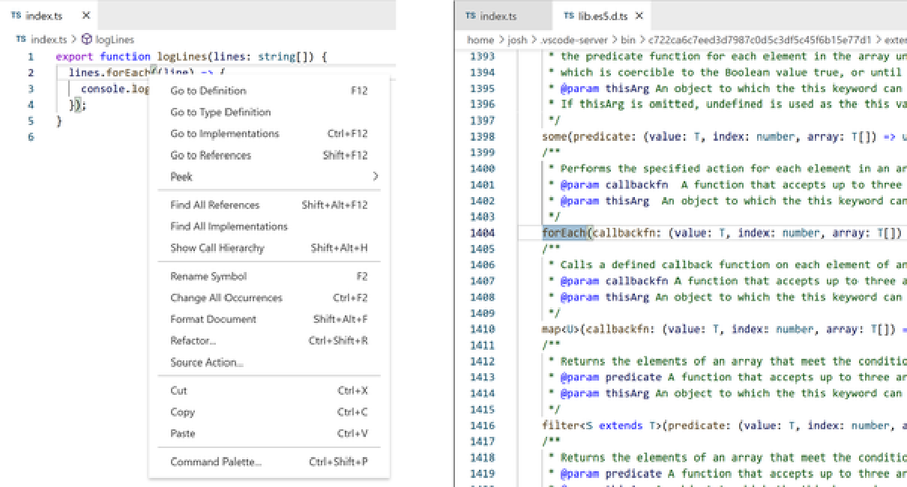

**Phần III. Sử dụng (Usage)**

# **Chương 11. Các tệp khai báo (Declaration Files)**

## Mục lục

- [**Chương 11. Các tệp khai báo (Declaration Files)**](#chương-11-các-tệp-khai-báo-declaration-files)
  - [**Các tệp khai báo (Declaration Files)**](#các-tệp-khai-báo-declaration-files-1)
      - [**MẸO (TIP)**](#mẹo-tip)
  - [**Khai báo các giá trị thời gian chạy (Declaring Runtime Values)**](#khai-báo-các-giá-trị-thời-gian-chạy-declaring-runtime-values)
      - [**MẸO (TIP)**](#mẹo-tip-1)
    - [**Các giá trị toàn cục (Global Values)**](#các-giá-trị-toàn-cục-global-values)
      - [**MẸO (TIP)**](#mẹo-tip-2)
    - [**Hợp nhất giao diện toàn cục (Global Interface Merging)**](#hợp-nhất-giao-diện-toàn-cục-global-interface-merging)
    - [**Bổ sung toàn cục (Global Augmentations)**](#bổ-sung-toàn-cục-global-augmentations)
  - [**Các khai báo tích hợp sẵn (Built-In Declarations)**](#các-khai-báo-tích-hợp-sẵn-built-in-declarations)
    - [**Khai báo thư viện (Library Declarations)**](#khai-báo-thư-viện-library-declarations)
      - [**Mục tiêu thư viện (Library targets)**](#mục-tiêu-thư-viện-library-targets)
      - [**MẸO (TIP)**](#mẹo-tip-3)
    - [**Khai báo DOM (DOM Declarations)**](#khai-báo-dom-dom-declarations)
  - [**Khai báo Module (Module Declarations)**](#khai-báo-module-module-declarations)
    - [**Khai báo Module đại diện (Wildcard Module Declarations)**](#khai-báo-module-đại-diện-wildcard-module-declarations)
      - [**CẢNH BÁO (WARNING)**](#cảnh-báo-warning)
  - [**Kiểu của các gói (Package Types)**](#kiểu-của-các-gói-package-types)
    - [**Tùy chọn declaration**](#tùy-chọn-declaration)
    - [**Kiểu của gói phụ thuộc (Dependency Package Types)**](#kiểu-của-gói-phụ-thuộc-dependency-package-types)
    - [**Công khai kiểu của gói (Exposing Package Types)**](#công-khai-kiểu-của-gói-exposing-package-types)
      - [**GHI CHÚ (NOTE)**](#ghi-chú-note)
  - [**DefinitelyTyped**](#definitelytyped)
      - [**GHI CHÚ (NOTE)**](#ghi-chú-note-1)
      - [**CẢNH BÁO (WARNING)**](#cảnh-báo-warning-1)
    - [**Tính sẵn có của kiểu (Type Availability)**](#tính-sẵn-có-của-kiểu-type-availability)
      - [**MẸO (TIP)**](#mẹo-tip-4)
  - [**Tổng kết**](#tổng-kết)
    - [**MẸO (TIP)**](#mẹo-tip-5)

_Các tệp khai báo_

_Chỉ chứa mã của hệ thống kiểu_

_Không có cấu trúc thời gian chạy_

Mặc dù viết mã bằng TypeScript rất tuyệt vời và đó là tất cả những gì bạn muốn làm, bạn vẫn sẽ cần phải làm việc với các tệp JavaScript thuần túy trong các dự án TypeScript của mình. Nhiều gói (packages) được viết trực tiếp bằng JavaScript, không phải TypeScript. Ngay cả các gói được viết bằng TypeScript cũng được phân phối dưới dạng các tệp JavaScript.

Hơn nữa, các dự án TypeScript cần một cách để được thông báo về các hình dạng kiểu của các tính năng đặc thù theo môi trường như các biến toàn cục và các API. Một dự án chạy trong, chẳng hạn như Node.js, có thể có quyền truy cập vào các module Node tích hợp sẵn mà không có sẵn trong trình duyệt—và ngược lại.

TypeScript cho phép khai báo các hình dạng kiểu tách biệt khỏi phần triển khai của chúng. Các khai báo kiểu thường được viết trong các tệp có tên kết thúc bằng phần mở rộng _.d.ts_, được gọi là _các tệp khai báo_ (declaration files). Các tệp khai báo nhìn chung hoặc được viết bên trong một dự án, được xây dựng và phân phối cùng với gói npm đã biên dịch của dự án, hoặc được chia sẻ dưới dạng một gói “typings” độc lập.

## **Các tệp khai báo (Declaration Files)**

Một tệp khai báo _.d.ts_ nhìn chung hoạt động tương tự như một tệp _.ts_, ngoại trừ một ràng buộc đáng chú ý là không được phép bao gồm mã thời gian chạy (runtime code). Các tệp _.d.ts_ chỉ chứa các mô tả về các giá trị thời gian chạy, interfaces, modules và các kiểu dữ liệu tổng quát có sẵn. Chúng không thể chứa bất kỳ mã thời gian chạy nào có thể biên dịch xuống JavaScript.

Các tệp khai báo có thể được import giống như bất kỳ tệp nguồn TypeScript nào khác.

Tệp _types.d.ts_ này export một interface `Character` được sử dụng bởi tệp _index.ts_:

```typescript
// types.d.ts
export interface Character {
catchphrase?: string;
name: string;
}
// index.ts
import { Character } from "./types";
export const character: Character= {
catchphrase: "Yee-haw!",
name: "Sandy Cheeks",
};
```

#### **MẸO (TIP)**

Các tệp khai báo tạo ra thứ được gọi là _ambient context_ (ngữ cảnh môi trường xung quanh), nghĩa là một vùng mã nơi bạn chỉ có thể khai báo các types, chứ không phải các giá trị.

Chương này chủ yếu dành cho các tệp khai báo và các dạng khai báo kiểu phổ biến nhất được sử dụng bên trong chúng.

## **Khai báo các giá trị thời gian chạy (Declaring Runtime Values)**

Mặc dù các tệp định nghĩa không thể tạo ra các giá trị thời gian chạy như hàm hoặc biến, chúng có thể khai báo rằng các cấu trúc đó có tồn tại bằng từ khóa `declare`. Làm như vậy sẽ thông báo cho hệ thống kiểu biết rằng một số ảnh hưởng bên ngoài—chẳng hạn như thẻ `<script>` trong một trang web—đã tạo ra giá trị dưới tên đó với một kiểu cụ thể.

Khai báo một biến bằng `declare` sử dụng cùng cú pháp như khai báo biến thông thường, ngoại trừ việc không được phép có giá trị khởi tạo.

Đoạn mã này khai báo thành công một biến `declared` nhưng nhận lỗi kiểu vì cố gắng cung cấp giá trị cho một biến `initializer`:

```typescript
// types.d.ts
declare let declared: string;  // Ok
declare let initializer: string = "Wanda";
//                                ~~~~~~~
// Error: Initializers are not allowed in ambient contexts.
```

Hàm và lớp cũng được khai báo tương tự như các dạng thông thường của chúng, nhưng không có thân hàm hoặc thân phương thức.

Hàm và phương thức `canGrantWish` sau đây được khai báo đúng cách mà không có thân hàm, nhưng hàm và phương thức `grantWish` bị lỗi cú pháp vì cố gắng thiết lập thân hàm không đúng cách:

```typescript
// fairies.d.ts
declare function canGrantWish(wish: string): boolean;  // Ok

declare function grantWish(wish: string) { return true; }
//                                       ~
// Error: An implementation cannot be declared in ambient contexts.

class Fairy {
canGrantWish(wish: string): boolean;  // Ok
grantWish(wish: string) {
//                  ~
// Error: An implementation cannot be declared in ambient contexts.
return true;
    }
}
```

#### **MẸO (TIP)**

Các quy tắc về `any` ngầm định của TypeScript hoạt động giống nhau đối với các hàm và biến được khai báo trong ambient contexts như trong mã nguồn thông thường. Vì ambient contexts không thể cung cấp thân hàm hoặc giá trị biến ban đầu, các chú thích kiểu tường minh—bao gồm cả các chú thích kiểu trả về tường minh—nhìn chung là cách duy nhất để ngăn chúng khỏi việc ngầm định có kiểu `any`.

Mặc dù các khai báo kiểu sử dụng từ khóa `declare` phổ biến nhất trong các tệp định nghĩa _.d.ts_, từ khóa `declare` cũng có thể được sử dụng bên ngoài các tệp khai báo. Một tệp module hoặc script cũng có thể sử dụng `declare`.

Điều này có thể hữu ích khi một biến toàn cục có sẵn chỉ nhằm mục đích sử dụng trong tệp đó.

Ở đây, một biến `myGlobalValue` được định nghĩa trong tệp _index.ts_, vì vậy nó được phép sử dụng trong tệp đó:

```typescript
// index.ts
declare const myGlobalValue: string;

console.log(myGlobalValue);  // Ok
```

Lưu ý rằng trong khi các hình dạng kiểu như interfaces được cho phép có hoặc không có `declare` trong các tệp định nghĩa _.d.ts_, các cấu trúc thời gian chạy như hàm hoặc biến sẽ kích hoạt cảnh báo kiểu nếu không có `declare`:

```typescript
// index.d.ts
interface Writer {}  // Ok
declare interface Writer {}  // Ok

declare const fullName: string;  // Ok: type is the primitive string
declare const firstName: "Liz";  // Ok: type is the literal "value"

const lastName = "Lemon";
// Error: Top-level declarations in .d.ts files must
// start with either a 'declare' or 'export' modifier.
```

### **Các giá trị toàn cục (Global Values)**

Bởi vì các tệp TypeScript không có câu lệnh `import` hoặc `export` được coi là các _scripts_ thay vì các _modules_, các cấu trúc—bao gồm các types—được khai báo trong chúng đều có sẵn trên phạm vi toàn cục. Các tệp định nghĩa không có bất kỳ import hay export nào có thể tận dụng hành vi đó để khai báo các kiểu trên phạm vi toàn cục. Các tệp định nghĩa toàn cục đặc biệt hữu ích để khai báo các kiểu hoặc biến toàn cục có sẵn trên tất cả các tệp trong một ứng dụng.

Ở đây, một tệp _globals.d.ts_ khai báo rằng một `const version: string` tồn tại trên phạm vi toàn cục. Một tệp _version.ts_ sau đó có thể tham chiếu đến biến toàn cục `version` mặc dù không import từ _globals.d.ts_:

```typescript
// globals.d.ts
declare const version: string;

// version.ts
export function logVersion() {
console.log(`Version: ${version}`);  // Ok
}
```

Các giá trị được khai báo toàn cục thường được sử dụng nhiều nhất trong các ứng dụng trình duyệt sử dụng các biến toàn cục. Mặc dù hầu hết các framework web hiện đại thường sử dụng các kỹ thuật mới hơn như ECMAScript modules, nhưng việc có thể lưu trữ các biến trên phạm vi toàn cục vẫn có thể hữu ích—đặc biệt là trong các dự án nhỏ hơn.

#### **MẸO (TIP)**

Nếu bạn thấy mình không thể tự động truy cập các kiểu toàn cục được khai báo trong tệp _.d.ts_, hãy kiểm tra lại kỹ xem tệp _.d.ts_ đó có đang import hoặc export bất kỳ thứ gì không. Ngay cả một lệnh export duy nhất cũng sẽ khiến toàn bộ tệp không còn khả dụng trên phạm vi toàn cục nữa!

### **Hợp nhất giao diện toàn cục (Global Interface Merging)**

Biến không phải là các giá trị toàn cục duy nhất trôi nổi xung quanh trong hệ thống kiểu của một dự án TypeScript. Nhiều khai báo kiểu tồn tại trên phạm vi toàn cục cho các API và giá trị toàn cục. Bởi vì các interface hợp nhất với các interface khác có cùng tên, việc khai báo một interface trong một ngữ cảnh script toàn cục—chẳng hạn như tệp khai báo _.d.ts_ không có bất kỳ câu lệnh `import` hoặc `export` nào—sẽ bổ sung cho interface đó trên toàn cục.

Ví dụ: một ứng dụng web dựa vào một biến toàn cục được thiết lập bởi server có thể muốn khai báo biến đó là tồn tại trên interface `Window` toàn cục. Việc hợp nhất interface sẽ cho phép một tệp như _types/window.d.ts_ khai báo một biến tồn tại trên biến `window` toàn cục có kiểu `Window`:

```html
<script type="text/javascript"> window.myVersion = "3.1.1"; </script>
```

```typescript
// types/window.d.ts
interface Window {
myVersion: string;
}
// index.ts
export function logWindowVersion() {
console.log(`Window version is: ${window.myVersion}`);
window.alert("Built-in window types still work! Hooray!")
}
```

### **Bổ sung toàn cục (Global Augmentations)**

Không phải lúc nào cũng có thể hạn chế việc sử dụng các câu lệnh `import` hoặc `export` trong một tệp _.d.ts_ cần bổ sung phạm vi toàn cục, chẳng hạn như khi các định nghĩa toàn cục của bạn được đơn giản hóa đáng kể bằng cách import một kiểu được định nghĩa ở nơi khác. Đôi khi các kiểu được khai báo trong một tệp module lại nhằm mục đích được sử dụng trên toàn cục.

Đối với những trường hợp đó, TypeScript cho phép cú pháp `declare global` cho một khối mã. Làm như vậy sẽ đánh dấu nội dung của khối đó nằm trong ngữ cảnh toàn cục mặc dù môi trường xung quanh chúng thì không:

```typescript
// types.d.ts
// (module context)
declare global {
// (global context)
}
// (module context)
```

Ở đây, một tệp `types/data.d.ts` export một interface `Data`, interface này sau đó sẽ được import bởi cả `types/globals.d.ts` và tệp thời gian chạy _index.ts_:

```typescript
// types/data.d.ts
export interface Data {
version: string;
}
```

Ngoài ra, `types/globals.d.ts` khai báo một biến có kiểu `Data` trên toàn cục bên trong một khối `declare global` cũng như một biến chỉ có sẵn trong tệp đó:

```typescript
// types/globals.d.ts
import { Data } from "./data";
declare global {
  const globallyDeclared: Data;
}
declare const locallyDeclared: Data;
```

Tệp _index.ts_ sau đó có quyền truy cập vào biến `globallyDeclared` mà không cần import, và vẫn cần import `Data`:

```typescript
// index.ts
import { Data } from "./types/data";
function logData(data: Data) {  // Ok
console.log(`Data version is: ${data.version}`);
}
logData(globallyDeclared);  // Ok
logData(locallyDeclared);
//      ~~~~~~~~~~~~~~~
// Error: Cannot find name 'locallyDeclared'.
```

Việc sắp xếp các khai báo toàn cục và module để phối hợp tốt với nhau có thể khá phức tạp. Việc sử dụng hợp lý các từ khóa `declare` và `global` của TypeScript có thể mô tả những định nghĩa kiểu nào được dự định là có sẵn trên toàn cục trong các dự án.

## **Các khai báo tích hợp sẵn (Built-In Declarations)**

Bây giờ bạn đã thấy cách các khai báo hoạt động, đã đến lúc hé lộ công dụng tiềm ẩn của chúng trong TypeScript: chúng đã hỗ trợ việc kiểm tra kiểu của nó trong suốt thời gian qua! Các đối tượng toàn cục như `Array`, `Function`, `Map`, và `Set` là những ví dụ về các cấu trúc mà hệ thống kiểu cần biết nhưng không được khai báo trong mã của bạn. Chúng được cung cấp bởi bất kỳ (các) runtime nào mà mã của bạn được thiết kế để chạy: Deno, Node, một trình duyệt web, v.v.

### **Khai báo thư viện (Library Declarations)**

Các đối tượng toàn cục tích hợp sẵn như `Array` và `Function` tồn tại trong tất cả các runtime JavaScript được khai báo trong các tệp có tên dạng _lib.[target].d.ts_. _target_ là phiên bản JavaScript hỗ trợ tối thiểu được nhắm mục tiêu bởi dự án của bạn, chẳng hạn như ES5, ES2020, hoặc ESNext.

Các tệp định nghĩa thư viện tích hợp sẵn, hay “lib files”, khá lớn vì chúng đại diện cho toàn bộ các API tích hợp sẵn của JavaScript. Ví dụ: các thành viên trên kiểu `Array` tích hợp sẵn được đại diện bởi một interface `Array` toàn cục bắt đầu như thế này:

```typescript
// lib.es5.d.ts
interface Array<T> {
/**
     * Gets or sets the length of the array.
     * This is a number one higher than the highest index in the array.
     */
length: number;
// ...
}
```

Các tệp lib được phân phối như một phần của gói npm TypeScript. Bạn có thể tìm thấy chúng bên trong gói tại các đường dẫn như _node_modules/typescript/lib/lib.es5.d.ts_. Đối với các IDE như VS Code sử dụng các phiên bản TypeScript được đóng gói riêng để kiểm tra kiểu mã nguồn, bạn có thể tìm thấy tệp lib đang được sử dụng bằng cách nhấp chuột phải vào một phương thức tích hợp sẵn như `forEach` của mảng trong mã của bạn và chọn tùy chọn như Go to Definition (Hình 11-1).



_Hình 11-1. Trái: Go to Definition trên một `forEach`; phải: tệp lib.es5.d.ts được mở ra kết quả_

#### **Mục tiêu thư viện (Library targets)**

TypeScript theo mặc định sẽ bao gồm tệp lib thích hợp dựa trên thiết lập `target` được cung cấp cho CLI `tsc` và/hoặc trong _tsconfig.json_ của dự án của bạn (mặc định là `"es5"`). Các tệp lib kế tiếp cho các phiên bản JavaScript mới hơn sẽ xây dựng dựa trên nhau bằng cách sử dụng tính năng hợp nhất interface.

Ví dụ: các thành viên `Number` tĩnh như `EPSILON` và `isFinite` được thêm vào trong ES2015 được liệt kê trong _lib.es2015.d.ts_:

```typescript
// lib.es2015.d.ts

interface NumberConstructor {
    /**
     * The value of Number.EPSILON is the difference between 1 and the
     * smallest value greater than 1 that is representable as a Number
     * value, which is approximately:
     * 2.2204460492503130808472633361816 x 10 − 16.
     */
    readonly EPSILON: number;

    /**
     * Returns true if passed value is finite.
     * Unlike the global isFinite, Number.isFinite doesn't forcibly
     * convert the parameter to a number. Only finite values of the
     * type number result in true.
     * @param number A numeric value.
     */
    isFinite(number: unknown): boolean;
    // ...
}
```

Các dự án TypeScript sẽ bao gồm các tệp lib cho tất cả các phiên bản mục tiêu của JavaScript cho đến mục tiêu tối thiểu của chúng. Ví dụ: một dự án có mục tiêu là `"es2016"` sẽ bao gồm _lib.es5.d.ts_, _lib.es2015.d.ts_, và _lib.es2016.d.ts_.

#### **MẸO (TIP)**

Các tính năng ngôn ngữ chỉ có sẵn trong các phiên bản JavaScript mới hơn mục tiêu của bạn sẽ không có sẵn trong hệ thống kiểu. Ví dụ: nếu mục tiêu của bạn là `"es5"`, các tính năng ngôn ngữ từ ES2015 trở lên như `String.prototype.startsWith` sẽ không được nhận diện.

Các tùy chọn trình biên dịch như `target` được đề cập chi tiết hơn trong Chương 13, “Các tùy chọn cấu hình”.

### **Khai báo DOM (DOM Declarations)**

Bên ngoài bản thân ngôn ngữ JavaScript, khu vực khai báo kiểu được tham chiếu phổ biến nhất là dành cho các trình duyệt web. Các kiểu trình duyệt web, thường được gọi là các kiểu “DOM”, bao gồm các API như `localStorage` và các hình dạng kiểu như `HTMLElement` có sẵn chủ yếu trong các trình duyệt web. Các kiểu DOM được lưu trữ trong một tệp _lib.dom.d.ts_ cùng với các tệp khai báo _lib.*.d.ts_ khác.

Các kiểu DOM toàn cục, giống như nhiều biến toàn cục tích hợp sẵn, thường được mô tả bằng các interface toàn cục. Ví dụ: interface `Storage` được sử dụng cho `localStorage` và `sessionStorage` bắt đầu đại loại như sau:

```typescript
// lib.dom.d.ts

interface Storage {
    /**
     * Returns the number of key/value pairs.
     */
    readonly length: number;
    /**
     * Removes all key/value pairs, if there are any.
     */
    clear(): void;
    /**
     * Returns the current value associated with the given key,
     * or null if the given key does not exist.
     */
    getItem(key: string): string | null;
    // ...
}
```

TypeScript bao gồm các kiểu DOM theo mặc định trong các dự án không ghi đè tùy chọn trình biên dịch `lib`. Điều đó đôi khi có thể gây nhầm lẫn cho các lập trình viên làm việc trên các dự án được thiết kế để chạy trong các môi trường phi trình duyệt như Node, vì họ không nên truy cập các API toàn cục như `document` và `localStorage` mà hệ thống kiểu lại cho là có tồn tại. Các tùy chọn trình biên dịch như `lib` được đề cập chi tiết hơn trong Chương 13, “Các tùy chọn cấu hình”.

## **Khai báo Module (Module Declarations)**

Một tính năng quan trọng nữa của các tệp khai báo là khả năng mô tả hình dạng của các module. Từ khóa `declare` có thể được sử dụng trước một tên chuỗi của một module để thông báo cho hệ thống kiểu về nội dung của module đó. Ở đây, module `"my-example-lib"` được khai báo là có tồn tại trong một tệp script khai báo `modules.d.ts`, sau đó được sử dụng trong một tệp _index.ts_:

```typescript
// modules.d.ts
declare module"my-example-lib" {
export const value: string;
}

// index.ts
import { value } from "my-example-lib";
console.log(value);  // Ok
```

Bạn không cần phải sử dụng `declare module` thường xuyên, nếu có, trong mã của riêng mình. Nó chủ yếu được sử dụng với các khai báo module đại diện (wildcard) ở phần sau và với các kiểu gói được đề cập sau trong chương này. Ngoài ra, hãy xem Chương 13, “Các tùy chọn cấu hình” để biết thông tin về `resolveJsonModule`, một tùy chọn trình biên dịch cho phép TypeScript nhận diện nguyên bản các lệnh import từ các tệp _.json_.

### **Khai báo Module đại diện (Wildcard Module Declarations)**

Một cách sử dụng phổ biến của các khai báo module là thông báo cho các ứng dụng web biết rằng một phần mở rộng tệp không phải JavaScript/TypeScript cụ thể có sẵn để `import` vào mã. Các khai báo module có thể chứa một ký tự đại diện `*` duy nhất để chỉ ra rằng bất kỳ module nào khớp với mẫu đó đều có cấu trúc giống nhau.

Ví dụ: nhiều dự án web chẳng hạn như những dự án được cấu hình sẵn trong các bộ khởi tạo React phổ biến như create-react-app và create-next-app hỗ trợ CSS modules để import các kiểu dáng từ các tệp CSS dưới dạng các đối tượng có thể được sử dụng tại thời gian chạy. Chúng sẽ định nghĩa các module với một mẫu như `"*.module.css"` mặc định export một đối tượng có kiểu `{ [i: string]: string }`:

```typescript
// styles.d.ts
declare module"*.module.css" {
const styles: { [i: string]: string };
export default styles;
}

// component.ts
import styles from "./styles.module.css";

styles.anyClassName;  // Type: string
```

#### **CẢNH BÁO (WARNING)**

Sử dụng các wildcard modules để đại diện cho các tệp cục bộ không hoàn toàn an toàn về kiểu. TypeScript không cung cấp cơ chế để đảm bảo đường dẫn module được import khớp với một tệp cục bộ có thực. Một số dự án sử dụng hệ thống build như Webpack và/hoặc tạo các tệp _.d.ts_ từ các tệp cục bộ để đảm bảo các import khớp nhau.

## **Kiểu của các gói (Package Types)**

Bây giờ bạn đã thấy cách khai báo typings bên trong một dự án, đã đến lúc đề cập đến việc sử dụng các kiểu giữa các gói. Các dự án được viết bằng TypeScript nhìn chung vẫn phân phối các gói chứa các đầu ra _.js_ đã được biên dịch. Chúng thường sử dụng các tệp _.d.ts_ để khai báo các hình dạng hệ thống kiểu TypeScript hỗ trợ phía sau các tệp JavaScript đó.

### **Tùy chọn declaration**

TypeScript cung cấp một tùy chọn `declaration` để tạo các đầu ra _.d.ts_ cho các tệp đầu vào cùng với các đầu ra JavaScript.

Ví dụ, với tệp nguồn _index.ts_ sau:

```typescript
// index.ts
export const greet= (text: string) => {
console.log(`Hello, ${text}!`);
};
```

Sử dụng `declaration`, một `module` là `"es2015"`, và một `target` là `"es2015"`, các đầu ra sau sẽ được tạo ra:

```typescript
// index.d.ts
export declare const greet: (text: string) => void;

// index.js
export const greet= (text) => {
console.log(`Hello, ${text}!`);
};
```

Các tệp _.d.ts_ được tạo tự động là cách tốt nhất để một dự án tạo các định nghĩa kiểu cho người dùng sử dụng. Nhìn chung khuyến nghị rằng hầu hết các gói được viết bằng TypeScript tạo ra các tệp đầu ra _.js_ cũng nên đóng gói các tệp _.d.ts_ cùng với các tệp đó.

Các tùy chọn trình biên dịch như `declaration` được đề cập chi tiết hơn trong Chương 13, “Các tùy chọn cấu hình”.

### **Kiểu của gói phụ thuộc (Dependency Package Types)**

TypeScript có thể phát hiện và sử dụng các tệp _.d.ts_ được đóng gói bên trong các phụ thuộc `node_modules` của một dự án. Các tệp đó sẽ thông báo cho hệ thống kiểu về các hình dạng kiểu được export bởi gói đó như thể chúng được viết bên trong cùng một dự án hoặc được khai báo bằng một khối module `declare`.

Một module npm điển hình đi kèm với các tệp khai báo _.d.ts_ riêng của nó có thể có cấu trúc tệp dạng như:

```text
lib/
    index.js
    index.d.ts
package.json
```

Ví dụ: trình chạy thử nghiệm vô cùng phổ biến Jest được viết bằng TypeScript và cung cấp các tệp _.d.ts_ đi kèm trong gói `jest` của nó. Nó có phụ thuộc vào gói `@jest/globals` cung cấp các hàm như `describe` và `it`, sau đó `jest` làm cho chúng có sẵn trên toàn cầu:

```json
// package.json
{
"devDependencies":{
"jest":"^32.1.0"
}
}
// using-globals.d.ts
describe("MyAPI", () => {
it("works", () => { /* ... */ });
});

// using-imported.d.ts
import { describe, it } from "@jest/globals";
describe("MyAPI", () => {
it("works", () => { /* ... */ });
});
```

Nếu chúng ta tái tạo một tập hợp con rất hạn chế của các gói typings Jest từ đầu, chúng có thể trông giống như các tệp này. Gói `@jest/globals` export các hàm `describe` và `it`. Sau đó, gói `jest` import các hàm đó và bổ sung phạm vi toàn cục với các biến `describe` và `it` thuộc kiểu hàm tương ứng của chúng:

```typescript
// node_modules/@jest/globals/index.d.ts
export function describe(name: string, test: () => void): void;
export function it(name: string, test: () => void): void;

// node_modules/jest/index.d.ts
import * as globals from "@jest/globals";
declare global {
const describe: typeof globals.describe;
const it: typeof globals.it;
}
```

Cấu trúc này cho phép các dự án sử dụng Jest tham chiếu đến các phiên bản toàn cục của `describe` và `it`. Các dự án cũng có thể chọn import các hàm đó từ gói `@jest/globals`.

### **Công khai kiểu của gói (Exposing Package Types)**

Nếu dự án của bạn được dự định phân phối trên npm và cung cấp các kiểu cho người dùng, hãy thêm trường `"types"` trong tệp _package.json_ của gói để trỏ đến tệp khai báo gốc. Trường `types` hoạt động tương tự như trường `main`—và thường sẽ trông giống nhau nhưng có phần mở rộng _.d.ts_ thay vì _.js_.

Ví dụ: trong tệp gói này, tệp thời gian chạy chính _./lib/index.js_ tương ứng với tệp types _./lib/index.d.ts_:

```json
{
"author":"Pendant Publishing",
"main":"./lib/index.js",
"name":"coffeetable",
"types":"./lib/index.d.ts",
"version":"0.5.22"
}
```

TypeScript sau đó sẽ sử dụng nội dung của _./lib/index.d.ts_ làm những gì nên được cung cấp cho các tệp sử dụng import từ gói đó.

#### **GHI CHÚ (NOTE)**

Nếu trường `types` không tồn tại trong _package.json_ của một gói, TypeScript sẽ giả định giá trị mặc định là _./index.d.ts_. Điều này phản ánh hành vi npm mặc định là giả định tệp _./index.js_ là điểm nhập `main` cho một gói nếu không được chỉ định.

Hầu hết các gói sử dụng tùy chọn trình biên dịch `declaration` của TypeScript để tạo các tệp _.d.ts_ cùng với các đầu ra _.js_ từ các tệp nguồn. Các tùy chọn trình biên dịch được đề cập trong Chương 13, “Các tùy chọn cấu hình”.

## **DefinitelyTyped**

Đáng buồn thay, không phải tất cả các dự án đều được viết bằng TypeScript. Một số lập trình viên không may mắn vẫn đang viết các dự án của họ bằng JavaScript thuần túy cũ kỹ mà không có bộ kiểm tra kiểu hỗ trợ họ. Thật kinh khủng.

Các dự án TypeScript của chúng ta vẫn cần được thông báo về các hình dạng kiểu của các module từ các gói đó. Nhóm TypeScript và cộng đồng đã tạo ra một kho lưu trữ khổng lồ có tên DefinitelyTyped để chứa các định nghĩa do cộng đồng viết cho các gói. DefinitelyTyped, hay gọi tắt là DT, là một trong những kho lưu trữ hoạt động tích cực nhất trên GitHub. Nó chứa hàng ngàn gói định nghĩa _.d.ts_, cùng với tự động hóa xung quanh việc đánh giá các đề xuất thay đổi và xuất bản các bản cập nhật.

Các gói DT được xuất bản trên npm dưới phạm vi `@types` với cùng tên như gói mà chúng cung cấp các kiểu. Ví dụ: tính đến năm 2022, `@types/react` cung cấp các định nghĩa kiểu cho gói `react`.

#### **GHI CHÚ (NOTE)**

`@types` nhìn chung được cài đặt dưới dạng `dependencies` hoặc `devDependencies`, mặc dù sự phân biệt giữa hai loại này đã trở nên mờ nhạt trong những năm gần đây. Nói chung, nếu dự án của bạn được dự định phân phối dưới dạng một gói npm, nó nên sử dụng `dependencies` để người dùng gói cũng kéo theo các định nghĩa kiểu được sử dụng bên trong. Nếu dự án của bạn là một ứng dụng độc lập chẳng hạn như ứng dụng được build và chạy trên server, nó nên sử dụng `devDependencies` để truyền đạt rằng các kiểu chỉ là một công cụ tại thời điểm phát triển.

Ví dụ: đối với một gói tiện ích dựa vào `lodash`—tính đến năm 2022 có gói `@types/lodash` riêng biệt—_package.json_ sẽ chứa các dòng tương tự như:

```json
// package.json
{
"dependencies":{
"@types/lodash":"^4.14.182",
"lodash":"^4.17.21"
}
}
```

Tệp _package.json_ cho một ứng dụng độc lập được xây dựng trên React có thể chứa các dòng tương tự như:

```json
// package.json
{
"dependencies":{
"react":"^18.1.0"
},
"devDependencies":{
"@types/react":"^18.0.9"
}
}
```

Lưu ý rằng các số phiên bản ngữ nghĩa (“semver”) không nhất thiết phải khớp nhau giữa các gói `@types/` và các gói mà chúng đại diện. Bạn thường có thể thấy một số gói bị lệch một phiên bản vá (patch) như với React ở trên, một phiên bản phụ (minor) như với Lodash ở trên, hoặc thậm chí các phiên bản chính (major).

#### **CẢNH BÁO (WARNING)**

Vì các tệp này do cộng đồng viết nên chúng có thể bị tụt hậu so với dự án gốc hoặc có những điểm không chính xác nhỏ. Nếu dự án của bạn biên dịch thành công nhưng bạn gặp lỗi thời gian chạy khi gọi các thư viện, hãy điều tra xem chữ ký của các API bạn đang truy cập có bị thay đổi hay không. Điều này ít phổ biến hơn, nhưng vẫn không phải là chưa từng nghe thấy, đối với các dự án trưởng thành có bề mặt API ổn định.

### **Tính sẵn có của kiểu (Type Availability)**

Hầu hết các gói JavaScript phổ biến hoặc xuất xưởng với các typings riêng của chúng hoặc có các typings có sẵn thông qua DefinitelyTyped.

Nếu bạn muốn có các kiểu cho một gói chưa có sẵn các kiểu, ba lựa chọn phổ biến nhất của bạn sẽ là:

- Gửi một pull request đến DefinitelyTyped để tạo gói `@types/` của nó.
- Sử dụng cú pháp `declare module` đã được giới thiệu trước đó để viết các kiểu bên trong dự án của bạn.
- Vô hiệu hóa `noImplicitAny` như được đề cập—và được cảnh báo mạnh mẽ không nên làm—trong Chương 13, “Các tùy chọn cấu hình”.

Tôi khuyên bạn nên đóng góp các kiểu cho DefinitelyTyped nếu bạn có thời gian. Làm như vậy sẽ giúp ích cho các lập trình viên TypeScript khác, những người cũng có thể muốn sử dụng gói đó.

#### **MẸO (TIP)**

Xem aka.ms/types để hiển thị xem một gói có các kiểu được đóng gói kèm theo hay thông qua một gói `@types/` riêng biệt.

## **Tổng kết**

Trong chương này, bạn đã sử dụng các tệp khai báo và các khai báo giá trị để thông báo cho TypeScript về các module và giá trị không được khai báo trong mã nguồn của bạn:

- Tạo các tệp khai báo với _.d.ts_
- Khai báo các kiểu và giá trị bằng từ khóa `declare`
- Thay đổi các kiểu toàn cục bằng cách sử dụng các giá trị toàn cục, hợp nhất interface toàn cục và bổ sung toàn cục
- Cấu hình và sử dụng các khai báo target, library và DOM tích hợp sẵn của TypeScript
- Khai báo các kiểu của module, bao gồm các module đại diện (wildcard)
- Cách TypeScript tiếp nhận các kiểu từ các gói
- Sử dụng DefinitelyTyped để lấy các kiểu cho các gói không bao gồm kiểu riêng của chúng

#### **MẸO (TIP)**

Bây giờ bạn đã đọc xong chương này, hãy thực hành những gì bạn đã học tại _https://learningtypescript.com/declaration-files_.

_Các kiểu TypeScript nói gì ở miền Nam nước Mỹ?_

_“Sao cơ, tôi thực sự khai báo (`declare`) đấy!”_
