# **Chương 12. Sử dụng các tính năng IDE (Using IDE Features)**

## Mục lục

- [**Chương 12. Sử dụng các tính năng IDE (Using IDE Features)**](#chương-12-sử-dụng-các-tính-năng-ide-using-ide-features)
      - [**GHI CHÚ (NOTE)**](#ghi-chú-note)
      - [**MẸO (TIP)**](#mẹo-tip)
  - [**Điều hướng mã nguồn (Navigating Code)**](#điều-hướng-mã-nguồn-navigating-code)
    - [**Tìm kiếm định nghĩa (Finding Definitions)**](#tìm-kiếm-định-nghĩa-finding-definitions)
    - [**Tìm kiếm tham chiếu (Finding References)**](#tìm-kiếm-tham-chiếu-finding-references)
    - [**Tìm kiếm triển khai (Finding Implementations)**](#tìm-kiếm-triển-khai-finding-implementations)
  - [**Viết mã (Writing Code)**](#viết-mã-writing-code)
    - [**Tự động hoàn thành tên (Completing Names)**](#tự-động-hoàn-thành-tên-completing-names)
    - [**Tự động cập nhật Import (Automatic Import Updates)**](#tự-động-cập-nhật-import-automatic-import-updates)
      - [**MẸO (TIP)**](#mẹo-tip-1)
    - [**Hành động mã nguồn (Code Actions)**](#hành-động-mã-nguồn-code-actions)
      - [**MẸO (TIP)**](#mẹo-tip-2)
      - [**Đổi tên (Renaming)**](#đổi-tên-renaming)
      - [**Xóa mã không sử dụng (Removing unused code)**](#xóa-mã-không-sử-dụng-removing-unused-code)
      - [**Các sửa lỗi nhanh khác (Other quick fixes)**](#các-sửa-lỗi-nhanh-khác-other-quick-fixes)
      - [**Tái cấu trúc (Refactoring)**](#tái-cấu-trúc-refactoring)
  - [**Làm việc hiệu quả với các lỗi (Working Effectively with Errors)**](#làm-việc-hiệu-quả-với-các-lỗi-working-effectively-with-errors)
    - [**Các lỗi của Language Service (Language Service Errors)**](#các-lỗi-của-language-service-language-service-errors)
      - [**Tab Problems**](#tab-problems)
      - [**Chạy trình biên dịch trong Terminal (Running a terminal compiler)**](#chạy-trình-biên-dịch-trong-terminal-running-a-terminal-compiler)
      - [**MẸO (TIP)**](#mẹo-tip-3)
      - [**Hiểu rõ các kiểu dữ liệu (Understanding types)**](#hiểu-rõ-các-kiểu-dữ-liệu-understanding-types)
  - [**Tổng kết**](#tổng-kết)
    - [**MẸO (TIP)**](#mẹo-tip-4)

_Lần đầu tiên lập trình với một IDE mang lại cảm giác như có siêu năng lực._

Không có ngôn ngữ lập trình phổ biến nào có thể hoàn thiện nếu thiếu tính năng tô sáng cú pháp (syntax highlighting) và các tính năng IDE khác hỗ trợ phát triển trên ngôn ngữ đó. Một trong những thế mạnh lớn nhất của TypeScript là dịch vụ ngôn ngữ (language service) của nó cung cấp một bộ công cụ trợ giúp phát triển mạnh mẽ cho mã nguồn JavaScript và TypeScript. Chương này sẽ đề cập đến một số tính năng hữu ích nhất.

Tôi thực sự khuyên bạn nên thử nghiệm các tính năng IDE này trên các dự án TypeScript mà bạn đã xây dựng song song với cuốn sách này. Mặc dù tất cả các ví dụ và ảnh chụp màn hình trong chương này đều thuộc về VS Code, trình soạn thảo yêu thích của tôi, nhưng bất kỳ IDE nào có hỗ trợ TypeScript đều sẽ hỗ trợ hầu hết hoặc toàn bộ nội dung của chương này. Tính đến năm 2022, điều đó bao gồm hỗ trợ gốc hoặc các plugin TypeScript cho ít nhất tất cả các trình soạn thảo sau: Atom, Emacs, Vim, Visual Studio, và WebStorm.

#### **GHI CHÚ (NOTE)**

Chương này là một danh sách chưa đầy đủ về một số tính năng IDE TypeScript hữu ích phổ biến hơn, cùng với các phím tắt mặc định cho chúng trong VS Code. Bạn có thể sẽ tìm thấy nhiều tính năng hơn nữa khi tiếp tục viết mã TypeScript.

Nhiều tính năng IDE thường được cung cấp trong menu ngữ cảnh (context menu) hiển thị khi nhấp chuột phải vào một tên trong mã nguồn. Các IDE như VS Code thường hiển thị các phím tắt trong menu ngữ cảnh. Việc làm quen với các phím tắt của IDE có thể giúp bạn viết mã và thực hiện tái cấu trúc nhanh hơn rất nhiều.

Ảnh chụp màn hình này hiển thị danh sách các lệnh và phím tắt của chúng trong VS Code cho một biến trong TypeScript (Hình 12-1).

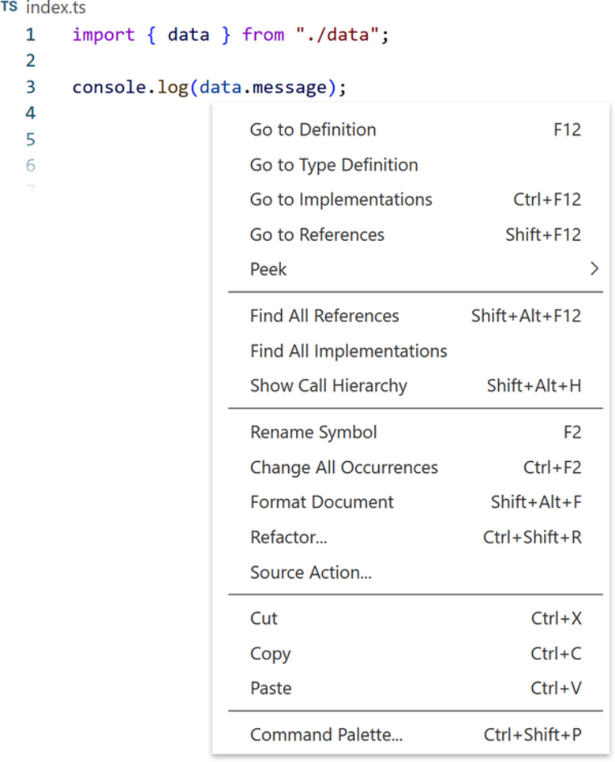

_Hình 12-1. VS Code hiển thị danh sách các lệnh trong menu ngữ cảnh nhấp chuột phải cho một biến_

#### **MẸO (TIP)**

Trong VS Code, cũng như hầu hết các ứng dụng, các phím mũi tên lên và xuống để chọn các tùy chọn thả xuống, và Enter kích hoạt một tùy chọn.

## **Điều hướng mã nguồn (Navigating Code)**

Các lập trình viên thường dành nhiều thời gian đọc mã hơn là chủ động viết mã. Các công cụ hỗ trợ điều hướng mã nguồn vô cùng hữu ích trong việc đẩy nhanh thời gian đó. Nhiều tính năng được cung cấp bởi dịch vụ ngôn ngữ TypeScript hướng tới việc tìm hiểu về mã nguồn: đặc biệt là chuyển đổi nhanh giữa các định nghĩa kiểu hoặc các giá trị trong mã và nơi chúng được sử dụng. Bây giờ tôi sẽ điểm qua các tùy chọn điều hướng thường dùng từ menu ngữ cảnh cùng với các phím tắt VS Code tương ứng.

### **Tìm kiếm định nghĩa (Finding Definitions)**

TypeScript có thể bắt đầu từ một tham chiếu đến một định nghĩa kiểu hoặc giá trị và điều hướng bạn trở lại vị trí ban đầu của nó trong mã. VS Code cũng cung cấp một số cách để truy ngược theo cách đó:

- Go to Definition (F12) điều hướng trực tiếp đến nơi một tên được yêu cầu được định nghĩa ban đầu.
- Nhấn Cmd (Mac) / Ctrl (Windows) + nhấp chuột vào một tên cũng kích hoạt việc đi tới định nghĩa.
- Peek > Peek Definition (Option (Mac) / Alt (Windows) + F12) hiển thị một hộp Peek cho thấy định nghĩa mà không cần rời khỏi vị trí hiện tại.

Go to Type Definition là phiên bản chuyên biệt của Go to Definition để đi đến định nghĩa của bất kỳ kiểu nào của một giá trị. Đối với một thể hiện của một lớp hoặc interface, nó sẽ hiển thị chính lớp hoặc interface đó thay vì nơi thể hiện đó được định nghĩa.

Các ảnh chụp màn hình này hiển thị việc tìm định nghĩa của một biến `data` được import vào một tệp bằng Go to Definition (Hình 12-2).

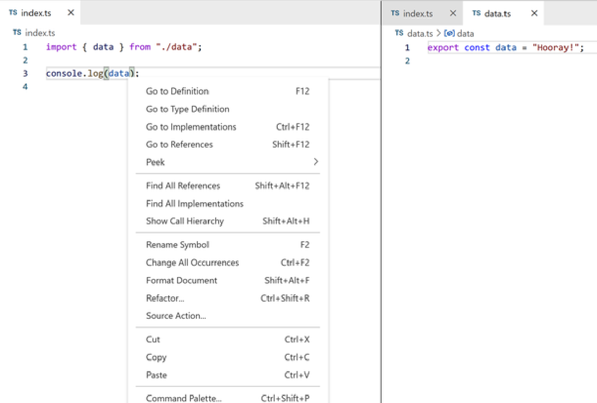

_Hình 12-2. Trái: Go to Definition trên một tên biến; phải: tệp data.ts kết quả được mở ra_

Khi định nghĩa được khai báo trong chính mã của bạn, chẳng hạn như một tệp tương đối, trình soạn thảo sẽ đưa bạn đến tệp đó. Các module bên ngoài mã của bạn như các gói npm thường sẽ sử dụng các tệp khai báo _.d.ts_ thay thế.

### **Tìm kiếm tham chiếu (Finding References)**

Cho trước một định nghĩa kiểu hoặc giá trị, TypeScript có thể hiển thị cho bạn danh sách tất cả các tham chiếu đến nó, hoặc những nơi nó được sử dụng trong dự án. VS Code cung cấp một số cách để trực quan hóa danh sách đó.

Go to References (Shift + F12) hiển thị danh sách các tham chiếu đến định nghĩa kiểu hoặc giá trị đó—bắt đầu từ chính nó—trong một hộp Peek có thể mở rộng ngay bên dưới tên được nhấp chuột phải.

Ví dụ: đây là Go to References về khai báo của biến `data` trong một tệp, _data.ts_, hiển thị cả khai báo và cách sử dụng nó trong một tệp khác, _index.ts_ (Hình 12-3).

_Hình 12-3. Menu Peek hiển thị các tham chiếu đến một biến_

Hộp Peek đó chứa chế độ xem tệp của tệp tham chiếu. Bạn có thể sử dụng tệp đó—gõ phím, chạy các lệnh của trình soạn thảo, v.v.—như thể nó là một tệp được mở bình thường. Bạn cũng có thể nhấp đúp vào chế độ xem tệp của hộp Peek để mở tệp đó.

Nhấp qua danh sách tên tệp ở bên phải hộp Peek sẽ chuyển chế độ xem tệp của hộp Peek sang tệp được nhấp. Nhấp đúp vào một dòng của tệp từ danh sách sẽ mở tệp và chọn tham chiếu phù hợp của nó.

Ở đây, VS Code đang hiển thị cùng một khai báo và cách sử dụng của biến `data`, nhưng được mở rộng trong chế độ xem thanh bên ở bên phải (Hình 12-4).

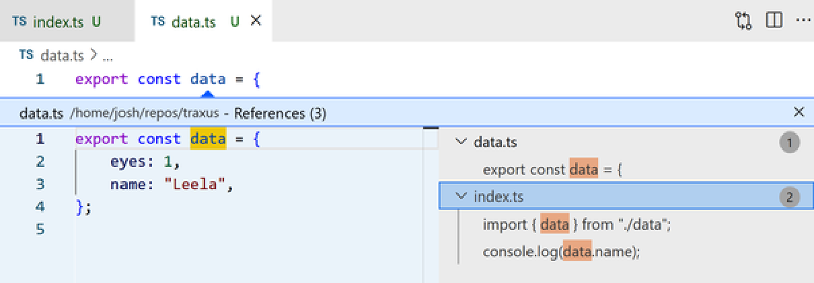

_Hình 12-4. Menu Peek hiển thị một tham chiếu đã mở tới một biến_

Find All References (Option (Mac) / Alt (Windows) + Shift + F12) cũng hiển thị danh sách các tham chiếu, nhưng trong chế độ xem thanh bên vẫn hiển thị sau khi điều hướng mã. Điều này có thể hữu ích để mở hoặc thực hiện các hành động trên nhiều tham chiếu cùng một lúc (Hình 12-5).

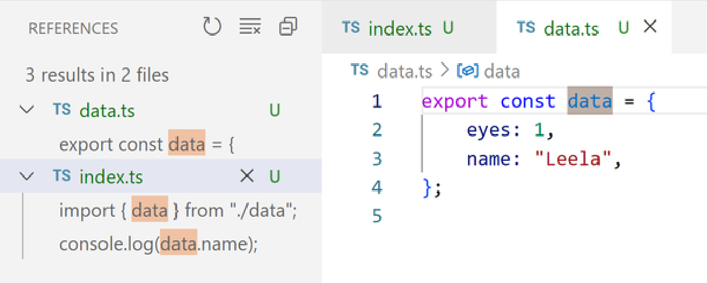

_Hình 12-5. Menu Find All References cho một biến_

### **Tìm kiếm triển khai (Finding Implementations)**

Go to Implementations (Cmd (Mac) / Ctrl (Windows) + F12) và Find All Implementations là các phiên bản chuyên biệt của Go To / Find All References dành riêng cho interfaces và các phương thức lớp trừu tượng. Chúng tìm thấy tất cả các triển khai của một interface hoặc phương thức trừu tượng trong mã (Hình 12-6).

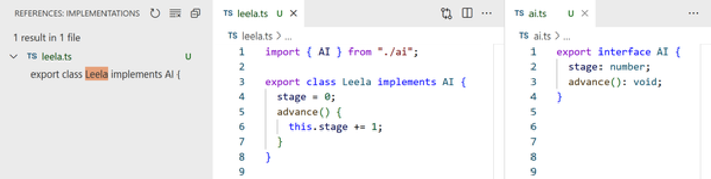

_Hình 12-6. Menu Find All Implementations cho một interface `AI`_

Những tính năng này đặc biệt hữu ích khi bạn đang tìm kiếm cụ thể cách các giá trị được định kiểu như lớp hoặc interface được sử dụng. Find All References có thể quá nhiều thông tin gây nhiễu, vì nó cũng sẽ hiển thị các định nghĩa và các tham chiếu kiểu khác đến lớp hoặc interface.

## **Viết mã (Writing Code)**

Các dịch vụ ngôn ngữ IDE như dịch vụ TypeScript của VS Code chạy ẩn dưới nền của trình soạn thảo và phản hồi các thao tác được thực hiện trong các tệp. Chúng nhìn thấy các chỉnh sửa đối với các tệp khi bạn gõ chúng—ngay cả trước khi các thay đổi được lưu vào tệp. Làm như vậy cho phép kích hoạt hàng loạt tính năng giúp tự động hóa các tác vụ phổ biến khi viết mã TypeScript.

### **Tự động hoàn thành tên (Completing Names)**

Các API của TypeScript có thể được các trình soạn thảo sử dụng để điền các tên tồn tại trong cùng một tệp. Khi bạn bắt đầu gõ một cái tên, chẳng hạn như khi cung cấp một biến đã khai báo trước đó làm đối số hàm, các trình soạn thảo sử dụng TypeScript thường sẽ đề xuất các gợi ý tự động hoàn thành (autocompletions) với danh sách các biến có tên khớp. Nhấp vào tên trong danh sách bằng chuột hoặc nhấn phím Enter sẽ hoàn thành tên đó (Hình 12-7).

_Hình 12-7. Trái: tự động hoàn thành trên một biến được gõ là `dat`; phải: kết quả của việc tự động hoàn thành thành một `data` được import_

Việc tự động thêm import cũng sẽ được cung cấp cho các phụ thuộc của gói. Các ảnh chụp màn hình này hiển thị các import và mã module của tệp TypeScript trước và sau khi `sortBy` được import từ gói `"lodash"` (Hình 12-8).

_Hình 12-8. Trái: tự động hoàn thành trên một biến được gõ là `sortBy`; phải: kết quả của việc tự động hoàn thành thành một `sortBy` được import từ `lodash`_

Tự động import là một trong những tính năng yêu thích nhất của tôi trong trải nghiệm TypeScript. Chúng xúc tiến rất nhiều quá trình thường tốn công sức để tìm xem các import đến từ đâu và sau đó phải gõ chúng ra một cách tường minh.

Tương tự, nếu bạn bắt đầu gõ tên của một thuộc tính từ một giá trị đã được định kiểu, các trình soạn thảo được hỗ trợ bởi TypeScript sẽ đề xuất tự động hoàn thành cho các thuộc tính đã biết của kiểu giá trị đó (Hình 12-9).

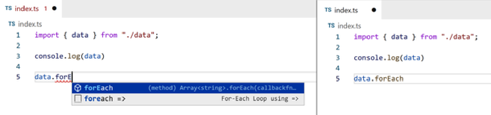

_Hình 12-9. Trái: tự động hoàn thành trên một thuộc tính được gõ là `forE`; phải: kết quả của việc tự động hoàn thành thành `.forEach`_

### **Tự động cập nhật Import (Automatic Import Updates)**

Nếu bạn đổi tên một tệp hoặc di chuyển nó từ thư mục này sang thư mục khác, bạn có thể cần phải cập nhật rất nhiều câu lệnh import cho tệp đó. Các cập nhật có thể cần được thực hiện cả trong chính tệp đó và trong bất kỳ tệp nào khác import từ nó.

Nếu bạn kéo và thả một tệp hoặc đổi tên nó thành một đường dẫn thư mục lồng nhau bằng trình khám phá tệp của VS Code, VS Code sẽ đề xuất sử dụng TypeScript để cập nhật đường dẫn tệp cho bạn.

Các ảnh chụp màn hình này hiển thị tệp _src/logging.ts_ được đổi tên thành vị trí _src/shared/logging.ts_, và các lệnh import tệp được cập nhật theo cách tương ứng (Hình 12-10).

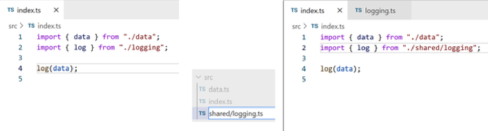

_Hình 12-10. Trái: một tệp src/index.ts import từ `"./logging"`; giữa: đổi tên src/logging.ts thành src/shared/logging.ts; phải: src/index.ts với đường dẫn import đã được cập nhật_

#### **MẸO (TIP)**

Chỉnh sửa nhiều tệp có thể để lại các thay đổi đối với tệp chưa được lưu. Hãy nhớ lưu bất kỳ tệp nào đã thay đổi sau khi chạy các chỉnh sửa trên chúng.

### **Hành động mã nguồn (Code Actions)**

Nhiều tiện ích IDE của TypeScript được cung cấp dưới dạng các hành động (actions) mà bạn có thể kích hoạt. Mặc dù một số hành động này chỉ sửa đổi tệp hiện tại đang được chỉnh sửa, nhưng một số hành động có thể sửa đổi nhiều tệp cùng một lúc. Sử dụng các code actions này là một cách tuyệt vời để chỉ đạo TypeScript thực hiện nhiều tác vụ viết mã thủ công của bạn, chẳng hạn như tính toán đường dẫn import và các tái cấu trúc phổ biến cho bạn.

Code actions thường được biểu thị bằng một loại biểu tượng nào đó trong trình soạn thảo khi có sẵn. Ví dụ, VS Code hiển thị một bóng đèn có thể nhấp vào bên cạnh con trỏ văn bản của bạn khi có ít nhất một code action khả dụng (Hình 12-11).

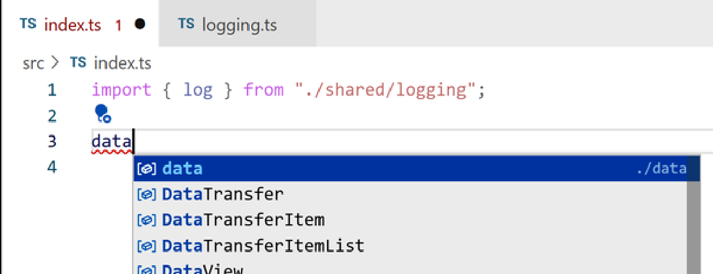

_Hình 12-11. Bóng đèn Code actions bên cạnh một tên gây ra lỗi kiểu_

#### **MẸO (TIP)**

Các trình soạn thảo thường cung cấp các phím tắt để thao tác với menu code actions hoặc tương đương, cho phép bạn kích hoạt bất kỳ hành động nào trong chương này mà không cần sử dụng chuột. Phím tắt mặc định của VS Code để mở menu code actions là Cmd + `.` trên Mac và Ctrl + `.` trên Linux/Windows. Các phím mũi tên lên và xuống chọn các tùy chọn thả xuống, và Enter kích hoạt một tùy chọn.

Các code actions này—đặc biệt là đổi tên và tái cấu trúc—rất mạnh mẽ nhờ được định hướng bởi hệ thống kiểu của TypeScript. Khi áp dụng một hành động cho một kiểu, TypeScript sẽ hiểu những giá trị nào trên tất cả các tệp thuộc kiểu đó, và sau đó có thể áp dụng bất kỳ thay đổi cần thiết nào cho các giá trị đó.

#### **Đổi tên (Renaming)**

Việc thay đổi một tên đã tồn tại, chẳng hạn như tên của một hàm, interface, hoặc biến có thể cồng kềnh nếu thực hiện thủ công. TypeScript có thể thực hiện đổi tên cho một tên đồng thời cập nhật tất cả các tham chiếu đến tên đó.

Tùy chọn menu ngữ cảnh Rename Symbol (F2) tạo một hộp văn bản nơi bạn có thể nhập tên mới. Kích hoạt đổi tên trên tên của một hàm, ví dụ, sẽ cung cấp một hộp văn bản để đổi tên hàm đó và tất cả các lời gọi đến nó. Nhấn Enter để áp dụng tên đó (Hình 12-12).

_Hình 12-12. Hộp để đổi tên hàm `log`, với `logData` được chèn vào_

Nếu bạn muốn xem điều gì sẽ xảy ra trước khi áp dụng tên mới, hãy nhấn Shift + Enter để mở ngăn Refactor Preview liệt kê tất cả các thay đổi văn bản sẽ diễn ra (Hình 12-13).

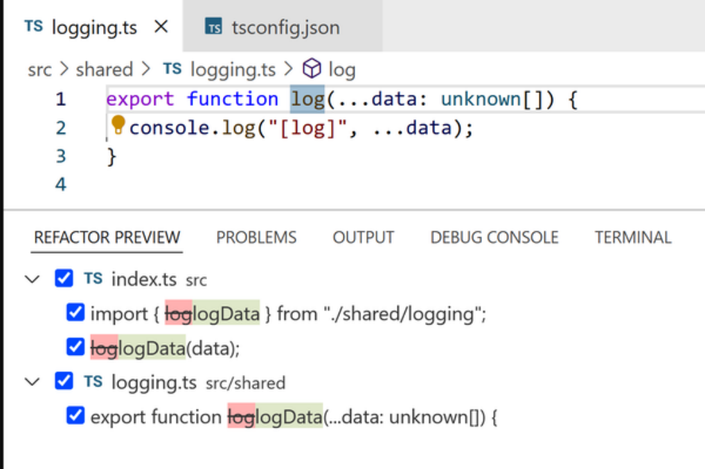

_Hình 12-13. Xem trước tái cấu trúc để đổi tên hàm `log`, với `logData` được xem trước trên hai tệp_

#### **Xóa mã không sử dụng (Removing unused code)**

Nhiều IDE thay đổi một cách tinh tế giao diện trực quan của mã không được sử dụng, chẳng hạn như các giá trị được import và các biến không bao giờ được tham chiếu. Ví dụ: VS Code làm giảm độ mờ của chúng đi khoảng một phần ba.

TypeScript cung cấp các code actions để xóa mã không sử dụng. (Hình 12-14) hiển thị kết quả của việc yêu cầu TypeScript xóa một câu lệnh `import` không được sử dụng.

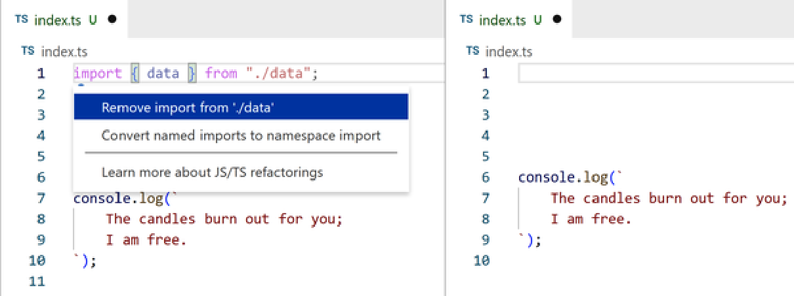

_Hình 12-14. Trái: chọn một import không sử dụng và mở menu tái cấu trúc; phải: tệp sau khi TypeScript xóa nó_

#### **Các sửa lỗi nhanh khác (Other quick fixes)**

Nhiều thông báo lỗi TypeScript dành cho các vấn đề về mã có thể được khắc phục nhanh chóng, chẳng hạn như các lỗi chính tả nhỏ trong từ khóa hoặc tên biến. Các sửa lỗi nhanh hữu ích phổ biến khác của TypeScript bao gồm:

- Khai báo một thuộc tính còn thiếu trên một lớp hoặc interface
- Sửa tên trường bị gõ sai
- Điền vào các thuộc tính còn thiếu của một biến được khai báo dưới dạng một kiểu

Tôi khuyên bạn nên kiểm tra danh sách các bản sửa lỗi nhanh bất cứ khi nào bạn phát hiện ra một thông báo lỗi mà bạn chưa từng thấy trước đây. Bạn không bao giờ biết TypeScript đã cung cấp những tiện ích hữu ích nào để giải quyết nó!

#### **Tái cấu trúc (Refactoring)**

Dịch vụ ngôn ngữ TypeScript cung cấp rất nhiều thay đổi mã tiện lợi cho các cấu trúc mã khác nhau. Một số thao tác đơn giản như di chuyển các dòng mã xung quanh, trong khi những thao tác khác phức tạp như tạo các hàm mới cho bạn.

Khi bạn đã chọn một vùng mã, VS Code sẽ hiển thị biểu tượng bóng đèn bên cạnh vùng chọn của bạn. Nhấp vào nó để xem danh sách các tái cấu trúc có sẵn. Đây là cảnh một lập trình viên trích xuất một mảng literal nội dòng thành một biến `const` (Hình 12-15).

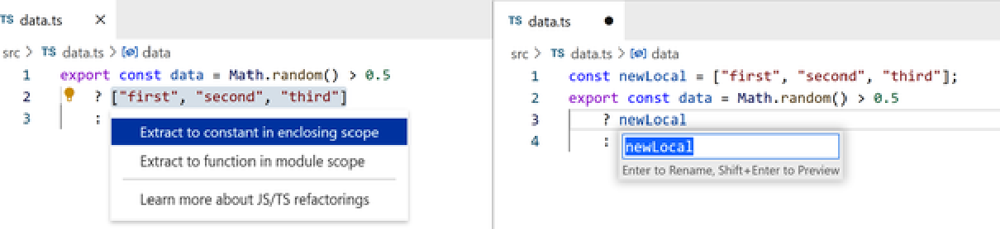

_Hình 12-15. Trái: chọn một array literal và mở menu tái cấu trúc; phải: trích xuất thành một biến hằng số_

## **Làm việc hiệu quả với các lỗi (Working Effectively with Errors)**

Đọc và hành động dựa trên các thông báo lỗi là một thực tế hiển nhiên khi làm việc trong bất kỳ ngôn ngữ lập trình nào. Mọi lập trình viên, bất kể mức độ thành thạo ngôn ngữ TypeScript ra sao, đều sẽ kích hoạt vô số lỗi của trình biên dịch TypeScript mỗi khi họ viết mã TypeScript. Sử dụng các tính năng IDE để nâng cao khả năng làm việc hiệu quả với các lỗi của trình biên dịch TypeScript sẽ giúp bạn làm việc hiệu quả hơn rất nhiều với ngôn ngữ này.

### **Các lỗi của Language Service (Language Service Errors)**

Các trình soạn thảo thường hiển thị bất kỳ lỗi nào được báo cáo bởi dịch vụ ngôn ngữ TypeScript dưới dạng các đường lượn sóng màu đỏ bên dưới đoạn mã có vấn đề. Di chuột qua các ký tự được gạch dưới sẽ hiển thị một hộp thông tin bên cạnh chúng với nội dung của lỗi (Hình 12-16).

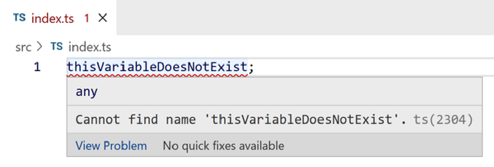

_Hình 12-16. Thông tin di chuột trên một biến không tồn tại_

VS Code cũng hiển thị các lỗi cho bất kỳ tệp đang mở nào trong tab Problems trong phần Bảng điều khiển (Panels) của nó. Liên kết View Problem ở phía dưới bên trái trong hộp di chuột cho một lỗi sẽ mở một màn hình hiển thị nội tuyến của thông báo được chèn sau dòng có vấn đề và trước bất kỳ dòng tiếp theo nào (Hình 12-17).

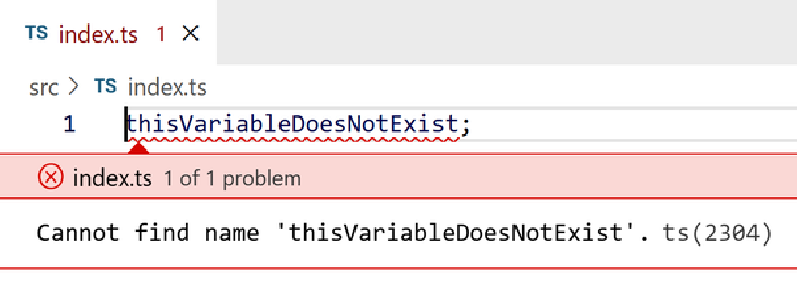

_Hình 12-17. Màn hình hiển thị nội tuyến View Problem cho một biến không tồn tại_

Khi có nhiều vấn đề tồn tại trong cùng một tệp nguồn, màn hình hiển thị của chúng sẽ bao gồm các mũi tên lên và xuống mà bạn có thể sử dụng để chuyển đổi qua lại giữa chúng. F8 và Shift + F8 hoạt động như các phím tắt để lần lượt chuyển tiếp và lùi lại trong danh sách các vấn đề đó (Hình 12-18).

_Hình 12-18. Một trong hai màn hình hiển thị nội tuyến View Problem cho các biến không tồn tại_

#### **Tab Problems**

VS Code bao gồm một tab Problems trong bảng điều khiển của nó, đúng như tên gọi, hiển thị bất kỳ vấn đề nào trong không gian làm việc của bạn. Điều đó bao gồm các lỗi được báo cáo bởi dịch vụ ngôn ngữ TypeScript.

Ảnh chụp màn hình này hiển thị tab Problems cho thấy hai sự cố trong một tệp TypeScript (Hình 12-19).

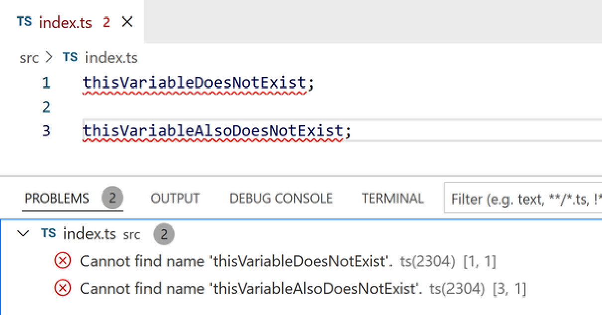

_Hình 12-19. Tab Problems hiển thị hai lỗi trong một tệp_

Nhấp vào bất kỳ lỗi nào trong tab Problems sẽ đưa con trỏ văn bản của bạn đến dòng và cột vi phạm trong tệp của nó.

Lưu ý rằng VS Code sẽ chỉ liệt kê các vấn đề cho các tệp hiện đang mở. Nếu bạn muốn có một danh sách cập nhật theo thời gian thực về tất cả các sự cố của trình biên dịch TypeScript, bạn sẽ cần chạy trình biên dịch TypeScript trong terminal.

#### **Chạy trình biên dịch trong Terminal (Running a terminal compiler)**

Tôi khuyên bạn nên chạy trình biên dịch TypeScript ở chế độ theo dõi (watch mode - được đề cập trong Chương 13, “Các tùy chọn cấu hình”) trong một terminal trong khi làm việc trong một dự án TypeScript. Làm như vậy sẽ cung cấp cho bạn một danh sách cập nhật theo thời gian thực về tất cả các vấn đề—chứ không chỉ những vấn đề trong các tệp đang mở.

Để thực hiện việc này trong VS Code, hãy mở bảng Terminal và chạy `tsc -w` (hoặc `tsc -b -w` nếu sử dụng project references, cũng được đề cập trong Chương 13, “Các tùy chọn cấu hình”). Bây giờ bạn sẽ thấy một màn hình terminal hiển thị tất cả các vấn đề TypeScript trong dự án của bạn, như trong ảnh chụp màn hình này (Hình 12-20).

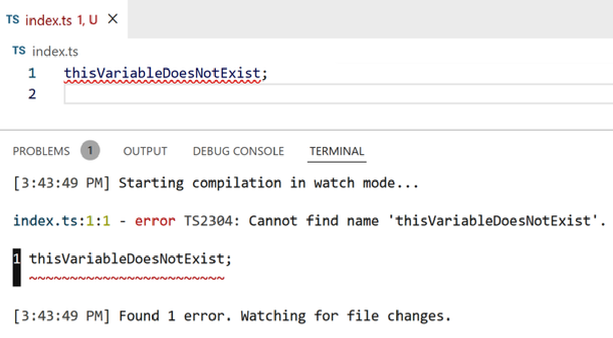

_Hình 12-20. Chạy `tsc -w` trong terminal để báo cáo sự cố trong tệp_

Nhấn Cmd (Mac) / Ctrl (Windows) + nhấp vào tên tệp cũng sẽ đưa con trỏ văn bản của bạn đến dòng và cột vi phạm trong tệp của nó.

#### **MẸO (TIP)**

Một số dự án sử dụng cấu hình launch.json của VS Code để khởi động một terminal với trình biên dịch TypeScript ở chế độ watch mode cho bạn. Xem code.visualstudio.com/docs/editor/tasks để biết tài liệu tham khảo đầy đủ về các tác vụ VS Code.

#### **Hiểu rõ các kiểu dữ liệu (Understanding types)**

Đôi khi bạn sẽ thấy mình cần tìm hiểu kiểu của một thứ gì đó được thiết lập theo cách mà kiểu đó không hiển thị rõ ràng. Đối với bất kỳ giá trị nào, bạn có thể di chuột qua tên của nó để xem hộp di chuột hiển thị kiểu của nó.

Ảnh chụp màn hình này hiển thị hộp di chuột cho một biến (Hình 12-21).

_Hình 12-21. Thông tin di chuột trên một biến_

Giữ Ctrl trong khi di chuột để hiển thị nơi tên được khai báo. Ảnh chụp màn hình này hiển thị hộp di chuột Ctrl cho cùng một biến như trước (Hình 12-22).

_Hình 12-22. Thông tin di chuột mở rộng trên một biến_

Hộp thông tin di chuột cũng có sẵn trên các kiểu, chẳng hạn như type aliases. Ảnh chụp màn hình này hiển thị việc di chuột qua một kiểu `keyof typeof` để xem union tương đương của nó gồm các string literals (Hình 12-23).

_Hình 12-23. Thông tin di chuột mở rộng trên một kiểu_

Một chiến lược mà tôi thấy hữu ích khi cố gắng hiểu các thành phần của các kiểu phức tạp là tạo một type alias chỉ đại diện cho một thành phần của kiểu đó. Sau đó, bạn sẽ có thể di chuột qua type alias đó để xem kết quả kiểu của nó là gì.

Đối với kiểu `FruitsType` từ trước làm ví dụ, phần `typeof fruits` của nó có thể được trích xuất thành một kiểu trung gian riêng biệt bằng một thao tác tái cấu trúc. Sau đó, kiểu trung gian đó có thể được di chuột vào để xem thông tin kiểu (Hình 12-24).

_Hình 12-24. Trái: trích xuất một phần của kiểu `FruitsType`; phải: di chuột qua kiểu đã trích xuất đó_

Chiến lược type alias trung gian đặc biệt hữu ích cho việc gỡ lỗi các thao tác kiểu được đề cập trong Chương 15, “Thao tác kiểu”.

## **Tổng kết**

Trong chương này, bạn đã khám phá việc sử dụng các tích hợp IDE của TypeScript để nâng cao khả năng viết mã TypeScript của mình:

- Mở các menu ngữ cảnh trên các kiểu và giá trị để liệt kê các lệnh có sẵn của chúng
- Điều hướng mã bằng cách tìm kiếm các định nghĩa, tham chiếu và triển khai
- Tự động hóa việc viết mã với hoàn thành tên và tự động import
- Nhiều code actions hơn bao gồm đổi tên và tái cấu trúc
- Các chiến lược để xem và hiểu các lỗi của language service
- Các chiến lược để tìm hiểu và hiểu rõ các kiểu dữ liệu

#### **MẸO (TIP)**

Bây giờ bạn đã đọc xong chương này, hãy thực hành những gì bạn đã học tại _https://learningtypescript.com/using-ide-features_.

_Những chiếc IDE đang yêu nói gì với nhau?_

_“Bạn hoàn thiện tôi (You complete me)!”_
