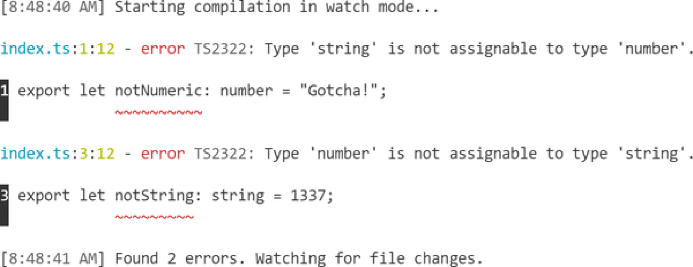

# **Chương 13. Các tùy chọn cấu hình (Configuration Options)**

## Mục lục

- [**Chương 13. Các tùy chọn cấu hình (Configuration Options)**](#chương-13-các-tùy-chọn-cấu-hình-configuration-options)
  - [**Tùy chọn tsc (tsc Options)**](#tùy-chọn-tsc-tsc-options)
    - [**Chế độ Pretty (Pretty Mode)**](#chế-độ-pretty-pretty-mode)
    - [**Chế độ Watch (Watch Mode)**](#chế-độ-watch-watch-mode)
  - [**Các tệp TSConfig (TSConfig Files)**](#các-tệp-tsconfig-tsconfig-files)
      - [**GHI CHÚ (NOTE)**](#ghi-chú-note)
    - [**tsc --init**](#tsc---init)
    - [**CLI so với tệp cấu hình (CLI Versus Configuration)**](#cli-so-với-tệp-cấu-hình-cli-versus-configuration)
      - [**MẸO (TIP)**](#mẹo-tip)
  - [**Bao gồm tệp (File Inclusions)**](#bao-gồm-tệp-file-inclusions)
    - [**include**](#include)
    - [**exclude**](#exclude)
      - [**MẸO (TIP)**](#mẹo-tip-1)
  - [**Các phần mở rộng thay thế (Alternative Extensions)**](#các-phần-mở-rộng-thay-thế-alternative-extensions)
    - [**Cú pháp JSX (JSX Syntax)**](#cú-pháp-jsx-jsx-syntax)
      - [**jsx**](#jsx)
    - [**resolveJsonModule**](#resolvejsonmodule)
  - [**Xuất mã (Emit)**](#xuất-mã-emit)
    - [**outDir**](#outdir)
    - [**target**](#target)
      - [**MẸO (TIP)**](#mẹo-tip-2)
    - [**Xuất các tệp khai báo (Emitting Declarations)**](#xuất-các-tệp-khai-báo-emitting-declarations)
      - [**emitDeclarationOnly**](#emitdeclarationonly)
    - [**Source Maps**](#source-maps)
      - [**sourceMap**](#sourcemap)
      - [**declarationMap**](#declarationmap)
      - [**MẸO (TIP)**](#mẹo-tip-3)
    - [**noEmit**](#noemit)
  - [**Kiểm tra kiểu (Type Checking)**](#kiểm-tra-kiểu-type-checking)
    - [**lib**](#lib)
      - [**MẸO (TIP)**](#mẹo-tip-4)
    - [**skipLibCheck**](#skiplibcheck)
    - [**Chế độ nghiêm ngặt (Strict Mode)**](#chế-độ-nghiêm-ngặt-strict-mode)
      - [**CẢNH BÁO (WARNING)**](#cảnh-báo-warning)
      - [**noImplicitAny**](#noimplicitany)
      - [**MẸO (TIP)**](#mẹo-tip-5)
      - [**strictBindCallApply**](#strictbindcallapply)
      - [**strictFunctionTypes**](#strictfunctiontypes)
      - [**GHI CHÚ (NOTE)**](#ghi-chú-note-1)
      - [**strictNullChecks**](#strictnullchecks)
      - [**strictPropertyInitialization**](#strictpropertyinitialization)
      - [**useUnknownInCatchVariables**](#useunknownincatchvariables)
  - [**Các Module (Modules)**](#các-module-modules)
    - [**module**](#module)
    - [**moduleResolution**](#moduleresolution)
      - [**GHI CHÚ (NOTE)**](#ghi-chú-note-2)
      - [**MẸO (TIP)**](#mẹo-tip-6)
    - [**Khả năng tương tác với CommonJS (Interoperability with CommonJS)**](#khả-năng-tương-tác-với-commonjs-interoperability-with-commonjs)
      - [**esModuleInterop**](#esmoduleinterop)
      - [**allowSyntheticDefaultImports**](#allowsyntheticdefaultimports)
    - [**isolatedModules**](#isolatedmodules)
  - [**JavaScript**](#javascript)
      - [**MẸO (TIP)**](#mẹo-tip-7)
    - [**allowJs**](#allowjs)
    - [**checkJs**](#checkjs)
      - [**@ts-check**](#ts-check)
    - [**Hỗ trợ JSDoc (JSDoc Support)**](#hỗ-trợ-jsdoc-jsdoc-support)
      - [**MẸO (TIP)**](#mẹo-tip-8)
  - [**Mở rộng cấu hình (Configuration Extensions)**](#mở-rộng-cấu-hình-configuration-extensions)
    - [**extends**](#extends)
    - [**Cấu hình cơ sở (Configuration Bases)**](#cấu-hình-cơ-sở-configuration-bases)
      - [**MẸO (TIP)**](#mẹo-tip-9)
  - [**Tham chiếu dự án (Project References)**](#tham-chiếu-dự-án-project-references)
      - [**MẸO (TIP)**](#mẹo-tip-10)
    - [**composite**](#composite)
    - [**references**](#references)
      - [**GHI CHÚ (NOTE)**](#ghi-chú-note-3)
    - [**Chế độ Build (Build Mode)**](#chế-độ-build-build-mode)
      - [**Các tùy chọn ở chế độ Build (Build-mode options)**](#các-tùy-chọn-ở-chế-độ-build-build-mode-options)
  - [**Tổng kết**](#tổng-kết)
    - [**MẸO (TIP)**](#mẹo-tip-11)

_Các tùy chọn của trình biên dịch:_

_Types, modules và biết bao điều kỳ diệu!_

_Hãy dùng `tsc` theo cách của bạn._

TypeScript có khả năng cấu hình cao và được thiết kế để thích ứng với tất cả các mô hình sử dụng JavaScript phổ biến. Nó có thể hoạt động cho các dự án từ mã trình duyệt cũ cho đến các môi trường máy chủ hiện đại nhất.

Phần lớn khả năng cấu hình của TypeScript đến từ kho tàng phong phú với hơn 100 tùy chọn cấu hình có thể được cung cấp thông qua:

- Các cờ dòng lệnh (CLI) được truyền cho `tsc`
- Các tệp cấu hình TypeScript “TSConfig”

Chương này không nhằm mục đích trở thành một tài liệu tham khảo đầy đủ cho tất cả các tùy chọn cấu hình TypeScript. Thay vào đó, tôi đề xuất bạn coi chương này như một chuyến tham quan qua các tùy chọn phổ biến nhất mà bạn sẽ thấy mình sử dụng. Tôi chỉ bao gồm những tùy chọn có xu hướng hữu ích và được sử dụng rộng rãi hơn cho hầu hết các thiết lập dự án TypeScript. Xem aka.ms/tsc để biết tài liệu tham khảo đầy đủ về từng tùy chọn này và nhiều hơn nữa.

## **Tùy chọn tsc (tsc Options)**

Trong Chương 1, “Từ JavaScript đến TypeScript”, bạn đã sử dụng `tsc index.ts` để biên dịch một tệp _index.ts_. Lệnh `tsc` có thể nhận hầu hết các tùy chọn cấu hình của TypeScript dưới dạng các cờ `--`.

Ví dụ: để chạy `tsc` trên một tệp _index.ts_ và bỏ qua việc xuất ra tệp _index.js_ (nghĩa là chỉ chạy kiểm tra kiểu), hãy truyền cờ `--noEmit`:

```shell
tsc index.ts --noEmit
```

Bạn có thể chạy `tsc --help` để nhận danh sách các cờ CLI thường dùng. Danh sách đầy đủ các tùy chọn cấu hình `tsc` từ aka.ms/tsc có thể xem được bằng `tsc --all`.

### **Chế độ Pretty (Pretty Mode)**

CLI `tsc` có khả năng xuất đầu ra ở chế độ “pretty” (đẹp mắt): được tạo kiểu với màu sắc và khoảng cách để làm cho chúng dễ đọc hơn. Nó mặc định ở chế độ pretty nếu phát hiện terminal đầu ra hỗ trợ văn bản có màu.

Dưới đây là một ví dụ về giao diện của `tsc` khi in ra hai lỗi kiểu từ một tệp (Hình 13-1).


_Hình 13-1. `tsc` báo cáo hai lỗi với tên tệp màu xanh lam, số dòng và cột màu vàng, cùng các đường lượn sóng màu đỏ_

Nếu bạn thích đầu ra CLI cô đọng hơn và/hoặc không có các màu sắc khác nhau, bạn có thể cung cấp rõ ràng `--pretty false` để thông báo cho TypeScript sử dụng định dạng không màu ngắn gọn hơn (Hình 13-2).


_Hình 13-2. `tsc` báo cáo hai lỗi dưới dạng văn bản thuần túy_

### **Chế độ Watch (Watch Mode)**

Cách yêu thích nhất của tôi khi sử dụng CLI `tsc` là với chế độ `-w` / `--watch` của nó. Thay vì thoát ra sau khi hoàn thành, chế độ watch sẽ giữ cho TypeScript chạy vô thời hạn và liên tục cập nhật terminal của bạn với danh sách theo thời gian thực về tất cả các lỗi mà nó thấy.

Chạy ở chế độ watch trên một tệp chứa hai lỗi được hiển thị trong Hình 13-3.



_Hình 13-3. `tsc` báo cáo hai lỗi trong chế độ watch mode_

Hình 13-4 hiển thị `tsc` cập nhật đầu ra console để chỉ ra rằng tệp đã được thay đổi theo cách khắc phục tất cả các lỗi.


_Hình 13-4. `tsc` báo cáo không có lỗi trong chế độ watch mode_

Chế độ watch đặc biệt hữu ích khi bạn đang thực hiện các thay đổi lớn như tái cấu trúc trên nhiều tệp. Bạn có thể sử dụng các lỗi kiểu của TypeScript như một danh sách kiểm tra (checklist) để xem những gì vẫn cần được dọn dẹp.

## **Các tệp TSConfig (TSConfig Files)**

Thay vì luôn phải cung cấp tất cả tên tệp và các tùy chọn cấu hình cho `tsc`, hầu hết các tùy chọn cấu hình có thể được chỉ định trong tệp _tsconfig.json_ (“TSConfig”) trong một thư mục.

Sự tồn tại của _tsconfig.json_ chỉ ra rằng thư mục đó là thư mục gốc của một dự án TypeScript. Chạy `tsc` trong một thư mục sẽ đọc bất kỳ tùy chọn cấu hình nào trong tệp _tsconfig.json_ đó.

Bạn cũng có thể truyền `-p` / `--project` cho `tsc` với đường dẫn đến một thư mục chứa _tsconfig.json_ hoặc bất kỳ tệp nào để `tsc` sử dụng tệp đó thay thế:

```shell
tsc -p path/to/tsconfig.json
```

Các tệp TSConfig nhìn chung được khuyến nghị mạnh mẽ sử dụng cho các dự án TypeScript bất cứ khi nào có thể. Các IDE như VS Code sẽ tôn trọng cấu hình của chúng khi cung cấp cho bạn các tính năng IntelliSense.

Xem aka.ms/tsconfig.json để biết danh sách đầy đủ các tùy chọn cấu hình có sẵn trong các tệp TSConfig.

#### **GHI CHÚ (NOTE)**

Nếu bạn không đặt một tùy chọn trong _tsconfig.json_ của mình, đừng lo lắng rằng thiết lập mặc định của TypeScript cho tùy chọn đó có thể thay đổi và can thiệp vào cài đặt biên dịch của dự án của bạn. Điều này hầu như không bao giờ xảy ra và nếu có, nó sẽ yêu cầu một bản cập nhật phiên bản lớn cho TypeScript và được nêu rõ trong ghi chú phát hành.

### **tsc --init**

Dòng lệnh `tsc` bao gồm một lệnh `--init` để tạo một tệp _tsconfig.json_ mới. Tệp TSConfig mới được tạo đó sẽ chứa một liên kết đến tài liệu cấu hình cũng như hầu hết các tùy chọn cấu hình TypeScript được phép với các nhận xét một dòng mô tả ngắn gọn công dụng của chúng. Chạy lệnh này:

```shell
tsc --init
```

sẽ tạo ra một tệp _tsconfig.json_ có đầy đủ chú thích:

```json
{

"compilerOptions":{

/* Visit https://aka.ms/tsconfig.json to read more about this file */

// ...

}

}
```

Tôi khuyên bạn nên sử dụng `tsc --init` để tạo tệp cấu hình trên vài dự án TypeScript đầu tiên của mình. Các giá trị mặc định của nó có thể áp dụng cho hầu hết các dự án và các chú thích tài liệu của nó rất hữu ích trong việc hiểu chúng.

### **CLI so với tệp cấu hình (CLI Versus Configuration)**

Nhìn qua tệp TSConfig được tạo bởi `tsc --init`, bạn có thể nhận thấy rằng các tùy chọn cấu hình trong tệp đó nằm trong một đối tượng `"compilerOptions"`. Hầu hết các tùy chọn có sẵn trong cả CLI và trong các tệp TSConfig đều rơi vào một trong hai loại:

- _Compiler (Trình biên dịch)_: Cách mỗi tệp được bao gồm được biên dịch và/hoặc kiểm tra kiểu bởi TypeScript
- _File (Tệp)_: Những tệp nào sẽ hoặc sẽ không được TypeScript chạy trên đó

Các thiết lập khác mà chúng ta sẽ nói đến sau hai danh mục đó, chẳng hạn như tham chiếu dự án (project references), nhìn chung chỉ có sẵn trong các tệp TSConfig.

#### **MẸO (TIP)**

Nếu một thiết lập được cung cấp cho CLI `tsc`, chẳng hạn như một thay đổi một lần cho bản build CI hoặc production, nó thường sẽ ghi đè lên bất kỳ giá trị nào được chỉ định trong tệp TSConfig. Vì các IDE thường đọc từ _tsconfig.json_ trong một thư mục cho các cài đặt TypeScript, nên bạn nên đặt hầu hết các tùy chọn cấu hình trong tệp _tsconfig.json_.

## **Bao gồm tệp (File Inclusions)**

Theo mặc định, `tsc` sẽ chạy trên tất cả các tệp _.ts_ không ẩn (những tệp có tên không bắt đầu bằng dấu `.`) trong thư mục hiện tại và bất kỳ thư mục con nào, bỏ qua các thư mục ẩn và các thư mục có tên _node_modules_. Cấu hình TypeScript có thể thay đổi danh sách các tệp đó để chạy trên đó.

### **include**

Cách phổ biến nhất để bao gồm các tệp là sử dụng thuộc tính `"include"` ở cấp cao nhất trong một _tsconfig.json_. Nó cho phép một mảng các chuỗi mô tả những thư mục và/hoặc tệp nào cần đưa vào quá trình biên dịch TypeScript.

Ví dụ: tệp cấu hình này bao gồm đệ quy tất cả các tệp nguồn TypeScript trong thư mục _src/_ tương đối với _tsconfig.json_:

```json
{
"include":["src"]
}
```

Các ký tự đại diện Glob được cho phép trong các chuỗi `include` để kiểm soát chi tiết hơn các tệp cần bao gồm:

- `*` khớp với không hoặc nhiều ký tự (không bao gồm dấu phân cách thư mục).
- `?` khớp với bất kỳ một ký tự nào (không bao gồm dấu phân cách thư mục).
- `**/` khớp với bất kỳ thư mục nào được lồng ở bất kỳ cấp độ nào.

Tệp cấu hình này chỉ cho phép các tệp _.d.ts_ được lồng trong thư mục _typings/_ và các tệp _src/_ có ít nhất hai ký tự trong tên của chúng trước phần mở rộng:

```json
{
  "include": [
    "typings/**/*.d.ts",
    "src/**/*??.*"
  ]
}
```

Đối với hầu hết các dự án, một tùy chọn trình biên dịch `include` đơn giản như `["src"]` nhìn chung là đủ.

### **exclude**

Danh sách các tệp `include` cho một dự án đôi khi bao gồm các tệp không nhằm mục đích biên dịch bởi TypeScript. TypeScript cho phép một tệp TSConfig bỏ qua các đường dẫn khỏi `include` bằng cách chỉ định chúng trong thuộc tính `"exclude"` ở cấp cao nhất. Tương tự như `include`, nó cho phép một mảng các chuỗi mô tả những thư mục và/hoặc tệp nào cần loại trừ khỏi quá trình biên dịch TypeScript.

Cấu hình sau bao gồm tất cả các tệp trong _src/_ ngoại trừ những tệp nằm trong bất kỳ thư mục _external/_ lồng nhau nào và thư mục _node_modules_:

```json
{
"exclude":["**/external", "node_modules"],
"include":["src"]
}
```

Theo mặc định, `exclude` chứa `["node_modules", "bower_components", "jspm_packages"]` để tránh chạy trình biên dịch TypeScript trên các tệp thư viện bên thứ ba đã được biên dịch.

#### **MẸO (TIP)**

Nếu bạn đang viết danh sách `exclude` của riêng mình, bạn thường sẽ không cần phải thêm lại `"bower_components"` hoặc `"jspm_packages"`. Hầu hết các dự án JavaScript cài đặt các node modules vào một thư mục bên trong dự án chỉ cài đặt vào `"node_modules"`.

Hãy nhớ rằng, `exclude` chỉ hoạt động để loại bỏ các tệp khỏi danh sách bắt đầu trong `include`. TypeScript sẽ chạy trên bất kỳ tệp nào được import bởi bất kỳ tệp nào được bao gồm, ngay cả khi tệp được import được liệt kê rõ ràng trong `exclude`.

## **Các phần mở rộng thay thế (Alternative Extensions)**

TypeScript theo mặc định có thể đọc trong bất kỳ tệp nào có phần mở rộng là _.ts_. Tuy nhiên, một số dự án yêu cầu khả năng đọc các tệp có các phần mở rộng khác nhau, chẳng hạn như JSON modules hoặc cú pháp JSX cho các thư viện UI như React.

### **Cú pháp JSX (JSX Syntax)**

Cú pháp JSX như `<Component />` thường được sử dụng trong các thư viện UI như Preact và React. Cú pháp JSX về mặt kỹ thuật không phải là JavaScript. Giống như các định nghĩa kiểu của TypeScript, nó là một phần mở rộng cho cú pháp JavaScript được biên dịch xuống JavaScript thông thường:

```html
const MyComponent = () => {
// Equivalent to:
//   return React.createElement("div", null, "Hello, world!");
return<div>Hello,world!</div>;
};
```

Để sử dụng cú pháp JSX trong một tệp, bạn phải thực hiện hai việc:

- Bật tùy chọn trình biên dịch `"jsx"` trong các tùy chọn cấu hình của bạn
- Đặt tên tệp đó với phần mở rộng _.tsx_

#### **jsx**

Giá trị được sử dụng cho tùy chọn trình biên dịch `"jsx"` xác định cách TypeScript phát ra mã JavaScript cho các tệp _.tsx_. Các dự án thường sử dụng một trong ba giá trị này (Bảng 13-1).

_Bảng 13-1. Đầu vào và đầu ra của tùy chọn trình biên dịch JSX_

|**Giá trị**|**Mã đầu vào**|**Mã đầu ra**|**Phần mở rộng tệp đầu ra**|
|---|---|---|---|
|“preserve”|`<div />`|`<div />`|_.jsx_|
|“react”|`<div />`|`React.createElement("div")`|_.js_|
|“react-native”|`<div />`|`<div />`|_.js_|

Các giá trị cho `jsx` có thể được cung cấp cho CLI `tsc` và/hoặc trong một tệp TSConfig.

```shell
tsc --jsx preserve
```

```json
{
"compilerOptions":{
"jsx":"preserve"
}
}
```

Nếu bạn không trực tiếp sử dụng trình chuyển mã (transpiler) tích hợp sẵn của TypeScript, đó là trường hợp khi bạn đang chuyển mã bằng một công cụ riêng biệt như Babel, bạn rất có thể có thể sử dụng bất kỳ giá trị nào được phép cho `"jsx"`. Hầu hết các ứng dụng web được xây dựng trên các framework hiện đại như Next.js hoặc Remix đều xử lý cấu hình React và cú pháp biên dịch. Nếu bạn đang sử dụng một trong các framework đó, có thể bạn sẽ không phải cấu hình trực tiếp trình chuyển mã tích hợp sẵn của TypeScript.

**Các hàm arrow generic trong tệp .tsx**

Chương 10, “Generics” đã đề cập rằng cú pháp cho các hàm arrow generic xung đột với cú pháp JSX. Việc cố gắng viết một đối số kiểu `<T>` cho một arrow function trong tệp _.tsx_ sẽ dẫn đến lỗi cú pháp do không có thẻ đóng cho phần tử mở đầu `T` đó:

```typescript
const identity=<T>(input: T) => input;
//               ~~~
// Error: JSX element 'T' has no corresponding closing tag.
```

Để giải quyết sự mơ hồ về cú pháp này, bạn có thể thêm một ràng buộc `= unknown` vào đối số kiểu. Các đối số kiểu mặc định là kiểu `unknown` nên điều này hoàn toàn không làm thay đổi hành vi của mã. Nó chỉ chỉ ra cho TypeScript đọc một đối số kiểu, chứ không phải một phần tử JSX:

```typescript
const identity=<T = unknown>(input: T) => input;  // Ok
```

### **resolveJsonModule**

TypeScript sẽ cho phép đọc các tệp _.json_ nếu tùy chọn trình biên dịch `resolveJsonModule` được đặt thành `true`. Khi được bật, các tệp _.json_ có thể được import như thể chúng là các tệp _.ts_ export một đối tượng. TypeScript sẽ suy luận kiểu của đối tượng đó như thể nó là một biến `const`.

Đối với các tệp JSON chứa một đối tượng, có thể sử dụng các lệnh import destructuring. Cặp tệp này định nghĩa một chuỗi `"activist"` trong một tệp _activist.json_ và import nó vào một tệp _usesActivist.ts_:

```json
// activist.json
{
"activist":"Mary Astell"
}
```

```typescript
// usesActivist.ts
import { activist } from "./activist.json";
// Logs: "Mary Astell"
console.log(activist);
```

Các default imports cũng có thể được sử dụng nếu tùy chọn trình biên dịch `esModuleInterop`—được đề cập sau trong chương này—được bật:

```typescript
// useActivist.ts
import data from "./activist.json";
```

Đối với các tệp JSON chứa các kiểu literal khác, chẳng hạn như mảng hoặc số, bạn sẽ phải sử dụng cú pháp import `* as`. Cặp tệp này định nghĩa một mảng các chuỗi trong tệp _activists.json_ sau đó được import vào tệp _useActivists.ts_:

```javascript
// activists.json
[
"Ida B. Wells",
"Sojourner Truth",
"Tawakkul Karmān"
]
// useActivists.ts
import *as activists from "./activists.json";
// Logs: "3 activists"
console.log(`${activists.length} activists`);
```

## **Xuất mã (Emit)**

Mặc dù sự trỗi dậy của các công cụ biên dịch chuyên dụng như Babel đã làm giảm vai trò của TypeScript trong một số dự án xuống chỉ còn là kiểm tra kiểu, nhiều dự án khác vẫn dựa vào TypeScript để biên dịch cú pháp TypeScript sang JavaScript. Sẽ rất tiện lợi cho các dự án khi có thể chỉ cần một phụ thuộc duy nhất vào `typescript` và sử dụng lệnh `tsc` của nó để xuất ra JavaScript tương đương.

### **outDir**

Theo mặc định, TypeScript đặt các tệp đầu ra cùng với các tệp nguồn tương ứng của chúng. Ví dụ: chạy `tsc` trên một thư mục chứa _fruits/apple.ts_ và _vegetables/zucchini.ts_ sẽ dẫn đến các tệp đầu ra _fruits/apple.js_ và _vegetables/zucchini.js_:

```text
fruits/
  apple.js
  apple.ts
vegetables/
  zucchini.js
  zucchini.ts
```

Đôi khi, việc đặt các tệp đầu ra trong một thư mục khác có thể thích hợp hơn. Ví dụ, nhiều dự án Node đặt các đầu ra đã biến đổi trong một thư mục _dist_ hoặc _lib_.

Tùy chọn trình biên dịch `outDir` của TypeScript cho phép chỉ định một thư mục gốc khác cho các đầu ra. Các tệp đầu ra được giữ trong cùng một cấu trúc thư mục tương đối như các tệp đầu vào.

Ví dụ: chạy `tsc --outDir dist` trên thư mục trước đó sẽ đặt các đầu ra bên trong thư mục _dist/_:

```text
dist/
  fruits/
    apple.js
  vegetables/
    zucchini.js
fruits/
  apple.ts
vegetables/
  zucchini.ts
```

TypeScript tính toán thư mục gốc để đặt các tệp đầu ra vào bằng cách tìm đường dẫn con chung dài nhất của tất cả các tệp đầu vào (không bao gồm các tệp khai báo _.d.ts_). Điều đó có nghĩa là các dự án đặt tất cả các tệp nguồn đầu vào trong một thư mục duy nhất sẽ có thư mục đó được coi là thư mục gốc.

Ví dụ: nếu ví dụ trên đặt tất cả các đầu vào trong thư mục _src/_ và biên dịch với `--outDir lib`, _lib/fruits/apple.js_ sẽ được tạo thay vì _lib/src/fruits/apple.js_:

```text
lib/
  fruits/
    apple.js
  vegetables/
    zucchini.js
src/
  fruits/
    apple.ts
  vegetables/
    zucchini.ts
```

Tùy chọn trình biên dịch `rootDir` thực sự tồn tại để chỉ định rõ ràng thư mục gốc đó, nhưng nó hiếm khi cần thiết hoặc được sử dụng với các giá trị khác ngoài `.` hoặc `src`.

### **target**

TypeScript có thể tạo ra JavaScript đầu ra có thể chạy trong các môi trường cũ như ES3 (khoảng năm 1999!). Hầu hết các môi trường hiện nay đều có thể hỗ trợ các tính năng cú pháp từ các phiên bản JavaScript mới hơn nhiều.

TypeScript bao gồm một tùy chọn trình biên dịch `target` để chỉ định mã JavaScript cần được chuyển đổi ngược về mức hỗ trợ cú pháp nào. Mặc dù `target` mặc định là `"es3"` vì lý do tương thích ngược khi không được chỉ định và `tsc --init` mặc định chỉ định `"es2016"`, nhưng nhìn chung bạn nên sử dụng cú pháp JavaScript mới nhất có thể theo (các) nền tảng mục tiêu của mình. Hỗ trợ các tính năng JavaScript mới hơn trong các môi trường cũ hơn đòi hỏi phải tạo ra nhiều mã JavaScript hơn, điều này làm cho kích thước tệp lớn hơn một chút và hiệu suất thời gian chạy kém hơn một chút.

#### **MẸO (TIP)**

Tính đến năm 2022, tất cả các bản phát hành trong năm qua của các trình duyệt phục vụ > 0,1% người dùng trên toàn thế giới đều hỗ trợ ít nhất toàn bộ ECMAScript 2019 và gần như toàn bộ ECMAScript 2020–2021, trong khi các phiên bản được hỗ trợ LTS của Node.js hỗ trợ tất cả ECMAScript 2021. Rất ít lý do để không có `target` ít nhất cao bằng `"es2019"`.

Ví dụ: hãy xem mã nguồn TypeScript này chứa các `const` của ES2015 và nullish coalescing `??` của ES2020:

```typescript
function defaultNameAndLog(nameMaybe: string | undefined) {
const name = nameMaybe??"anonymous";
console.log("From", nameMaybe, "to", name);
return name;
}
```

Với `tsc --target es2020` hoặc mới hơn, cả `const` và `??` đều là các tính năng cú pháp được hỗ trợ, vì vậy TypeScript sẽ chỉ cần loại bỏ `: string | undefined` khỏi đoạn mã đó:

```javascript
function defaultNameAndLog(nameMaybe) {
const name = nameMaybe??"anonymous";
console.log("From", nameMaybe, "to", name);
return name;
}
```

Với `tsc --target es2015` đến `es2019`, cú pháp `??` sẽ được biên dịch xuống phiên bản tương đương của nó trong các phiên bản JavaScript cũ hơn:

```javascript
function defaultNameAndLog(nameMaybe) {
const name = nameMaybe !== null&&nameMaybe !== void0
?nameMaybe
:"anonymous";
console.log("From", nameMaybe, "to", name);
return name;
}
```

Với `tsc --target es3` hoặc `es5`, `const` cũng cần phải được chuyển đổi thành `var` tương đương:

```javascript
function defaultNameAndLog(nameMaybe) {
var name = nameMaybe !== null&&nameMaybe !== void0
?nameMaybe
:"anonymous";
console.log("From", nameMaybe, "to", name);
return name;
}
```

Chỉ định tùy chọn trình biên dịch `target` thành một giá trị khớp với môi trường cũ nhất mà mã của bạn chạy sẽ đảm bảo mã được phát ra dưới dạng cú pháp hiện đại, ngắn gọn mà vẫn có thể chạy mà không có lỗi cú pháp.

### **Xuất các tệp khai báo (Emitting Declarations)**

Chương 11, “Các tệp khai báo” đã đề cập đến cách các tệp khai báo _.d.ts_ có thể được phân phối trong một gói để chỉ ra các kiểu mã cho người dùng. Hầu hết các gói sử dụng tùy chọn trình biên dịch `declaration` của TypeScript để phát ra các tệp đầu ra _.d.ts_ từ các tệp nguồn:

```shell
tsc --declaration
```

```json
{
"compilerOptions":{
"declaration":true
}
}
```

Các tệp đầu ra _.d.ts_ được xuất ra theo các quy tắc đầu ra giống như các tệp _.js_, bao gồm cả việc tôn trọng `outDir`.

Ví dụ: chạy `tsc --declaration` trên một thư mục chứa _fruits/apple.ts_ và _vegetables/zucchini.ts_ sẽ dẫn đến các tệp khai báo đầu ra _fruits/apple.d.ts_ và _vegetables/zucchini.d.ts_ cùng với các tệp đầu ra _.js_:

```text
fruits/
  apple.d.ts
  apple.js
  apple.ts
vegetables/
  zucchini.d.ts
  zucchini.js
  zucchini.ts
```

#### **emitDeclarationOnly**

Một tùy chọn trình biên dịch `emitDeclarationOnly` tồn tại, như một phần bổ sung chuyên biệt cho tùy chọn trình biên dịch `declaration`, chỉ đạo TypeScript chỉ phát ra các tệp khai báo: hoàn toàn không có tệp _.js_ / _.jsx_ nào. Điều này hữu ích cho các dự án sử dụng một công cụ bên ngoài để tạo JavaScript đầu ra nhưng vẫn muốn sử dụng TypeScript để tạo các tệp định nghĩa đầu ra:

```shell
tsc --emitDeclarationOnly
```

```json
{
"compilerOptions":{
"emitDeclarationOnly":true
}
}
```

Nếu `emitDeclarationOnly` được bật, thì `declaration` hoặc tùy chọn trình biên dịch `composite` được đề cập sau trong chương này phải được bật.

Ví dụ: chạy `tsc --declaration --emitDeclarationOnly` trên một thư mục chứa _fruits/apple.ts_ và _vegetables/zucchini.ts_ sẽ dẫn đến các tệp khai báo đầu ra _fruits/apple.d.ts_ và _vegetables/zucchini.d.ts_ mà không có bất kỳ tệp đầu ra _.js_ nào:

```text
fruits/
  apple.d.ts
  apple.ts
vegetables/
  zucchini.d.ts
  zucchini.ts
```

### **Source Maps**

Source maps là các mô tả về cách nội dung của các tệp đầu ra khớp với các tệp nguồn ban đầu. Chúng cho phép các công cụ dành cho nhà phát triển như trình gỡ lỗi (debuggers) hiển thị mã nguồn ban đầu khi điều hướng qua tệp đầu ra. Chúng đặc biệt hữu ích cho các trình gỡ lỗi trực quan như những trình gỡ lỗi được sử dụng trong công cụ dành cho nhà phát triển của trình duyệt và IDE để cho phép bạn xem nội dung tệp nguồn ban đầu trong khi gỡ lỗi. TypeScript bao gồm khả năng xuất ra các bản đồ nguồn cùng với các tệp đầu ra.

#### **sourceMap**

Tùy chọn trình biên dịch `sourceMap` của TypeScript cho phép xuất ra các sourcemaps _.js.map_ hoặc _.jsx.map_ cùng với các tệp đầu ra _.js_ hoặc _.jsx_. Các tệp sourcemap được đặt cùng tên với tệp JavaScript đầu ra tương ứng và được đặt trong cùng một thư mục.

Ví dụ: chạy `tsc --sourceMap` trên một thư mục chứa _fruits/apple.ts_ và _vegetables/zucchini.ts_ sẽ dẫn đến các tệp sourcemap đầu ra _fruits/apple.js.map_ và _vegetables/zucchini.js.map_ cùng với các tệp đầu ra _.js_:

```text
fruits/
  apple.js
  apple.js.map
  apple.ts
vegetables/
  zucchini.js
  zucchini.js.map
  zucchini.ts
```

#### **declarationMap**

TypeScript cũng có thể tạo source maps cho các tệp khai báo _.d.ts_. Tùy chọn trình biên dịch `declarationMap` của nó chỉ đạo nó tạo một source map _.d.ts.map_ cho mỗi _.d.ts_ ánh xạ ngược lại tệp nguồn ban đầu. Declaration maps cho phép các IDE như VS Code đi tới tệp nguồn ban đầu khi sử dụng các tính năng của trình soạn thảo như Go to Definition.

#### **MẸO (TIP)**

`declarationMap` đặc biệt hữu ích khi làm việc với project references, được đề cập ở phần cuối của chương này.

Ví dụ: chạy `tsc --declaration --declarationMap` trên một thư mục chứa _fruits/apple.ts_ và _vegetables/zucchini.ts_ sẽ dẫn đến các tệp sourcemap khai báo đầu ra _fruits/apple.d.ts.map_ và _vegetables/zucchini.d.ts.map_ cùng với các tệp đầu ra _.d.ts_ và _.js_:

```text
fruits/
  apple.d.ts
  apple.d.ts.map
  apple.js
  apple.ts
vegetables/
  zucchini.d.ts
  zucchini.d.ts.map
  zucchini.js
  zucchini.ts
```

### **noEmit**

Đối với các dự án hoàn toàn dựa vào các công cụ khác để biên dịch các tệp nguồn thành JavaScript đầu ra, TypeScript có thể được hướng dẫn bỏ qua việc phát ra các tệp hoàn toàn. Bật tùy chọn trình biên dịch `noEmit` sẽ chỉ đạo TypeScript hoạt động hoàn toàn như một bộ kiểm tra kiểu.

Chạy `tsc --noEmit` trên bất kỳ ví dụ nào trước đó sẽ không có tệp mới nào được tạo. TypeScript sẽ chỉ báo cáo bất kỳ lỗi cú pháp hoặc kiểu nào mà nó tìm thấy.

## **Kiểm tra kiểu (Type Checking)**

Hầu hết các tùy chọn cấu hình của TypeScript kiểm soát bộ kiểm tra kiểu của nó. Bạn có thể định cấu hình nó nhẹ nhàng và dễ tha thứ, chỉ phát ra các cảnh báo kiểm tra kiểu khi hoàn toàn chắc chắn về một lỗi, hoặc khắt khe và nghiêm ngặt, yêu cầu gần như tất cả mã phải được định kiểu rõ ràng.

### **lib**

Để bắt đầu, những API toàn cục nào mà TypeScript giả định là có mặt trong môi trường thời gian chạy có thể được cấu hình bằng tùy chọn trình biên dịch `lib`. Nó nhận vào một mảng các chuỗi mặc định là tùy chọn trình biên dịch `target` của bạn, cũng như `dom` để chỉ ra việc bao gồm các kiểu trình duyệt.

Hầu hết thời gian, lý do duy nhất để tùy chỉnh `lib` là loại bỏ việc bao gồm `dom` cho một dự án không chạy trong trình duyệt:

```shell
tsc --lib es2020
```

```json
{
"compilerOptions":{
"lib":["es2020"]
}
}
```

Ngoài ra, đối với một dự án sử dụng polyfills để hỗ trợ các API JavaScript mới hơn, `lib` có thể bao gồm `dom` và bất kỳ phiên bản ECMAScript nào:

```shell
tsc --lib dom,es2021
```

```json
{
"compilerOptions":{
"lib":["dom","es2021"]
}
}
```

Hãy cảnh giác với việc sửa đổi `lib` mà không cung cấp tất cả các polyfill thời gian chạy phù hợp. Một dự án có `lib` được đặt thành `"es2021"` chạy trên một nền tảng chỉ hỗ trợ tối đa ES2020 có thể không có lỗi kiểm tra kiểu nào nhưng vẫn gặp lỗi thời gian chạy khi cố gắng sử dụng các API được định nghĩa trong ES2021 trở lên, chẳng hạn như `String.replaceAll`:

```javascript
const value = "a b c";
value.replaceAll(" ", ", ");
// Uncaught TypeError: value.replaceAll is not a function
```

#### **MẸO (TIP)**

Hãy coi tùy chọn trình biên dịch `lib` là chỉ ra những API ngôn ngữ tích hợp sẵn nào có sẵn, trong khi tùy chọn trình biên dịch `target` cho biết những tính năng cú pháp nào tồn tại.

### **skipLibCheck**

TypeScript cung cấp một tùy chọn trình biên dịch `skipLibCheck` chỉ ra việc bỏ qua kiểm tra kiểu trong các tệp khai báo không được bao gồm rõ ràng trong mã nguồn của bạn. Điều này có thể hữu ích cho các ứng dụng dựa vào nhiều phụ thuộc có thể dựa trên các định nghĩa khác nhau, xung đột của các thư viện dùng chung:

```json
tsc --skipLibCheck
{
"compilerOptions":{

"skipLibCheck":true
}
}
```

`skipLibCheck` tăng tốc hiệu suất TypeScript bằng cách cho phép nó bỏ qua một số kiểm tra kiểu. Vì lý do này, nhìn chung nên bật nó trên hầu hết các dự án.

### **Chế độ nghiêm ngặt (Strict Mode)**

Hầu hết các tùy chọn trình biên dịch kiểm tra kiểu của TypeScript được nhóm thành cái mà TypeScript gọi là _chế độ nghiêm ngặt_ (strict mode). Mỗi tùy chọn trình biên dịch nghiêm ngặt mặc định là `false`, và khi được bật, sẽ chỉ đạo bộ kiểm tra kiểu bật một số kiểm tra bổ sung.

Tôi sẽ đề cập đến các tùy chọn nghiêm ngặt thường dùng nhất theo thứ tự bảng chữ cái sau trong chương này. Trong số các tùy chọn đó, `noImplicitAny` và `strictNullChecks` đặc biệt hữu ích và có tác động mạnh mẽ trong việc thực thi mã an toàn kiểu.

Bạn có thể bật tất cả các kiểm tra chế độ nghiêm ngặt bằng cách bật tùy chọn trình biên dịch `strict`:

```shell
tsc --strict
```

```json
{
"compilerOptions":{
"strict":true
}
}
```

Nếu bạn muốn bật tất cả các kiểm tra chế độ nghiêm ngặt ngoại trừ một số kiểm tra nhất định, bạn có thể vừa bật `strict` vừa vô hiệu hóa rõ ràng một số kiểm tra nhất định. Ví dụ: cấu hình này cho phép tất cả các chế độ nghiêm ngặt ngoại trừ `noImplicitAny`:

```json
tsc --strict --noImplicitAny false
{
"compilerOptions":{

"noImplicitAny":false,
"strict":true
}
}
```

#### **CẢNH BÁO (WARNING)**

Các phiên bản tương lai của TypeScript có thể giới thiệu các tùy chọn trình biên dịch kiểm tra kiểu nghiêm ngặt mới dưới cờ `strict`. Do đó, việc sử dụng `strict` có thể gây ra các cảnh báo kiểm tra kiểu mới khi bạn cập nhật các phiên bản TypeScript. Bạn luôn có thể từ chối các cài đặt cụ thể trong TSConfig của mình.

#### **noImplicitAny**

Nếu TypeScript không thể suy luận kiểu của một tham số hoặc thuộc tính, thì nó sẽ quay về giả định kiểu `any`. Nhìn chung, phương pháp hay nhất là không cho phép các kiểu `any` ngầm định này trong mã vì kiểu `any` được phép bỏ qua phần lớn quá trình kiểm tra kiểu của TypeScript.

Tùy chọn trình biên dịch `noImplicitAny` hướng dẫn TypeScript đưa ra cảnh báo kiểm tra kiểu khi nó phải quay về một `any` ngầm định.

Ví dụ: viết tham số hàm sau mà không có khai báo kiểu sẽ gây ra lỗi kiểu dưới cờ `noImplicitAny`:

```typescript
const logMessage= (message) => {
//                ~~~~~~~
// Error: Parameter 'message' implicitly has an 'any' type.
console.log(`Message: ${message}!`);
};
```

Hầu hết thời gian, cảnh báo `noImplicitAny` có thể được giải quyết bằng cách thêm chú thích kiểu vào vị trí gây lỗi:

```typescript
const logMessage= (message: string) => {  // Ok
console.log(`Message: ${message}!`);
}
```

Hoặc, trong trường hợp các tham số hàm, đặt hàm cha ở một vị trí chỉ ra kiểu của hàm:

```typescript
type LogsMessage= (message: string) => void;

const logMessage: LogsMessage= (message) => {  // Ok
console.log(`Message: ${message}!`);
}
```

#### **MẸO (TIP)**

`noImplicitAny` là một cờ tuyệt vời để đảm bảo an toàn kiểu trong toàn bộ dự án. Tôi thực sự khuyên bạn nên cố gắng bật nó trong các dự án được viết hoàn toàn bằng TypeScript. Tuy nhiên, nếu một dự án vẫn đang chuyển đổi từ JavaScript sang TypeScript, việc hoàn tất chuyển đổi tất cả các tệp sang TypeScript trước có thể dễ dàng hơn.

#### **strictBindCallApply**

Khi TypeScript được phát hành lần đầu tiên, nó không có đủ các tính năng hệ thống kiểu phong phú để có thể đại diện cho các tiện ích hàm `Function.apply`, `Function.bind`, hoặc `Function.call` tích hợp sẵn. Những hàm đó theo mặc định phải nhận `any` cho danh sách các đối số của chúng. Điều đó không an toàn về kiểu!

Ví dụ: nếu không có `strictBindCallApply`, các biến thể sau trên `getLength` đều bao gồm `any` trong các kiểu của chúng:

```typescript
function getLength(text: string, trim?: boolean) {
return trim?text.trim().length : text.length;
}
// Function type: (thisArg: Function, argArray?: any) => any
getLength.apply;
// Returned type: any
getLength.bind(undefined, "abc123");
// Returned type: any
getLength.call(undefined, "abc123", true);
```

Giờ đây, khi các tính năng hệ thống kiểu của TypeScript đủ mạnh để đại diện cho các đối số rest generic của các hàm đó, TypeScript cho phép chọn tham gia sử dụng các kiểu hạn chế hơn cho các hàm.

Bật `strictBindCallApply` cho phép các kiểu chính xác hơn nhiều cho các biến thể của `getLength`:

```typescript
function getLength(text: string, trim?: boolean) {
return trim?text.trim().length : text;
}
// Function type:
// (thisArg: typeof getLength, args: [text: string, trim?: boolean]) =>
number;
getLength.apply;
// Returned type: (trim?: boolean) => number
getLength.bind(undefined, "abc123");
// Returned type: number
getLength.call(undefined, "abc123", true);
```

Thực hành tốt nhất trong TypeScript là bật `strictBindCallApply`. Việc kiểm tra kiểu được cải thiện của nó đối với các tiện ích hàm tích hợp giúp cải thiện tính an toàn kiểu cho các dự án sử dụng chúng.

#### **strictFunctionTypes**

Tùy chọn trình biên dịch `strictFunctionTypes` làm cho các kiểu tham số hàm được kiểm tra nghiêm ngặt hơn một chút. Một kiểu hàm không còn được coi là có thể gán cho một kiểu hàm khác nếu các tham số của nó là kiểu con (subtypes) của các tham số của kiểu kia.

Lấy một ví dụ cụ thể, hàm `checkOnNumber` ở đây nhận vào một hàm có khả năng nhận một `number | string`, nhưng lại được cung cấp một hàm `stringContainsA` mong muốn chỉ nhận một tham số có kiểu `string`. Kiểm tra kiểu mặc định của TypeScript sẽ cho phép điều đó—và chương trình sẽ bị crash do cố gắng gọi `.match()` trên một `number`:

```typescript
function checkOnNumber(containsA: (input: number | string) => boolean) {
return containsA(1337);
}

function stringContainsA(input: string) {
return!!input.match(/a/i);

}

checkOnNumber(stringContainsA);
```

Dưới cờ `strictFunctionTypes`, `checkOnNumber(stringContainsA)` sẽ gây ra lỗi kiểm tra kiểu:

```typescript
// Argument of type '(input: string) => boolean' is not assignable
// to parameter of type '(input: string | number) => boolean'.
//   Types of parameters 'input' and 'input' are incompatible.
//     Type 'string | number' is not assignable to type 'string'.
//       Type 'number' is not assignable to type 'string'.
checkOnNumber(stringContainsA);
```

#### **GHI CHÚ (NOTE)**

Về mặt thuật ngữ kỹ thuật, các tham số hàm chuyển từ _bivariant_ (hai chiều) sang _contravariant_ (nghịch biến). Bạn có thể đọc thêm về sự khác biệt trong ghi chú phát hành TypeScript 2.6.

#### **strictNullChecks**

Trong Chương 3, “Unions và Literals”, tôi đã thảo luận về sai lầm tỷ đô của các ngôn ngữ: cho phép các kiểu rỗng như `null` và `undefined` có thể gán được cho các kiểu không rỗng. Vô hiệu hóa cờ `strictNullChecks` của TypeScript sẽ thêm đại khái `null | undefined` vào mọi kiểu trong mã của bạn, do đó cho phép bất kỳ biến nào nhận `null` hoặc `undefined`.

Đoạn mã này sẽ gây ra lỗi kiểu khi gán `null` cho một giá trị có kiểu `string` chỉ khi `strictNullChecks` được bật:

```typescript
let value: string;

value = "abc123";  // Always ok

value = null;
// With strictNullChecks enabled:
// Error: Type 'null' is not assignable to type 'string'.
```

Thực hành tốt nhất trong TypeScript là bật `strictNullChecks`. Làm như vậy giúp ngăn ngừa lỗi crash và loại bỏ sai lầm tỷ đô. Hãy tham khảo Chương 3, “Unions và Literals” để biết thêm chi tiết.

#### **strictPropertyInitialization**

Trong Chương 8, “Lớp”, tôi đã thảo luận về việc kiểm tra khởi tạo nghiêm ngặt trong các lớp: đảm bảo rằng mỗi thuộc tính trên một lớp được gán chắc chắn trong constructor của lớp. Cờ `strictPropertyInitialization` của TypeScript khiến một lỗi kiểu được đưa ra trên các thuộc tính của lớp không có bộ khởi tạo và không được gán chắc chắn trong constructor.

Thực hành tốt nhất trong TypeScript nhìn chung là bật `strictPropertyInitialization`. Làm như vậy giúp ngăn ngừa sự cố crash do sai sót trong logic khởi tạo lớp.

Hãy tham khảo Chương 8, “Lớp” để biết thêm chi tiết.

#### **useUnknownInCatchVariables**

Xử lý lỗi trong bất kỳ ngôn ngữ nào vốn dĩ là một khái niệm không an toàn. Về mặt lý thuyết, bất kỳ hàm nào cũng có thể ném ra bất kỳ số lượng lỗi nào từ các trường hợp biên như đọc thuộc tính trên `undefined` hoặc các câu lệnh `throw` do người dùng viết. Trên thực tế, không có gì đảm bảo một lỗi bị ném ra thậm chí là một thể hiện của lớp `Error`: mã luôn có thể `throw "something-else"`.

Do đó, hành vi mặc định của TypeScript đối với các lỗi là cung cấp cho chúng kiểu `any`, vì chúng có thể là bất kỳ thứ gì. Điều đó cho phép sự linh hoạt trong việc xử lý lỗi nhưng phải trả giá bằng việc dựa vào `any` vốn không an toàn về kiểu theo mặc định.

Biến `error` trong đoạn mã sau có kiểu `any` vì TypeScript không có cách nào biết tất cả các lỗi có thể bị ném ra bởi `someExternalFunction()` có thể là gì:

```typescript
try {
someExternalFunction();
} catch (error) {
error;  // Default type: any
}
```

Giống như hầu hết các trường hợp sử dụng `any`, về mặt kỹ thuật sẽ hợp lý hơn—với chi phí thường đòi hỏi các khẳng định kiểu hoặc thu hẹp kiểu tường minh—khi coi các lỗi là `unknown` thay thế. Các lỗi trong mệnh đề catch được phép chú thích là kiểu `any` hoặc `unknown`.

Bản sửa lỗi trong đoạn mã này thêm một `: unknown` tường minh vào `error` để chuyển nó sang kiểu `unknown`:

```typescript
try {
someExternalFunction();
} catch (error: unknown) {
error;  // Type: unknown
}
```

Cờ khu vực nghiêm ngặt `useUnknownInCatchVariables` thay đổi kiểu lỗi mệnh đề catch mặc định của TypeScript thành `unknown`. Khi bật `useUnknownInCatchVariables`, cả hai đoạn mã đều sẽ có kiểu của `error` được đặt là `unknown`.

Thực hành tốt nhất trong TypeScript nhìn chung là bật `useUnknownInCatchVariables`, vì không phải lúc nào cũng an toàn khi giả định các lỗi sẽ là bất kỳ kiểu cụ thể nào.

## **Các Module (Modules)**

Các hệ thống khác nhau của JavaScript để export và import nội dung module—AMD, CommonJS, ECMAScript, v.v.—là một trong những hệ thống module phức tạp nhất trong bất kỳ ngôn ngữ lập trình hiện đại nào. JavaScript tương đối bất thường ở chỗ cách các tệp import nội dung của nhau thường được điều khiển bởi các framework do người dùng viết như Webpack. TypeScript cố gắng hết sức để cung cấp các tùy chọn cấu hình đại diện cho hầu hết các cấu hình module hợp lý của người dùng.

Hầu hết các dự án TypeScript mới đều được viết bằng cú pháp ECMAScript modules chuẩn hóa. Để tóm tắt lại, đây là cách ECMAScript modules import một giá trị (`value`) từ một module khác (`"my-example-lib"`) và export giá trị của riêng chúng (`logValue`):

```typescript
import { value } from "my-example-lib";

export const logValue = () => console.log(value);
```

### **module**

TypeScript cung cấp một tùy chọn trình biên dịch `module` để chỉ đạo hệ thống module nào mà mã được chuyển mã sẽ sử dụng. Khi viết mã nguồn với ECMAScript modules, TypeScript có thể chuyển đổi các câu lệnh `export` và `import` sang một hệ thống module khác dựa trên giá trị `module`.

Ví dụ: chỉ đạo một dự án được viết bằng ECMAScript xuất ra dưới dạng CommonJS modules trong dòng lệnh:

```shell
tsc --module commonjs
```

hoặc trong một TSConfig:

```json
{
"compilerOptions":{
"module":"commonjs"
}
}
```

Đoạn mã trước đó sẽ được xuất ra đại loại như sau:

```javascript
const my_example_lib = require("my-example-lib");
exports.logValue = () => console.log(my_example_lib.value);
```

Nếu tùy chọn trình biên dịch `target` của bạn là `"es3"` hoặc `"es5"`, giá trị mặc định của `module` sẽ là `"commonjs"`. Mặt khác, `module` sẽ mặc định là `"es2015"` để chỉ định xuất ra ECMAScript modules.

### **moduleResolution**

_Phân giải Module_ (Module resolution) là quá trình mà đường dẫn được import trong một lệnh import được ánh xạ tới một module. TypeScript cung cấp một tùy chọn `moduleResolution` mà bạn có thể sử dụng để chỉ định logic cho quá trình đó. Bạn thường sẽ muốn cung cấp cho nó một trong hai chiến lược logic:

- `node`: Hành vi được sử dụng bởi các bộ phân giải CommonJS như Node.js truyền thống
- `nodenext`: Căn chỉnh theo hành vi được chỉ định cho ECMAScript modules

Hai chiến lược này tương tự nhau. Hầu hết các dự án có thể sử dụng một trong hai chiến lược và không nhận thấy sự khác biệt. Bạn có thể đọc thêm về những điều phức tạp đằng sau việc phân giải module trên https://www.typescriptlang.org/docs/handbook/module-resolution.html.

#### **GHI CHÚ (NOTE)**

`moduleResolution` hoàn toàn không làm thay đổi cách TypeScript phát ra mã. Nó chỉ được sử dụng để mô tả môi trường thời gian chạy mà mã của bạn dự định chạy.

Cả đoạn mã CLI và đoạn mã tệp JSON sau đây đều hoạt động để chỉ định tùy chọn trình biên dịch `moduleResolution`:

```shell
tsc --moduleResolution nodenext
```

```json
{
"compilerOptions":{
"moduleResolution":"nodenext"
}
}
```

#### **MẸO (TIP)**

Vì lý do tương thích ngược, TypeScript giữ giá trị `moduleResolution` mặc định là một giá trị `classic` đã được sử dụng cho các dự án từ nhiều năm trước. Bạn gần như chắc chắn không muốn chiến lược `classic` trong bất kỳ dự án hiện đại nào.

### **Khả năng tương tác với CommonJS (Interoperability with CommonJS)**

Khi làm việc với các module JavaScript, có sự khác biệt giữa export “default” của một module và đầu ra “namespace” của nó. Export _default_ của một module là thuộc tính `.default` trên đối tượng được export của nó. Export _namespace_ của một module chính là bản thân đối tượng được export.

Bảng 13-2 tóm tắt sự khác biệt giữa default và namespace exports cùng imports.

_Bảng 13-2. Các dạng export và import của CommonJS và ECMAScript module_

|**Khu vực cú pháp**|**CommonJS**|**ECMAScript modules**|
|---|---|---|
|Default export|`module.exports.default = value;`|`export default value;`|
|Default import|`const { default: value } = require("...");`|`import value from "...";`|
|Namespace export|`module.exports = value;`|Không hỗ trợ|
|Namespace import|`const value = require("...");`|`import * as value from "...";`|

Hệ thống kiểu của TypeScript xây dựng hiểu biết về các import và export của tệp dưới dạng ECMAScript modules. Tuy nhiên, nếu dự án của bạn phụ thuộc vào các gói npm như hầu hết các dự án, có khả năng một số phụ thuộc đó vẫn được xuất bản dưới dạng CommonJS modules. Hơn nữa, mặc dù một số gói tuân thủ các quy tắc của ECMAScript modules tránh việc đưa vào một default export, nhiều lập trình viên vẫn thích các default-style imports ngắn gọn hơn so với namespace-style imports. TypeScript bao gồm một vài tùy chọn trình biên dịch giúp cải thiện khả năng tương tác giữa các định dạng module.

#### **esModuleInterop**

Tùy chọn cấu hình `esModuleInterop` thêm một lượng logic nhỏ vào mã JavaScript được phát ra bởi TypeScript khi `module` không phải là định dạng ECMAScript module như `"es2015"` hoặc `"esnext"`. Logic đó cho phép ECMAScript modules import từ các module ngay cả khi chúng không tuân thủ các quy tắc của ECMAScript modules xung quanh default hoặc namespace imports.

Một lý do phổ biến để bật `esModuleInterop` là đối với các gói như `"react"` không đi kèm default export. Nếu một module cố gắng sử dụng default-style import từ gói `"react"`, TypeScript sẽ báo cáo lỗi kiểu nếu không bật `esModuleInterop`:

```typescript
import React from "react";
//     ~~~~~
// Module '"file:///node_modules/@types/react/index"' can
// only be default-imported using the 'esModuleInterop' flag.
```

Lưu ý rằng `esModuleInterop` chỉ trực tiếp thay đổi cách mã JavaScript được phát ra hoạt động với các import. Tùy chọn cấu hình `allowSyntheticDefaultImports` sau đây là những gì thông báo cho hệ thống kiểu về khả năng tương tác import.

#### **allowSyntheticDefaultImports**

Tùy chọn trình biên dịch `allowSyntheticDefaultImports` thông báo cho hệ thống kiểu rằng ECMAScript modules có thể default import từ các tệp vốn là các export CommonJS namespace không tương thích.

Nó mặc định là `true` chỉ khi một trong các điều kiện sau là đúng:

- `module` là `"system"` (một định dạng module cũ hơn, hiếm khi được sử dụng không được đề cập trong cuốn sách này).
- `esModuleInterop` là `true` và `module` không phải là định dạng ECMAScript modules như `"es2015"` hoặc `"esnext"`.

Nói cách khác, nếu `esModuleInterop` là `true` nhưng `module` là `"esnext"`, TypeScript sẽ giả định mã JavaScript đã biên dịch đầu ra không sử dụng các trợ giúp tương tác import. Nó sẽ báo cáo một lỗi kiểu cho một default import từ các gói như `"react"`:

```typescript
import React from "react";

// Module '"file:///node_modules/@types/react/index"' can only be
// default-imported using the 'allowSyntheticDefaultImports' flag`.
```

### **isolatedModules**

Các trình chuyển mã bên ngoài như Babel chỉ hoạt động trên một tệp tại một thời điểm không thể sử dụng thông tin hệ thống kiểu để phát ra JavaScript. Do đó, các tính năng cú pháp TypeScript dựa vào thông tin kiểu để phát ra JavaScript thường không được hỗ trợ trong các trình chuyển mã đó. Việc bật trình biên dịch `isolatedModules` yêu cầu TypeScript báo cáo lỗi trên bất kỳ trường hợp cú pháp nào có khả năng gây ra sự cố trong các trình chuyển mã đó:

- Const enums, được đề cập trong Chương 14, “Phần mở rộng cú pháp”
- Các tệp Script (nonmodule)
- Xuất kiểu độc lập (Standalone type exports), được đề cập trong Chương 14, “Phần mở rộng cú pháp”

Tôi thường khuyên bạn nên bật `isolatedModules` nếu dự án của bạn sử dụng một công cụ khác ngoài TypeScript để chuyển mã sang JavaScript.

## **JavaScript**

Mặc dù TypeScript rất đáng yêu và tôi hy vọng bạn luôn muốn viết mã trong đó, bạn không nhất thiết phải viết tất cả các tệp nguồn của mình bằng TypeScript. Mặc dù TypeScript theo mặc định bỏ qua các tệp có phần mở rộng _.js_ hoặc _.jsx_, việc sử dụng các tùy chọn trình biên dịch `allowJs` và/hoặc `checkJs` của nó sẽ cho phép nó đọc, biên dịch và thậm chí—ở một mức độ hạn chế—kiểm tra kiểu các tệp JavaScript.

#### **MẸO (TIP)**

Một chiến lược phổ biến để chuyển đổi một dự án JavaScript hiện có sang TypeScript là bắt đầu với chỉ một vài tệp ban đầu được chuyển đổi sang TypeScript. Nhiều tệp hơn có thể được thêm vào theo thời gian cho đến khi không còn tệp JavaScript nào nữa. Bạn không cần phải chuyển đổi toàn bộ sang TypeScript cùng một lúc cho đến khi bạn sẵn sàng!

### **allowJs**

Tùy chọn trình biên dịch `allowJs` cho phép các cấu trúc được khai báo trong các tệp JavaScript được tính vào việc kiểm tra kiểu các tệp TypeScript. Khi kết hợp với tùy chọn trình biên dịch `jsx`, các tệp _.jsx_ cũng được phép.

Ví dụ: hãy xem tệp _index.ts_ này import một `value` được khai báo trong tệp _values.js_:

```typescript
// index.ts
import { value } from "./values";

console.log(`Quote: '${value.toUpperCase()}'`);

// values.js
export const value = "We cannot succeed when half of us are held back.";
```

Nếu không bật `allowJs`, câu lệnh `import` sẽ không có kiểu đã biết. Nó sẽ ngầm định là `any` theo mặc định hoặc kích hoạt một lỗi kiểu như “Could not find a declaration file for module `"./values"`.”

`allowJs` cũng thêm các tệp JavaScript vào danh sách các tệp được biên dịch sang ECMAScript target và được phát ra dưới dạng JavaScript. Source maps và declaration files cũng sẽ được tạo ra nếu các tùy chọn để làm như vậy được bật:

```shell
tsc --allowJs
```

```json
{
"compilerOptions":{
"allowJs":true
}
}
```

Khi bật `allowJs`, `value` được import sẽ có kiểu `string`. Không có lỗi kiểu nào được báo cáo.

### **checkJs**

TypeScript có thể làm nhiều hơn là chỉ tính các tệp JavaScript vào việc kiểm tra kiểu các tệp TypeScript: nó cũng có thể kiểm tra kiểu các tệp JavaScript. Tùy chọn trình biên dịch `checkJs` phục vụ hai mục đích:

- Mặc định `allowJs` thành `true` nếu nó chưa được bật
- Bật bộ kiểm tra kiểu trên các tệp _.js_ và _.jsx_

Bật `checkJs` sẽ làm cho TypeScript đối xử với các tệp JavaScript như thể chúng là các tệp TypeScript không có bất kỳ cú pháp đặc thù nào của TypeScript. Sự không khớp kiểu, tên biến bị viết sai chính tả, v.v., tất cả sẽ gây ra lỗi kiểu như bình thường trong tệp TypeScript:

```shell
tsc --checkJs
```

```json
{
"compilerOptions":{
"checkJs":true
}
}
```

Khi bật `checkJs`, tệp JavaScript này sẽ gây ra cảnh báo kiểm tra kiểu đối với tên biến không chính xác:

```javascript
// index.js

let myQuote = "Each person must live their life as a model for others.";

console.log(quote);
//          ~~~~~
// Error: Cannot find name 'quote'. Did you mean 'myQuote'?
```

Nếu không bật `checkJs`, TypeScript sẽ không báo cáo lỗi kiểu cho lỗi tiềm ẩn đó.

#### **@ts-check**

Ngoài ra, `checkJs` có thể được bật trên cơ sở từng tệp bằng cách thêm một chú thích `// @ts-check` ở đầu tệp. Làm như vậy sẽ bật tùy chọn `checkJs` chỉ cho tệp JavaScript đó:

```typescript
// index.js
// @ts-check
let myQuote = "Each person must live their life as a model for others.";

console.log(quote);
//          ~~~~~~~
// Error: Cannot find name 'quote'. Did you mean 'myQuote'?
```

### **Hỗ trợ JSDoc (JSDoc Support)**

Vì JavaScript không có cú pháp kiểu phong phú như TypeScript, các kiểu của các giá trị được khai báo trong các tệp JavaScript thường không chính xác bằng các giá trị được khai báo trong các tệp TypeScript. Ví dụ: trong khi TypeScript có thể suy luận giá trị của một đối tượng được khai báo dưới dạng một biến trong tệp JavaScript, thì không có cách nào trong JavaScript thuần túy để khai báo trong tệp đó rằng giá trị đó tuân theo bất kỳ interface cụ thể nào.

Tôi đã đề cập trong Chương 1, “Từ JavaScript đến TypeScript” rằng tiêu chuẩn cộng đồng JSDoc cung cấp một số cách để mô tả các kiểu bằng cách sử dụng các chú thích (comments). Khi `allowJs` và/hoặc `checkJs` được bật, TypeScript sẽ nhận diện bất kỳ định nghĩa JSDoc nào trong mã.

Ví dụ: đoạn mã này khai báo trong JSDoc rằng hàm `sentenceCase` nhận vào một `string`. TypeScript sau đó có thể suy luận rằng nó trả về một `string`. Khi bật `checkJs`, TypeScript sẽ biết để báo cáo lỗi kiểu khi truyền cho nó một `string[]` sau đó:

```typescript
// index.js
/**
 * @param {string} text
 */
function sentenceCase(text) {
return`${text[0].toUpperCase()}${text.slice(1)}.`;
}
sentenceCase("hello world"); // Ok
sentenceCase(["hello", "world"]);
//           ~~~~~~~~~~~~~~~~~~
// Error: Argument of type 'string[]' is not
// assignable to parameter of type 'string'.
```

Hỗ trợ JSDoc của TypeScript rất hữu ích cho việc bổ sung dần việc kiểm tra kiểu cho các dự án không có thời gian hoặc lập trình viên chưa quen thuộc để chuyển đổi sang TypeScript.

#### **MẸO (TIP)**

Danh sách đầy đủ các cú pháp JSDoc được hỗ trợ có sẵn trên _https://www.typescriptlang.org/docs/handbook/jsdoc-supported-types.html_.

## **Mở rộng cấu hình (Configuration Extensions)**

Khi bạn viết ngày càng nhiều dự án TypeScript, bạn có thể thấy mình viết lặp đi lặp lại các cài đặt dự án giống nhau. Mặc dù TypeScript không cho phép các tệp cấu hình được viết bằng JavaScript và sử dụng `import` hoặc `require`, nó cung cấp một cơ chế cho một tệp TSConfig chọn “kế thừa” (extending), hoặc sao chép các giá trị cấu hình, từ một tệp cấu hình khác.

### **extends**

Một TSConfig có thể kế thừa từ một TSConfig khác với tùy chọn cấu hình `extends`. `extends` nhận vào một đường dẫn đến một tệp TSConfig khác và chỉ ra rằng tất cả các cài đặt từ tệp đó nên được sao chép sang. Nó hoạt động tương tự như từ khóa `extends` trên các lớp: bất kỳ tùy chọn nào được khai báo trên cấu hình dẫn xuất (derived), hay con, sẽ ghi đè lên bất kỳ tùy chọn nào có cùng tên trên cấu hình cơ sở (base), hay cha.

Ví dụ: nhiều kho lưu trữ có nhiều TSConfigs, chẳng hạn như monorepos chứa nhiều thư mục _packages/*_, theo quy ước sẽ tạo một tệp _tsconfig.base.json_ cho các tệp _tsconfig.json_ kế thừa:

```json
// tsconfig.base.json
{
"compilerOptions":{
"strict":true
}
}
// packages/core/tsconfig.json
{
"extends":"../../tsconfig.base.json",
"include":["src"]
}
```

Lưu ý rằng `compilerOptions` được tính toán đệ quy. Mỗi tùy chọn trình biên dịch từ một TSConfig cơ sở sẽ sao chép sang một TSConfig dẫn xuất trừ khi TSConfig dẫn xuất ghi đè tùy chọn cụ thể đó.

Nếu ví dụ trước thêm một TSConfig thêm tùy chọn `allowJs`, TSConfig dẫn xuất mới đó vẫn sẽ có `compilerOptions.strict` được đặt thành `true`:

```json
// packages/js/tsconfig.json
{
"extends":"../../tsconfig.base.json",
"compilerOptions":{
"allowJs":true
},
"include":["src"]
}
```

**Kế thừa modules**

Thuộc tính `extends` có thể trỏ đến một trong hai loại import JavaScript:

- _Tuyệt đối (Absolute)_: Bắt đầu bằng `@` hoặc một chữ cái trong bảng chữ cái
- _Tương đối (Relative)_: Một đường dẫn tệp cục bộ bắt đầu bằng `.`

Khi giá trị `extends` là một đường dẫn tuyệt đối, nó chỉ ra việc kế thừa TSConfig từ một module npm. TypeScript sẽ sử dụng hệ thống phân giải module Node thông thường để tìm một gói khớp với tên đó. Nếu `package.json` của gói đó chứa trường `"tsconfig"` chứa chuỗi đường dẫn tương đối, tệp TSConfig tại đường dẫn đó sẽ được sử dụng. Mặt khác, tệp _tsconfig.json_ của gói sẽ được sử dụng.

Nhiều tổ chức sử dụng các gói npm để chuẩn hóa các tùy chọn trình biên dịch TypeScript trên các kho lưu trữ và/hoặc trong các monorepo. Các tệp TSConfig sau đây là những gì bạn có thể thiết lập cho một monorepo trong tổ chức `@my-org`. `packages/js` cần chỉ định tùy chọn trình biên dịch `allowJs`, trong khi `packages/ts` không thay đổi bất kỳ tùy chọn trình biên dịch nào:

```json
// packages/tsconfig.json
{
"compilerOptions":{
"strict":true
}
}
// packages/js/tsconfig.json
{
"extends":"@my-org/tsconfig",
"compilerOptions":{
"allowJs":true
},
"include":["src"]
}

// packages/ts/tsconfig.json
{

"extends":"@my-org/tsconfig",
"include":["src"]
}
```

### **Cấu hình cơ sở (Configuration Bases)**

Thay vì tạo cấu hình của riêng bạn từ đầu hoặc từ các đề xuất của `--init`, bạn có thể bắt đầu với tệp TSConfig “cơ sở” được tạo sẵn phù hợp với một môi trường thời gian chạy cụ thể. Các cấu hình cơ sở được tạo sẵn này có sẵn trên sổ đăng ký gói npm dưới phạm vi `@tsconfig/`, chẳng hạn như `@tsconfig/recommended` hoặc `@tsconfig/node16`.

Ví dụ: để cài đặt cấu hình cơ sở TSConfig được đề xuất cho `deno`:

```shell
npm install --save-dev @tsconfig/deno
# or
yarn add --dev @tsconfig/deno
```

Sau khi gói cấu hình cơ sở được cài đặt, nó có thể được tham chiếu giống như bất kỳ phần mở rộng cấu hình gói npm nào khác:

```json
{
"extends":"@tsconfig/deno/tsconfig.json"
}
```

Danh sách đầy đủ các TSConfig bases được ghi lại trên _https://github.com/tsconfig/bases_.

#### **MẸO (TIP)**

Nhìn chung bạn nên biết tệp của mình đang sử dụng những tùy chọn cấu hình TypeScript nào, ngay cả khi bạn không tự mình thay đổi chúng.

## **Tham chiếu dự án (Project References)**

Mỗi tệp cấu hình TypeScript mà tôi đã trình bày cho đến nay đều giả định rằng chúng quản lý tất cả các tệp nguồn của một dự án. Trong các dự án lớn hơn, việc sử dụng các tệp cấu hình khác nhau cho các khu vực khác nhau của dự án có thể rất hữu ích. TypeScript cho phép định nghĩa một hệ thống “tham chiếu dự án” (project references) nơi nhiều dự án có thể được xây dựng cùng nhau. Thiết lập project references tốn nhiều công sức hơn một chút so với việc sử dụng một tệp TSConfig duy nhất nhưng mang lại một số lợi ích chính:

- Bạn có thể chỉ định các tùy chọn trình biên dịch khác nhau cho các khu vực mã nhất định.
- TypeScript sẽ có thể lưu vào bộ nhớ cache các đầu ra bản build cho các dự án riêng lẻ, thường dẫn đến thời gian build nhanh hơn đáng kể cho các dự án lớn.
- Tham chiếu dự án thực thi một “cây phụ thuộc” (chỉ cho phép một số dự án nhất định import các tệp từ một số dự án nhất định khác), điều này có thể giúp cấu trúc các vùng mã rời rạc.

#### **MẸO (TIP)**

Project references thường được sử dụng trong các dự án lớn hơn có nhiều khu vực mã riêng biệt, chẳng hạn như monorepos và hệ thống thành phần mô-đun. Bạn có thể không muốn sử dụng chúng cho các dự án nhỏ không có hàng tá tệp trở lên.

Ba phần sau đây chỉ ra cách xây dựng các cài đặt dự án để kích hoạt project references:

- Chế độ `composite` trên một TSConfig thực thi việc nó hoạt động theo những cách phù hợp cho các chế độ build nhiều TSConfig.
- `references` trong một TSConfig cho biết nó dựa trên những TSConfig composite nào.
- Chế độ Build sử dụng các tham chiếu TSConfig composite để điều phối việc xây dựng các tệp của chúng.

### **composite**

TypeScript cho phép một dự án chọn tham gia vào tùy chọn cấu hình `composite` để chỉ ra rằng các đầu vào và đầu ra hệ thống tệp của nó tuân theo các ràng buộc giúp các công cụ build dễ dàng xác định xem các đầu ra build của nó có được cập nhật so với các đầu vào build của nó hay không. Khi `composite` là `true`:

- Cài đặt rootDir, nếu chưa được đặt rõ ràng, sẽ mặc định là thư mục chứa tệp TSConfig.
- Tất cả các tệp triển khai phải khớp với một mẫu include hoặc được liệt kê trong mảng `files`.
- `declaration` phải được bật.

Đoạn cấu hình này khớp với tất cả các điều kiện để bật chế độ `composite` trong thư mục `core/`:

```json
// core/tsconfig.json
{

"compilerOptions":{

"declaration":true
},

"composite":true
}
```

Những thay đổi này giúp TypeScript thực thi rằng tất cả các tệp đầu vào cho dự án đều tạo ra một tệp _.d.ts_ phù hợp. `composite` nhìn chung hữu ích nhất khi kết hợp với tùy chọn cấu hình `references` sau đây.

### **references**

Một dự án TypeScript có thể chỉ ra rằng nó dựa trên các đầu ra được tạo bởi một dự án TypeScript composite với cài đặt `references` trong TSConfig của nó. Việc import các module từ một dự án được tham chiếu sẽ được nhìn thấy trong hệ thống kiểu như import từ (các) tệp khai báo _.d.ts_ đầu ra của nó.

Đoạn cấu hình này thiết lập một thư mục _shell/_ tham chiếu đến thư mục _core/_ làm đầu vào của nó:

```json
// shell/tsconfig.json
{
"references":[
{"path":"../core"}

]
}
```

#### **GHI CHÚ (NOTE)**

Tùy chọn cấu hình `references` sẽ không được sao chép từ các TSConfig cơ sở sang các TSConfig dẫn xuất thông qua `extends`.

`references` nhìn chung hữu ích nhất khi kết hợp với chế độ build sau.

### **Chế độ Build (Build Mode)**

Sau khi một khu vực mã đã được thiết lập để sử dụng project references, có thể sử dụng `tsc` ở chế độ “build” thay thế của nó thông qua cờ CLI `-b` / `--build`. Chế độ build nâng cấp `tsc` thành một công cụ điều phối build dự án. Nó cho phép `tsc` chỉ xây dựng lại các dự án đã bị thay đổi kể từ lần build cuối cùng, dựa trên thời điểm nội dung của chúng và các tệp đầu ra của chúng được tạo lần cuối.

Chính xác hơn, chế độ build của TypeScript sẽ thực hiện những việc sau khi được cung cấp một TSConfig:

1. Tìm các dự án được tham chiếu của TSConfig đó.
2. Phát hiện xem chúng có được cập nhật hay không.
3. Build các dự án lỗi thời theo đúng thứ tự.
4. Build TSConfig được cung cấp nếu nó hoặc bất kỳ phụ thuộc nào của nó đã thay đổi.

Khả năng của chế độ build của TypeScript trong việc bỏ qua việc xây dựng lại các dự án đã cập nhật có thể cải thiện đáng kể hiệu suất build.

**Cấu hình điều phối (Coordinator configurations)**

Một mô hình tiện dụng phổ biến để thiết lập project references của TypeScript trong một kho lưu trữ là thiết lập một `tsconfig.json` ở cấp gốc với một mảng `files` trống và các tham chiếu đến tất cả các project references trong kho lưu trữ. TSConfig gốc đó sẽ không hướng dẫn TypeScript tự build bất kỳ tệp nào. Thay vào đó, nó sẽ hoạt động hoàn toàn để yêu cầu TypeScript build các dự án được tham chiếu khi cần thiết.

`tsconfig.json` này chỉ ra việc build các dự án `packages/core` và `packages/shell` trong một kho lưu trữ:

```json
// tsconfig.json
{
"files":[],
"references":[
{"path":"./packages/core"},
{"path":"./packages/shell"}
]
}
```

Cá nhân tôi thích chuẩn hóa việc có một script trong `package.json` của mình có tên là `build` hoặc `compile` gọi đến `tsc -b` như một phím tắt:

```json
// package.json
{
"scripts":{
"build":"tsc -b"
}
}
```

#### **Các tùy chọn ở chế độ Build (Build-mode options)**

Chế độ build hỗ trợ một vài tùy chọn CLI dành riêng cho việc build:

- `--clean`: xóa các đầu ra của các dự án đã chỉ định (có thể kết hợp với `--dry`)
- `--dry`: hiển thị những gì sẽ được thực hiện nhưng không thực sự build bất cứ thứ gì
- `--force`: hành động như thể tất cả các dự án đều đã lỗi thời
- `-w` / `--watch`: tương tự như chế độ watch thông thường của TypeScript

Vì chế độ build hỗ trợ chế độ watch, việc chạy một lệnh như `tsc -b -w` có thể là một cách nhanh chóng để có được danh sách cập nhật của tất cả các lỗi trình biên dịch trong một dự án lớn.

## **Tổng kết**

Trong chương này, bạn đã xem qua nhiều tùy chọn cấu hình quan trọng do TypeScript cung cấp:

- Sử dụng `tsc`, bao gồm các chế độ pretty và watch
- Sử dụng các tệp TSConfig, bao gồm cả việc tạo tệp bằng `tsc --init`
- Thay đổi những tệp nào sẽ được đưa vào bởi trình biên dịch TypeScript
- Cho phép cú pháp JSX trong các tệp _.tsx_ và/hoặc cú pháp JSON trong các tệp _.json_
- Thay đổi thư mục, phiên bản ECMAScript mục tiêu, tệp khai báo và/hoặc đầu ra source map với các tệp
- Thay đổi các kiểu thư viện tích hợp sẵn được sử dụng trong quá trình biên dịch
- Chế độ nghiêm ngặt (Strict mode) và các cờ nghiêm ngặt hữu ích như `noImplicitAny` và `strictNullChecks`
- Hỗ trợ các hệ thống module khác nhau và thay đổi việc phân giải module
- Cho phép bao gồm các tệp JavaScript và chọn tham gia kiểm tra kiểu các tệp đó
- Sử dụng `extends` để chia sẻ các tùy chọn cấu hình giữa các tệp
- Sử dụng project references và chế độ build để điều phối các bản build nhiều TSConfig

#### **MẸO (TIP)**

Bây giờ bạn đã đọc xong chương này, hãy thực hành những gì bạn đã học tại _https://learningtypescript.com/configuration-options_.

_Tùy chọn trình biên dịch TypeScript yêu thích của một người kỷ luật là gì?_

_`strict`._
